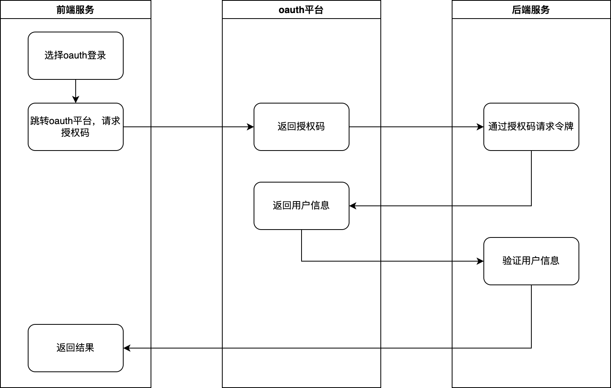

# oauth2

## 1、概念

oauth2.0是业界标准的授权协议，目前最流行的授权机制，用来授权第三方应用，获取用户数据。

数据的所有者告诉系统，同意授权第三方应用进入系统，获取这些数据。系统从而产生一个短期的进入令牌，用来代替密码，供第三方应用使用。

## 2、令牌与密码的区别

- 令牌是短期的，到期会自动失效，用户自己无法修改。密码一般长期有效，用户不修改，就不会发生变化。
- 令牌可以被数据所有者撤销，会立即失效。
- 令牌有权限范围，对于网络服务来说，只读令牌比读写令牌更安全。密码一般是完整权限。

这些设计保证了令牌既可以让第三方应用获得权限，同时又随时可控，不会危及系统安全。

只要知道了令牌，就能进入系统。系统一般不会再次确认身份，所以令牌必须保密，泄漏令牌与泄漏密码的后果一样，所以令牌的有效期，一般设置的很短。

## 3、四种授权方式

### 1）授权码

第三方应用先申请一个授权码，然后再用该码获取令牌。

授权码通过前端传送，令牌则是存储在后端，而且所有与资源服务区的通信都在后端完成。




```javascript
// 请求
https://b.com/oauth/authorize?
  response_type=code&
  client_id=CLIENT_ID&
  redirect_uri=CALLBACK_URL&
  scope=read
```

```javascript
// 获取授权码
https://a.com/callback?code=AUTHORIZATION_CODE
```

```javascript
// 请求token
https://b.com/oauth/token?
 client_id=CLIENT_ID&
 client_secret=CLIENT_SECRET&
 grant_type=authorization_code&
 code=AUTHORIZATION_CODE&
 redirect_uri=CALLBACK_URL

// 结果
{    
  "access_token":"ACCESS_TOKEN",
  "token_type":"bearer",
  "expires_in":2592000,
  "refresh_token":"REFRESH_TOKEN",
  "scope":"read",
  "uid":100101,
  "info":{...}
}
```


### 2）隐藏式

有些web应用是纯前端应用，没有后端。必须将令牌存储在前端。省略授权码这个中间步骤。

```javascript
// 直接请求token
https://b.com/oauth/authorize?
  response_type=token&
  client_id=CLIENT_ID&
  redirect_uri=CALLBACK_URL&
  scope=read
```

oauth平台直接返回令牌给前端

```javascript
https://a.com/callback#token=ACCESS_TOKEN
```

<span style='color: red'>注意，返回令牌的位置是URL锚点，而不是查询字符串，这是因为OAuth 2.0 允许跳转网址是http协议，因此存在“中间人攻击”的风险，而浏览器跳转时，锚点不会发到服务器，就减少了泄漏令牌的风险。</span>

这种方式把令牌传给前端是很不安全的。因此，只能用于一些安全要求不高的场景，并且令牌的有效期必须非常短，通常就是会话期间有效，浏览器关掉，令牌就失效了。

### 3）密码式

当高度信任 某个应用时，oauth也可以允许用户把用户名和密码，直接告诉该应用。该应用就使用密码，申请令牌，这种方式就是密码模式。

```javascript
// 要求用户直接提供oauth平台的用户名和密码，拿到以后直接请求令牌
https://oauth.b.com/token?
  grant_type=password&
  username=USERNAME&
  password=PASSWORD&
  client_id=CLIENT_ID
```

### 4）凭证式

适用于没有前端的命令行应用，即在命令行下请求令牌。

```javascript
// 在命令行向B发出请求，验证通过后直接返回令牌
https://oauth.b.com/token?
  grant_type=client_credentials&
  client_id=CLIENT_ID&
  client_secret=CLIENT_SECRET
```


## 4、更新令牌

当令牌的有效期到了，如果让用户重新走一遍上面的流程，再申请一个令牌，很可能体验不好，也没有必要，oauth2允许用户自动更新令牌。

如果token超时时间很长，比如14天，由于第三方软件获取受保护资源都要带着token，这样使得token的攻击面比较大。

如果token超时的时间很短，比如1个小时，那超时之后就需要用户再次授权，这样频繁的授权导致用户体验不好。

引入refresh token就解决了这个矛盾。

主要流程：

1、授权服务颁发刷新令牌

第三方软件得到一个访问令牌的同时，也会得到一个刷新令牌。

2、第三方服务使用刷新令牌

- 定时检测：将令牌的过期时间expire_in值保存下来并定时检测，过期就重新请求授权服务刷新token。
- 现场发现：当令牌失去响应的时候，使用refresh_token去重新授权。

3、校验刷新令牌

授权服务器会先比较grant_type和refresh_token的值，确认是请求刷新令牌的操作。

接收刷新令牌请求，

- 验证基本信息
- 先验证第三方软件是否存在。
- 验证刷新令牌是否存在。
- 验证刷新令牌是否属于该第三方软件。

重新生成访问令牌

如果token不超时，那么刷新token有下面几种方式

- 不会改变token，但超时时间会刷新，相当于续期token
- 更新token的值。
- 仍返回原token和refresh_token，也并不会续期。

如果token超时了，但refresh_token 未超时，那么更新token的值，推荐刷新令牌是一次性的，使用之后就会失效。通过refresh_token刷新后，refresh_token过期时间不会重新刷新。

如果refresh_token也超时了，就需要将刷新令牌和访问令牌都放弃，让用户重新授权。


