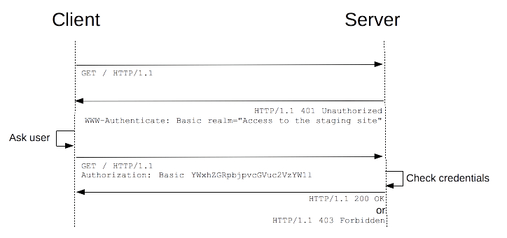

[toc]

# 网络协议

## 一、http token使用方式

token一般会放在header中使用Authorization的并带入存取的token，basic和bearer是token的类型。

### 1、Basic Token

是http最基本的认证方式，使用明码的方式传输password、uid。设计面并未考虑到TLS认证。

一般来说，在存取资源服务器的时候，需要预先带入token，如果未能成功验证通过时，Response则会回应相关的资讯，带有WWW-Authenticate HEADER，并带有Realm资讯。

Key words：

- Realm（Protection Space）：Token有效的网域。
- charset：用于设定schema的编码，只能允许utf-8一种。

### 2、Bearer Token

是以HTTP 1.1 TLS下去定义的Token，因此使用Bearer必须具备TLS环境。延续使用Basic Token 的WWW-Authenticate、Authorization HEADER，而proxy authentication不延续使用。

### 3、使用Token的方式

- 使用Authorization HEADER
- 使用Form Body：使用时不建议将Token加入Body。
- 直接使用在URI：一般不会使用这种方法，除非不可以使用header，或者protect resource支援该方法。

### 4、Token Response Error

使用Token时，http code 为200时代表成功。

Basic Token：当授权为不通过时，回传401 code并告知哪个Protect Scope错误。

HTTP/1.1 401 Unauthorized
Date: Mon, 04 Feb 2014 16:50:53 GMT
WWW-Authenticate: Basic realm="WallyWorld"

Bearer Token：当授权不通过时，回传400，401，403 code，并根据状况回传对应的错误

| **Error Type**  | 说明                                                         |
| :-------------- | :----------------------------------------------------------- |
| invalid_request | Response 400 error code，表示Request 缺少参数或者多了一些参数等错误 |
| invalid_token   | Response 401 error code，表示Token 错误，通过不了认证        |
| invalid_scope   | Response 403 error code，表示Token无权存取该Protect Resource |

HTTP/1.1 401 Unauthorized
WWW-Authenticate: Bearer realm="example",
                  error="invalid_token",
                  error_description="The access token expired"

### 5、总结

Basic Token主要还是使用在网域上的防护，而Bearer则是针对protect resource的存取，主要还是使用在Auth 2.0上，且一定要在TLS环境(HTTPS)使用。
