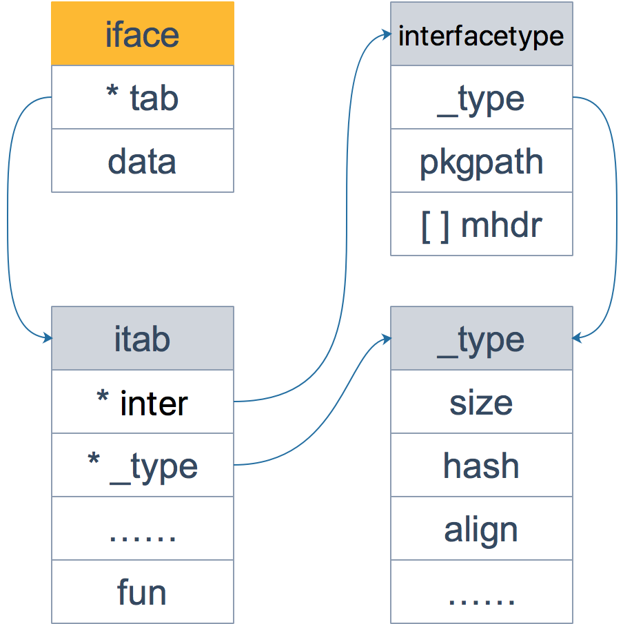

# 接口

## 1、鸭子类型

如果某个东西长得像鸭子，像鸭子一样游泳，像鸭子一样嘎嘎叫，那它就可以被看成是一只鸭子。

所谓的鸭子类型就是动态编程语言的一种对象推断策略，它更关注对象能如何被使用，而不是对象的类型本身。

Go语言作为一门静态语言，它通过接口的方式完美支持鸭子类型。

静态语言诸如java，c++，必须要显式地声明实现了某个接口，之后才能用在任何需要这个接口的地方。

<span style='color:red'>静态语言在编译期间就能发现类型不匹配的错误，不像动态语言，必须要运行到那一行代码才会报错。静态语言要求程序员在编码阶段就要按照规定来编写程序，为每个变量规定数据类型，这在某种程度上，加大了工作量，也加长了代码量。动态语言则没有这些要求，可以让人更专注在业务上，代码也更短，写起来更快。</span>


## 2、使用场景

### 空接口：可以接收任意类型

1）作为函数的参数，可以接收任意类型，可以编写较为通用的函数。

```go
func (p *pp) printArg(arg any, verb rune) {
    p.arg = arg
    p.value = reflect.Value{}

    if arg == nil {
       switch verb {
       case 'T', 'v':
          p.fmt.padString(nilAngleString)
       default:
          p.badVerb(verb)
       }
       return
    }

    // Special processing considerations.
    // %T (the value's type) and %p (its address) are special; we always do them first.
    switch verb {
    case 'T':
       p.fmt.fmtS(reflect.TypeOf(arg).String())
       return
    case 'p':
       p.fmtPointer(reflect.ValueOf(arg), 'p')
       return
    }

    // Some types can be done without reflection.
    switch f := arg.(type) {
    case bool:
       p.fmtBool(f, verb)
    case float32:
       p.fmtFloat(float64(f), 32, verb)
    case float64:
       p.fmtFloat(f, 64, verb)
    case complex64:
       p.fmtComplex(complex128(f), 64, verb)
    case complex128:
       p.fmtComplex(f, 128, verb)
    case int:
       p.fmtInteger(uint64(f), signed, verb)
    case int8:
       p.fmtInteger(uint64(f), signed, verb)
    case int16:
       p.fmtInteger(uint64(f), signed, verb)
    case int32:
       p.fmtInteger(uint64(f), signed, verb)
    case int64:
       p.fmtInteger(uint64(f), signed, verb)
    case uint:
       p.fmtInteger(uint64(f), unsigned, verb)
    case uint8:
       p.fmtInteger(uint64(f), unsigned, verb)
    case uint16:
       p.fmtInteger(uint64(f), unsigned, verb)
    case uint32:
       p.fmtInteger(uint64(f), unsigned, verb)
    case uint64:
       p.fmtInteger(f, unsigned, verb)
    case uintptr:
       p.fmtInteger(uint64(f), unsigned, verb)
    case string:
       p.fmtString(f, verb)
    case []byte:
       p.fmtBytes(f, verb, "[]byte")
    case reflect.Value:
       // Handle extractable values with special methods
       // since printValue does not handle them at depth 0.
       if f.IsValid() && f.CanInterface() {
          p.arg = f.Interface()
          if p.handleMethods(verb) {
             return
          }
       }
       p.printValue(f, verb, 0)
    default:
       // If the type is not simple, it might have methods.
       if !p.handleMethods(verb) {
          // Need to use reflection, since the type had no
          // interface methods that could be used for formatting.
          p.printValue(reflect.ValueOf(f), verb, 0)
       }
    }
}
```

2）作为函数返回值，当不确定函数可能返回的类型时，可以使用空接口作为函数的返回值。

3）在数据结构中存储任意类型.

4）类型断言

<span style='color:red'>注意：虽然空接口可以用来存储任何类型的值，但是过度使用空接口会使代码失去类型信息，增加运行时错误的风险，也会使代码更难理解和维护。</span>

### 带方法的接口

1）实现多态。

2）解循环引用。在go中，当两个包互相引用对方的类型或者方法时，会导致包循环引用，从而编译不通过。

```go
package packageA

import (
    "fmt"
    "dev.roombox.xdf.cn/galaxy/benchnet/projects/test/packageB"
)

type A struct {
}

func (a *A) AMethod() {
    fmt.Println("a method")
}

func UseBMethod(b *packageB.B) {
    b.BMethod()
}
```

```go
package packageB

import (
    "dev.roombox.xdf.cn/galaxy/benchnet/projects/test/packageA"
    "fmt"
)

type B struct {
}

func (b *B) BMethod() {
    a := &packageA.A{}
    a.AMethod()
    fmt.Println("b method")
}
```

这里可以考虑使用接口进行解引用

```go
package packageA

import (
    "fmt"
)

type MyInterfaceB interface {
    BMethod()
}

type A struct {
}

func (a *A) AMethod() {
    fmt.Println("a method")
}

func UseBMethod(b MyInterfaceB) {
    b.BMethod()
}
```


## 3、值接收者和指针接收者

1）在调用方法的时候，值类型既可以调用值接收者的方法，也可以调用指针接收者的方法；指针类型既可以调用指针接收者的方法，也可以调用值接收者的方法。

编译器会在背后做一些工作。

|                | 值接收者                                       | 指针接收者                                                   |
| -------------- | ---------------------------------------------- | ------------------------------------------------------------ |
| 值类型调用者   | 方法会使用调用者的一个副本，类似于传值。       | 使用值的引用来调用方法，相当于对值取地址，然后调用方法。     |
| 指针类型调用者 | 指针被解引用为值，相当于间接引用然后调用方法。 | 也是传值，方法里的操作会影响到调用者，类似于指针传参，拷贝了一份指针。 |

2）在实现接口的时候，接收者如果是值类型，相当于自动实现了接收者是指针类型的方法，而接收者是指针类型，则不会自动生成对应接收者是值类型的方法。

|                      | 结构体实现接口 | 结构体指针实现接口 |
| -------------------- | -------------- | ------------------ |
| 结构体初始化变量     | 通过           | 不通过             |
| 结构体指针初始化变量 | 通过           | 通过               |

- 当实现接口的类型和初始化变量时返回的类型是相同的，代码一定会通过编译。

- 当方法的接收者是值类型，而初始化的变量是指针类型时，作为指针的变量进行拷贝会得到一个相同的指针，能够隐式地对变量进行解引用获取到指向的值，然后再执行对应的方法。

- 当方法的接收者是指针类型，而初始化的变量是值类型时，作为值的变量进行拷贝得到一个全新的值，但是方法的接收者作为方法的第一个参数需要的是一个指针，编译器不会无中生有创建一个新的指针，即使编译器可以创建新的指针，这个指针指向的也不是最初调用该方法的结构体。

  

​	<span style='color:red'>接收者是指针类型的方法，很可能在方法中会对接收者的属性进行更改操作，从而影响接收者；而对于接收者是值类型的方法，在方法中不会对接收者本身产生影响。所以当实现了一个接收者是值类型的方法，就可以自动生成一个接收者是对应指针类型的方法，在方法中不会对接收者本身产生影响。但是当实现了一个接收者是指针类型的方法，如果此时自动生成一个接收者是值类型的方法，原本希望对接收者的改变，现在无法实现，因为值类型会产生一个拷贝，不会真正影响调用者。</span>

3）两者何时使用

使用指针作为方法接收者的理由：

- 方法能够修改接收者指向的值。
- 避免在每次调用方法时复制该值，在值的类型为大型结构体时，这样做更加高效。

<span style='color:red'>是使用值接收者还是指针接收者，不是由该方法是否修改了调用者来决定，而是应该基于该类型的本质。</span>


## 4、接口源码分析

### 非空接口

```go
type iface struct {
    tab  *itab          // 表示一个接口类型以及赋值给这个类型的实体类型
    data unsafe.Pointer // 指向具体的值，一般而言指向堆内存
}
```

```go
type itab struct {
    inter *interfacetype // 接口类型
    _type *_type         // 具体类型
    hash  uint32         // copy of _type.hash. Used for type switches. 快速判等
    _     [4]byte        // 预留
    // 和接口方法对应的具体类型的方法的地址
    // 这里仅放置具体类型和接口相关的方法
    fun [1]uintptr // variable sized. fun[0]==0 means _type does not implement inter.
}
```

```go
type interfacetype struct {
    typ     _type
    pkgpath name      // 接口所在的包名
    mhdr    []imethod // 接口定义的函数列表
}
```




### 空接口

```
type eface struct {
    _type *_type         // 表示空接口所承载的实体类型
    data  unsafe.Pointer // 指向具体的值
}
```


### 核心结构体

```go
type _type struct {
    // 类型大小
    size    uintptr
    ptrdata uintptr // size of memory prefix holding all pointers
    hash    uint32  // 类型的hash值
    tflag   tflag   // todo 反射相关
    // 内存对齐
    align      uint8
    fieldAlign uint8
    kind       uint8 // 类型类别
    // function for comparing objects of this type
    // (ptr to object A, ptr to object B) -> ==?
    equal func(unsafe.Pointer, unsafe.Pointer) bool // 对象快速判等函数
    // gcdata stores the GC type data for the garbage collector.
    // If the KindGCProg bit is set in kind, gcdata is a GC program.
    // Otherwise it is a ptrmask bitmap. See mbitmap.go for details.
    // gc相关
    gcdata    *byte
    str       nameOff
    ptrToThis typeOff
}
```


### 接口类型和nil比较

接口值的零值是指动态类型和动态值都为nil。当且仅当这两部分的值都为nil的情况下，这个接口的值才会被认为是nil。

打印出接口的动态类型和值

```go
package main

import (
	"unsafe"
	"fmt"
)

// 采用自定义iface结构体
type iface struct {
	itab, data uintptr
}

func main() {
	var a interface{} = nil

	var b interface{} = (*int)(nil)

	x := 5
	var c interface{} = (*int)(&x)
	
  // 强制解引用
	ia := *(*iface)(unsafe.Pointer(&a))
	ib := *(*iface)(unsafe.Pointer(&b))
	ic := *(*iface)(unsafe.Pointer(&c))

	fmt.Println(ia, ib, ic)

	fmt.Println(*(*int)(unsafe.Pointer(ic.data)))
}
```


### 编译器会检查类型是否实现了接口

```
var _ io.Writer = (*myWriter)(nil)
```

上述赋值语句会发生隐式类型转换，在转换的过程中，编译器会检测等号右边的类型是否实现了等号左边接口所规定的函数。


### 接口的构造过程

源码中会调用convert函数，它会构造出一个interface。

```golang
// 组装iface
func convT2I64(tab *itab, elem unsafe.Pointer) (i iface) {
	t := tab._type
	
	//...
	
	var x unsafe.Pointer
	if *(*uint64)(elem) == 0 {
		x = unsafe.Pointer(&zeroVal[0])
	} else {
		x = mallocgc(8, t, false)
		*(*uint64)(x) = *(*uint64)(elem)
	}
	i.tab = tab
	i.data = x
	return
}
```


### 打印接口的hash值

```golang
// 原理：定义一个山寨版的iface和itab，通过强制类型转换可以读取出想要的值。
type iface struct {
	tab  *itab
	data unsafe.Pointer
}
type itab struct {
	inter uintptr
	_type uintptr
	link uintptr
	hash  uint32
	_     [4]byte
	fun   [1]uintptr
}

func main() {
	var qcrao = Person(Student{age: 18})

	iface := (*iface)(unsafe.Pointer(&qcrao))
	fmt.Printf("iface.tab.hash = %#x\n", iface.tab.hash)
}
```


### 接口转换原理

当判定一种类型是否满足某个接口时，Go使用类型的方法集和接口所需要的方法进行匹配，如果类型的方法集完全包含接口的方法集，则可认为该类型实现了该接口。

Go会对方法集的函数按照函数名的字典序进行排序，<span style='color:red'>实际的时间复杂度会由O(mn)降为O(m+n)。</span>

```golang
// 将一个interface转换成另一个interface
func convI2I(inter *interfacetype, i iface) (r iface) {
	tab := i.tab
	if tab == nil {
		return
	}
	if tab.inter == inter {
		r.tab = tab
		r.data = i.data
		return
	}
	r.tab = getitab(inter, tab._type, false)
	r.data = i.data
	return
}
```

```go
func getitab(inter *interfacetype, typ *_type, canfail bool) *itab {
    if len(inter.mhdr) == 0 {
        throw("internal error - misuse of itab")
    }

    // easy case
    if typ.tflag&tflagUncommon == 0 {
        // 判断是否可以失败
        if canfail {
            return nil
        }
        // 不可以则触发panic
        name := inter.typ.nameOff(inter.mhdr[0].name)
        panic(&TypeAssertionError{nil, typ, &inter.typ, name.name()})
    }

    var m *itab

    // First, look in the existing table to see if we can find the itab we need.
    // This is by far the most common case, so do it without locks.
    // Use atomic to ensure we see any previous writes done by the thread
    // that updates the itabTable field (with atomic.Storep in itabAdd).
    // 优先从tab表中寻找需要的itab
    t := (*itabTableType)(atomic.Loadp(unsafe.Pointer(&itabTable)))
    if m = t.find(inter, typ); m != nil {
        goto finish
    }

    // Not found.  Grab the lock and try again.
    // 没找到，获取锁再尝试一次
    lock(&itabLock)
    if m = itabTable.find(inter, typ); m != nil {
        unlock(&itabLock)
        goto finish
    }

    // Entry doesn't exist yet. Make a new entry & add it.
    // 还是没有，创建一个加入到全局表中
    m = (*itab)(persistentalloc(unsafe.Sizeof(itab{})+uintptr(len(inter.mhdr)-1)*goarch.PtrSize, 0, &memstats.other_sys))
    m.inter = inter
    m._type = typ
    // The hash is used in type switches. However, compiler statically generates itab's
    // for all interface/type pairs used in switches (which are added to itabTable
    // in itabsinit). The dynamically-generated itab's never participate in type switches,
    // and thus the hash is irrelevant.
    // Note: m.hash is _not_ the hash used for the runtime itabTable hash table.
    m.hash = 0
  	// 填充函数列表并检查是否实现接口
    m.init()
  	// 加入全局itab列表
    itabAdd(m)
    unlock(&itabLock)
finish:
    if m.fun[0] != 0 {
        return m
    }
    if canfail {
        return nil
    }
    // this can only happen if the conversion
    // was already done once using the , ok form
    // and we have a cached negative result.
    // The cached result doesn't record which
    // interface function was missing, so initialize
    // the itab again to get the missing function name.
  	// 触发panic，并打印缺失的方法
    panic(&TypeAssertionError{concrete: typ, asserted: &inter.typ, missingMethod: m.init()})
}
```

```go
// init fills in the m.fun array with all the code pointers for
// the m.inter/m._type pair. If the type does not implement the interface,
// it sets m.fun[0] to 0 and returns the name of an interface function that is missing.
// It is ok to call this multiple times on the same m, even concurrently.
// 填充函数列表
func (m *itab) init() string {
    inter := m.inter
    typ := m._type
    x := typ.uncommon()

    // both inter and typ have method sorted by name,
    // and interface names are unique,
    // so can iterate over both in lock step;
    // the loop is O(ni+nt) not O(ni*nt).
    // 接口类型和具体类型的方法已经排好序了，并且接口名称唯一
    ni := len(inter.mhdr)
    nt := int(x.mcount)
    xmhdr := (*[1 << 16]method)(add(unsafe.Pointer(x), uintptr(x.moff)))[:nt:nt]
    j := 0
    methods := (*[1 << 16]unsafe.Pointer)(unsafe.Pointer(&m.fun[0]))[:ni:ni]
    var fun0 unsafe.Pointer
imethods:
    for k := 0; k < ni; k++ {
        i := &inter.mhdr[k]
        itype := inter.typ.typeOff(i.ityp)
        name := inter.typ.nameOff(i.name)
        iname := name.name()
        ipkg := name.pkgPath()
        if ipkg == "" {
            ipkg = inter.pkgpath.name()
        }
        for ; j < nt; j++ {
            t := &xmhdr[j]
            tname := typ.nameOff(t.name)
            // 检查名字和类型是否一致
            if typ.typeOff(t.mtyp) == itype && tname.name() == iname {
                pkgPath := tname.pkgPath()
                if pkgPath == "" {
                    pkgPath = typ.nameOff(x.pkgpath).name()
                }
                if tname.isExported() || pkgPath == ipkg {
                    if m != nil {
                        ifn := typ.textOff(t.ifn)
                        if k == 0 {
                            fun0 = ifn // we'll set m.fun[0] at the end
                        } else {
                            methods[k] = ifn
                        }
                    }
                    continue imethods
                }
            }
        }
        // didn't find method
        m.fun[0] = 0
        return iname
    }
    m.fun[0] = uintptr(fun0)
    return ""
}
```

把实体类型赋值给接口的时候，会调用conv系列函数

1. 具体类型转空接口时，type字段直接复制源类型的type，调用mallocgc获得一块新内存，把值复制进去，data再指向这块新内存。
2. 具体类型转非空接口时，入参tab是编译器在编译阶段预先生成好的，新接口tab字段直接指向入参tab指向的itab；调用mallocgc获得一块新内存，把值复制进去，data再指向这块新内存。
3. 对于接口转接口，itab调用getitab函数获取。只用生成一次，之后直接从hash表中获取。


### 类型断言

将目标类型的hash与接口变量中的itab.hash进行比较，如果相等，将完成类型转换，不相等则返回。

如果对空接口类型进行断言时会从eface._type中获取，然后与目标类型的hash进行比较，在进行类型转换。


## 5、多态

Go语言没有显式的设计诸如虚函数、纯虚函数、继承、多重继承等概念，但通过接口可以非常优雅地支持了面向对象的特性。

<span style='color:red'>多态是一种运行期行为。具有以下几个特点：</span>

1. 一种类型具有多种类型的能力。
2. 允许不同的对象对同一消息做出灵活的反应。
3. 以一种通用的方式对待每个使用对象。
4. 非动态语言必须通过继承和接口的方式来实现。

### 与c++接口的区别

c++接口是使用抽象类来实现的，如果类中至少有一个函数被声明为纯虚函数，则这个类就是抽象类。

设计抽象类的目的，是为了给其他类提供一个可以继承的适当的基类。抽象类不能被用于实例化对象，它只能作为接口使用。派生类需要明确地声明它继承自基类，并且需要实现基类中所有的纯虚函数。

c++定义接口的方式称为侵入式，而Go采用的是“非侵入式”，不需要显式声明，只需要实现接口定义的函数，编译器自动会识别。

c++和go在定义接口方式上的不同，也导致底层实现的不同。

1. C++通过虚函数表来实现基类调用派生类函数，而Go通过itab中的fun字段来实现接口变量调用实体类型的函数。
2. C++中的虚函数表是在编译期生成的，而Go的itab中的fun字段是在运行期间动态生成的。原因在于，Go中实体类型可能会无意中实现N多接口，很多接口并不是本来需要的，所以不能为类型实现的所有接口都生成一个itab，这也是非侵入式带来的影响。这在c++中是不存在的，因为派生需要显示声明它继承自哪个基类。

### Go多态的性能问题

如果在关闭编译器优化的情况下，多态相比于直接调用大概会带来18%左右的性能开销。如果开启编译器优化后，动态派发的额外开销会降至5%，对应用的整体性能影响会更小，所以与使用接口相比，动态派发的额外开销可以忽略不计。<span style='color:red'>这个前提是实现和调用方法的都是结构体指针。</span>

如果实现和调用方法都是结构体，那么额外开销会非常多，<span style='color:red'>尽量避免使用结构体类型实现接口，因为Go在函数调用时都是值传递导致的，动态派发则放大了这一影响。</span>


## 6、空接口类型与C++中的auto和void*的对比

1）空接口类型：可以接收任意类型的值，但是隐藏了值的具体类型，所以在使用的时候需要进行类型断言和判断。

```go
func TestInterface1(t *testing.T) {
    var i int64 = 100
    var b interface{} = i
    r, ok := b.(int64)
    if ok {
        fmt.Println(r)
    }
}

func TestInterface2(t *testing.T) {
    var i int64 = 100
    var b interface{} = i
    r, ok := b.(int)
    if ok {
        fmt.Println(r)
    }
}
```

2）auto：一个C++11中引入的关键字，可以允许编译器自动推倒变量的类型。

```C++
#include<iostream>

int main() {
	auto a = 5;
	auto b = "peng";
	std::cout << a << std::endl;
	std::cout << b << std::endl;
	return 0;
}
```

3）void*：一个通用的指针类型，可以指向任意类型。但是它只存储了变量的内存地址，并没有保存变量的类型信息，需要进行显式的类型转换。

```c++
#include <iostream>

int main() {
    int i = 48;
    void* p = &i;

    int* ip = (int*)(p);
    if (ip) {
        std::cout << *ip << std::endl; // 输出 "48"
    }
    return 0;
}
```

```c++
#include <iostream>

int main() {
    int i = 48;
    void* p = &i;

    char* ip = (char*)(p);
    if (ip) {
        std::cout << *ip << std::endl; 
    }
    return 0;
}
```

