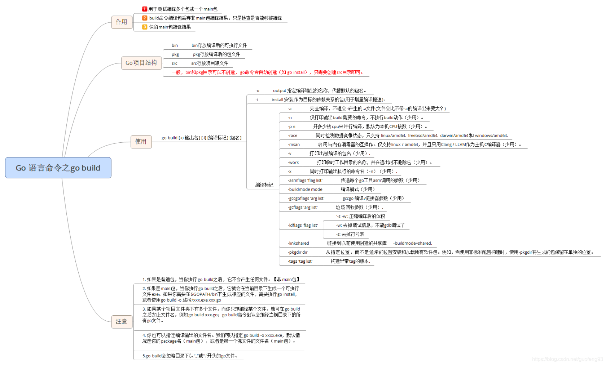

# 工具链

**安装**

go官方工具链安装目录下的bin子目录必须配置在PATH环境变量中。

GOPATH：此环境变量的默认值为当前用户的HOME目录下名为go文件夹对应的目录路径，可以手动配置多个路径。

该文件夹下的pkg子文件夹用来缓存被本地项目所依赖的GO模块（若干go库包的集合）。

GOBIN：用来指定go install子命令产生的Go应用程序二进制可执行文件应该存储在何处。

**Go其他环境变量**

| 环境变量   | 含义                              |
| ---------- | --------------------------------- |
| $GOARCH    | 体系架构等（arm，amd64等）        |
| $GOOS      | 当前的os环境（Linux， windows等） |
| $GOFILE    | 当前处理中的文件名                |
| $GOLINE    | 当前命令在文件中的行号            |
| $GOPACKAGE | 当前处理文件的包名                |

**go build**

编译源文件，参考go help build

1、如果源码中没有依赖GOPATH包引用，可以使用无参数go build

2、go build+文件列表

适合使用go语言编写的只有少量文件的工具

生成的可执行文件默认选择文件列表中第一个源码文件作为可执行文件名输出。

go build file1.go file2.go......

如果需要指定输出可执行文件名，可以使用-o参数

go build -o name file1.go file2.go......

⚠️：文件列表中的每个文件必须是同一个包的Go源码。

3、go build+包

直接根据包名进行编译，包内文件被增删也不影响编译指令

  

**go clean**

主要用来清除编译文件，提交源码到远端，方便对源码的管理

可以移除当前源码包和关联源码包里面编译生成的文件，包括以下几种：

- 执行go build命令时在当前目录下生成的与包名或者Go源码文件同名的可执行文件.
- 执行go test命令并加入-c标记时在当前目录下生成的一包名为“.test”后缀为名的文件。
- 执行go install命令安装当前代码包时产生的结果文件.
- 执行go install 命令安装当前代码包时产生的结果文件。如果当前代码包只包含库源码文件，则结果文件指的就是在工作区pkg目录下相应的归档文件。如果当前代码包中只包含一个命令源码文件，则结果文件指的就是工作区bin目录下的可执行文件。
- 在编译GO或C源码文件时遗留在相应目录中的文件或目录，包括“_obj”和“_test”目录，名称为"_testmain.go"、“test.out”、”build.out“或"a.out"的文件，名称以".5"，“.6”，”.8“，".a"、“.o”或“.so”为后缀的文件，这些目录和文件是在go build命令执行时生成的临时目录中的。

相关参数

- -i清除关联的安装的包和可运行文件，也就是通过go install安装的文件。
- -n把需要执行的清除命令打印出来，但是不执行，可以知道底层是如何运行的。
- -r循环的清楚import引入的包。
- -x打印出来执行的详细命令，其实就是-n的执行版本。
- -cache删除所有go build命令的缓存。
- -testcache删除当前包所有的测试结果。

**go run**

编译源码，并且直接执行源码的main()函数，不会在当前目录留下可执行文件。

可执行文件被放在临时文件中被执行，工作目录被设置为当前目录。

在go run的后部可以添加参数，这部分参数会作为代码可以接受的命令行输入提供给程序。

不可以使用go run+包的方式进行编译。

**gofmt**

gofmt帮助开发者格式化他们的代码到统一的风格。

gofmt是一个客户端程序，优先读取标准输入，如果传入了文件路径的话，会格式化这个文件，如果传入一个目录，会格式化目录中所有的.go文件，如果不传参数，会格式化当前目录下所有.go文件。

gofmt默认不会对代码进行简化，使用-s功能可开启简化代码功能，如下

1. 去除数组、切片、map初始化时不必要的类型声明 。
2. 去除数组切片操作时不必要的索引指定。
3. 去除循环时非必要的变量赋值。

命令参数

| 标记名称    | 标记描述                                                     |
| ----------- | ------------------------------------------------------------ |
| -l          | 仅把那些不符合格式化规范的，需要被命令程序改写的源码文件的绝对路径打印到标准输出，而不是把改写后的全部内容打印到标准输出 |
| -w          | 把改写后的内容直接写入文件，不打印到标准输出                 |
| -r          | 添加自定义重写规则                                           |
| -s          | 简化文件中的代码                                             |
| -d          | 只把改写前后内容的对比信息作为结果打印到标准输出，将使用diff命令对内容进行比对。 |
| -e          | 打印所有的语法错误到标准输出                                 |
| -comments   | 是否保留源码文件中的注释，默认为true                         |
| -tabwidth   | 用于设置代码中缩进所使用的空格数量，默认为8                  |
| -tabs       | 是否使用tab来代替空格表示缩进，默认为true                    |
| -cpuprofile | 是否开启cpu使用情况记录，并将内容保存在指定的文件            |

go fmt命令是对gofmt的简单封装

-n：仅打印出内部要执行的gofmt命令

-x：打印出gofmt命令并执行。

**go install**

将编译的中间文件放在GOPATH的pkg目录下，以及固定的将编译结果放在GOPATH的bin目录下。

主要流程：

1. 生成结果文件（.a包或者可执行文件）
2. 把编译好的结果移到$GOPATH/pkg或者$GOPATH/bin

注意：

1. go install 是建立在GOPATH上的，无法在独立的目录中使用go install
2.  GOPATH下的bin目录放置的是使用go install生成的可执行文件，名称来源于编译时的包名。
3. go install输出的目录始终为GOPATH下的bin目录。
4. GOPATH下的pkg目录放置的是编译期间的中间文件。

**go get**

可以借助代码管理工具通过远程拉取或更新代码包及其依赖包，并自动完成编译和安装。

注意：

- 必须确保安装了合适的源码管理工具，如git，svn，hg等，并把这些命令加入到PATH
- 1.16之后不具备安装二进制的功能，go get 将二进制相关的功能转移到go install，仅作为用于编辑go.mod文件的命令存在，接下来go get的行为等同于go get -d，仅下载源码并添加至go.mod

参数相关

| 参数      | 介绍                                                         |
| --------- | ------------------------------------------------------------ |
| -d        | 只下载不安装，新版本默认                                     |
| -f        | 只有在带有-u参数时才有效，不让-u去验证import中的每一个都已经获取了，对本地fork的包特别有用 |
| -fix      | 在获取源码后，先获取源码之后先运行fix，再做其他事情。        |
| -t        | 同时下载需要为运行测试所需要的包。                           |
| -u        | 强制使用网络去更新包和它的依赖包。会下载丢失的包，但不会更新已经存在的包 |
| -v        | 显示执行的命令，日志以及信息，方便检查错误。                 |
| -insecure | 允许使用不安全的HTTP方式进行下载操作。                       |

**go generate**

将扫描与当前包相关的源代码文件，找出包含//go:generate的特殊注释，提取并执行该特殊注释后面的命令。

注意：

- 该特殊注释必须在.go源码文件中。
- 每个源码文件可以包含多个特殊注释。
- 运行go generate命令时，才会执行特殊注释后面的命令。
- 当go generate命令执行出错，将终止程序执行。
- 特殊注释必须以//go:generate开头，双斜线后面没有空格。

可能的使用场景：

- yacc：从 .y 文件生成 .go 文件；

- protobufs：从 protocol buffer 定义文件（.proto）生成 .pb.go 文件；
- Unicode：从 UnicodeData.txt 生成 Unicode 表；
- HTML：将 HTML 文件嵌入到 go 源码；
- bindata：将形如 JPEG 这样的文件转成 go 代码中的字节数组。

命令行参数

| 参数    | 说明                                   |
| ------- | -------------------------------------- |
| -run    | 正则表达式匹配命令行，仅执行匹配的命令 |
| -v      | 输出被处理的包名和源文件名             |
| -n      | 显示不执行命令                         |
| -x      | 显示执行命令                           |
| command | 可以是在环境变量PATH中的任何命令       |


**go test**

go test 命令如果没有指定包那么将默认采用当前目录对应的包，并不会同时并发的执行多个测试。

命令行参数

-v  打印每个测试函数的名字和运行时间

```shell
$ go test -v
=== RUN TestPalindrome
--- PASS: TestPalindrome (0.00s)
=== RUN TestNonPalindrome
--- PASS: TestNonPalindrome (0.00s)
=== RUN TestFrenchPalindrome
--- FAIL: TestFrenchPalindrome (0.00s)
    word_test.go:28: IsPalindrome("été") = false
=== RUN TestCanalPalindrome
--- FAIL: TestCanalPalindrome (0.00s)
    word_test.go:35: IsPalindrome("A man, a plan, a canal: Panama") = false
FAIL
exit status 1
FAIL    gopl.io/ch11/word1  0.017s
```

-run 对应一个正则表达式，只有测试函数名被它正确匹配的测试函数才会被go test测试命令执行

```shell
$ go test -v -run="French|Canal"
=== RUN TestFrenchPalindrome
--- FAIL: TestFrenchPalindrome (0.00s)
    word_test.go:28: IsPalindrome("été") = false
=== RUN TestCanalPalindrome
--- FAIL: TestCanalPalindrome (0.00s)
    word_test.go:35: IsPalindrome("A man, a plan, a canal: Panama") = false
FAIL
exit status 1
FAIL    gopl.io/ch11/word1  0.014s
```

测试类型

1、表格驱动测试

通过精心挑选过的数据对函数进行测试

```Go
func TestIsPalindrome(t *testing.T) {
    var tests = []struct {
        input string
        want  bool
    }{
        {"", true},
        {"a", true},
        {"aa", true},
        {"ab", false},
        {"kayak", true},
        {"detartrated", true},
        {"A man, a plan, a canal: Panama", true},
        {"Evil I did dwell; lewd did I live.", true},
        {"Able was I ere I saw Elba", true},
        {"été", true},
        {"Et se resservir, ivresse reste.", true},
        {"palindrome", false}, // non-palindrome
        {"desserts", false},   // semi-palindrome
    }
    for _, test := range tests {
        if got := IsPalindrome(test.input); got != test.want {
            t.Errorf("IsPalindrome(%q) = %v", test.input, got)
        }
    }
}
```

2、随机测试

通过构造更广泛的随机输入来测试探索函数的行为

```Go
import "math/rand"

// randomPalindrome returns a palindrome whose length and contents
// are derived from the pseudo-random number generator rng.
func randomPalindrome(rng *rand.Rand) string {
    n := rng.Intn(25) // random length up to 24
    runes := make([]rune, n)
    for i := 0; i < (n+1)/2; i++ {
        r := rune(rng.Intn(0x1000)) // random rune up to '\u0999'
        runes[i] = r
        runes[n-1-i] = r
    }
    return string(runes)
}

func TestRandomPalindromes(t *testing.T) {
    // Initialize a pseudo-random number generator.
    seed := time.Now().UTC().UnixNano()
    t.Logf("Random seed: %d", seed)
    rng := rand.New(rand.NewSource(seed))

    for i := 0; i < 1000; i++ {
        p := randomPalindrome(rng)
        if !IsPalindrome(p) {
            t.Errorf("IsPalindrome(%q) = false", p)
        }
    }
}
```

3、白盒测试

有访问包内部函数和数据结构的权限。

4、黑盒测试

只需要测试包公开的文档和API行为，内部实现对测试代码是透明的。

剖析

```shell
$ go test -cpuprofile=cpu.out // 标识了最耗CPU时间的函数，在每个CPU上运行的线程在每隔几毫秒都会遇到操作系统的中断事件，每次中断都会记录一个剖析数据然后恢复正常运行。
$ go test -blockprofile=block.out // 阻塞剖析记录了阻塞goroutine最久的操作。
$ go test -memprofile=mem.out // 堆剖析标识了最耗内存的语句。剖析库会记录调用内部内存分配的操作，平均每512KB的内存申请会触发一个剖析数据。
```
