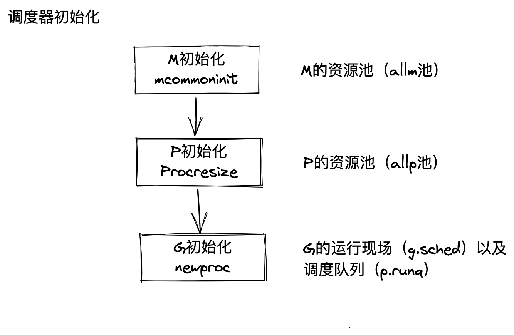
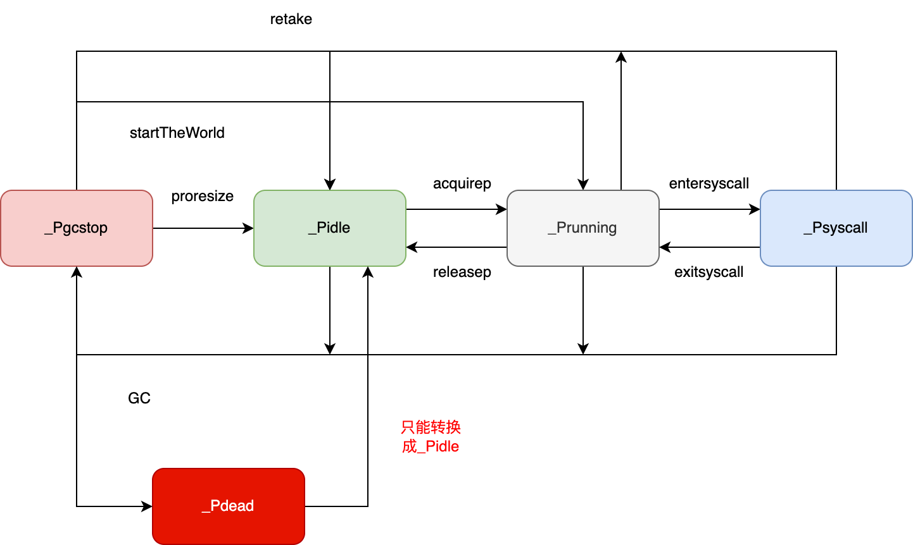
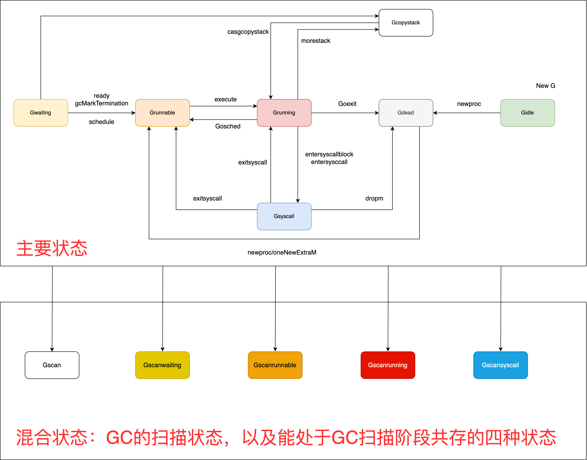
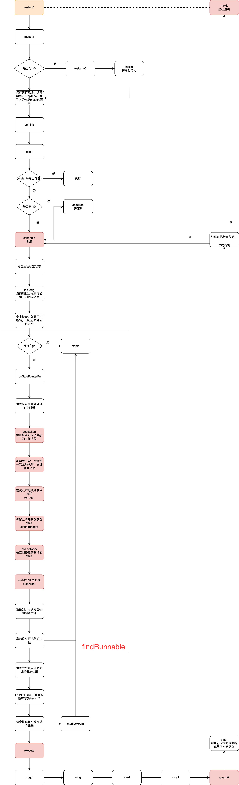

# 并发调度

## 1、工作共享和工作窃取

在工作共享中，只要处理器生成新线程，调度程序就会尝试将其中一些线程迁移到其他处理器，以期将工作分配给未充分利用的处理器。

在工作窃取中，未充分利用的处理器采取主动，它们试图从其他处理器窃取线程。

线程迁移在工作窃取中的发生频率低于工作共享，因为当所有处理器都有工作要做时，工作窃取调度程序不会迁移任何线程，但线程总是受到工作共享调度程序迁移。

## 2、MPG并发模型与并发调度单元

G：Goroutine，即在Go程序中使用go关键字创建的执行体。

M：Machine，或worker thread，即传统意义上进程的线程。

P：Processor，一种人为抽象的、用于执行Go代码被要求的局部资源。只有当M与一个P关联后才能执行Go代码。除非M发生阻塞或在进行系统调用的时间过长时，没有与之关联的P。

难点：

1、在多个M之间不使用屏障的情况下，得出调度器中多个M的全局状态是不可能的。

2、为了获得最佳的线程管理，我们必须获得未来的信息，即当一个新的G即将就绪时，则不再暂停一个工作线程。

三种平凡的做法：

1、集中式管理所有状态

这种做法是不可取的，在多个并发实体之间集中管理所有状态这一共享资源，需要锁的支持，当并发实体的数量增大时，将限制调度器的可扩展性。

2、每当需要就绪一个G1时，都让出一个P，直接切换出G2，再开始一个M来执行G2。

因为开始的M可能在下一个瞬间又没有调度任务，则会发生线程颠簸，进而又需要停止这个线程。

另一方面，我们希望在相同的线程内保存维护G，这种方式还会破坏计算的局部性原理。

3、任何时候当就绪一个G，也存在一个空闲的P时，都开始一个额外的线程，不进行切换。

因为这个额外线程会在没有检查任何工作的情况下立即进行停止，最终导致大量M的停止和开始行为，产生大量开销。

### 目前的Go的调度器实现中设计了工作线程的自旋状态

1、如果一个工作线程的本地队列、全局运行队列或网络轮询器中均没有可调度的任务，则该线程为自旋线程。

2、满足该条件、被开始的线程也被称为自旋线程，对于这种线程，运行时不做任何事情。

自旋线程在进行停止之前，会尝试从任务队列中寻找任务。当发现任务时，则会切换成非自旋状态，开始执行协程，找不到任务时，会停止。

当一个 Goroutine 准备就绪时，会首先检查自旋线程的数量，而不是去复始一个新的线程。

如果最后一个自旋线程发现工作并且停止自旋时，则复始一个新的自旋线程。 这个方法消除了不合理的线程复始峰值，且同时保证最终的最大 CPU 并行度利用率。

我们可以通过下图来直观理解工作线程的状态转换：

```
  如果存在空闲的 P，且存在暂止的 M，并就绪 G
          +------+
          v      |
执行 --> 自旋 --> 暂止
 ^        |
 +--------+
  如果发现工作
```

总的来说，调度器的方式可以概括为： **如果存在一个空闲的 P 并且没有自旋状态的工作线程 M，则当就绪一个 G 时，就复始一个额外的线程 M。** 这个方法消除了不合理的线程复始峰值，且同时保证最终的最大 CPU 并行度利用率。

这种设计的实现复杂性表现在进行自旋与非自旋线程状态转换时必须非常小心。 这种转换在提交一个新的 G 时发生竞争，最终导致任何一个工作线程都需要暂止对方。 如果双方均发生失败，则会以半静态 CPU 利用不足而结束调度。

因此，就绪一个 G 的通用流程为：

- 提交一个 G 到 per-P 的本地工作队列
- 执行 StoreLoad 风格的写屏障
- 检查 `sched.nmspinning` 数量

而从自旋到非自旋转换的一般流程为：

- 减少 `nmspinning` 的数量
- 执行 StoreLoad 风格的写屏障
- 在所有 per-P 本地任务队列检查新的工作

当然，此种复杂性在全局任务队列对全局队列并不适用的，因为当给一个全局队列提交工作时， 不进行线程的复始操作。

## 3、主要结构

### M的结构

M 是 OS 线程的实体。我们介绍几个比较重要的字段，包括：

- 持有用于执行调度器的 g0
- 持有用于信号处理的 gsignal
- 持有线程本地存储 tls
- 持有当前正在运行的 curg
- 持有运行 Goroutine 时需要的本地资源 p
- 表示自身的自旋和非自旋状态 spining
- 管理在它身上执行的 cgo 调用
- 将自己与其他的 M 进行串联
- 持有当前线程上进行内存分配的本地缓存 mcache

等等其他五十多个字段，包括关于 M 的一些调度统计、调试信息等。

```go
// src/runtime/runtime2.go
type m struct {
    g0      *g     // goroutine with scheduling stack 执行调度指令的协程
    morebuf gobuf  // gobuf arg to morestack
    divmod  uint32 // div/mod denominator for arm - known to liblink
    _       uint32 // align next field to 8 bytes

    // Fields not known to debuggers.
    procid        uint64            // for debuggers, but offset not hard-coded
    gsignal       *g                // signal-handling g 处理signal的g
    goSigStack    gsignalStack      // Go-allocated signal handling stack
    sigmask       sigset            // storage for saved signal mask
    tls           [tlsSlots]uintptr // thread-local storage (for x86 extern register) 线程本地存储
    mstartfn      func()
    curg          *g       // current running goroutine 当前正在运行的协程
    caughtsig     guintptr // goroutine running during fatal signal
    p             puintptr // attached p for executing go code (nil if not executing go code) 执行go代码时持有的p
    nextp         puintptr
    oldp          puintptr // the p that was attached before executing a syscall
    id            int64
    mallocing     int32
    throwing      throwType
    preemptoff    string // if != "", keep curg running on this m
    locks         int32
    dying         int32
    profilehz     int32
    spinning      bool // m is out of work and is actively looking for work m 当前没有运行 work 且正处于寻找 work 的活跃状态
    blocked       bool // m is blocked on a note
    newSigstack   bool // minit on C thread called sigaltstack
    printlock     int8
    incgo         bool          // m is executing a cgo call
    isextra       bool          // m is an extra m
    freeWait      atomic.Uint32 // Whether it is safe to free g0 and delete m (one of freeMRef, freeMStack, freeMWait)
    fastrand      uint64
    needextram    bool
    traceback     uint8
    ncgocall      uint64        // number of cgo calls in total
    ncgo          int32         // number of cgo calls currently in progress
    cgoCallersUse atomic.Uint32 // if non-zero, cgoCallers in use temporarily
    cgoCallers    *cgoCallers   // cgo traceback if crashing in cgo call cgo 调用崩溃的 cgo 回溯
    park          note
    alllink       *m // on allm 在 allm 上
    schedlink     muintptr
    lockedg       guintptr
    createstack   [32]uintptr // stack that created this thread.
    lockedExt     uint32      // tracking for external LockOSThread
    lockedInt     uint32      // tracking for internal lockOSThread
    nextwaitm     muintptr    // next m waiting for lock
    waitunlockf   func(*g, unsafe.Pointer) bool
    waitlock      unsafe.Pointer
    waittraceev   byte
    waittraceskip int
    startingtrace bool
    syscalltick   uint32
    freelink      *m // on sched.freem

    // these are here because they are too large to be on the stack
    // of low-level NOSPLIT functions.
    libcall   libcall
    libcallpc uintptr // for cpu profiler
    libcallsp uintptr
    libcallg  guintptr
    syscall   libcall // stores syscall parameters on windows

    vdsoSP uintptr // SP for traceback while in VDSO call (0 if not in call)
    vdsoPC uintptr // PC for traceback while in VDSO call

    // preemptGen counts the number of completed preemption
    // signals. This is used to detect when a preemption is
    // requested, but fails.
    preemptGen atomic.Uint32

    // Whether this is a pending preemption signal on this M.
    signalPending atomic.Uint32

    dlogPerM

    mOS

    // Up to 10 locks held by this m, maintained by the lock ranking code.
    locksHeldLen int
    locksHeld    [10]heldLockInfo
}
```

### P的结构

P 只是处理器的抽象，而非处理器本身，它存在的意义在于实现工作窃取（work stealing）算法。 简单来说，每个 P 持有一个 G 的本地队列。

<span style='color: red'>P 是 M 执行 Goroutine 所需的资源。</span>

P会管理本地的协程队列以及与M之间的任务分配。

在没有 P 的情况下，所有的 G 只能放在一个全局的队列中。 当 M 执行完 G 而没有 G 可执行时，必须将队列锁住从而取值。

当引入了 P 之后，P 持有 G 的本地队列，而持有 P 的 M 执行完 G 后在 P 本地队列中没有 发现其他 G 可以执行时，虽然仍然会先检查全局队列、网络，但这时增加了一个从其他 P 的 队列偷取（steal）一个 G 来执行的过程。优先级为本地 > 全局 > 网络 > 偷取。

```go
type p struct {
    id          int32
    status      uint32 // one of pidle/prunning/... p的状态
    link        puintptr
    schedtick   uint32     // incremented on every scheduler call
    syscalltick uint32     // incremented on every system call
    sysmontick  sysmontick // last tick observed by sysmon
    m           muintptr   // back-link to associated m (nil if idle) 反向链接到关联的M
    mcache      *mcache
    pcache      pageCache
    raceprocctx uintptr

    // 不同大小的本地defer池
    deferpool    []*_defer // pool of available defer structs (see panic.go) // 不同大小的可用的 defer 结构池
    deferpoolbuf [32]*_defer

    // Cache of goroutine ids, amortizes accesses to runtime·sched.goidgen.
    goidcache    uint64
    goidcacheend uint64

    // Queue of runnable goroutines. Accessed without lock.
    // 可运行的 Goroutine 队列，可无锁访问
    runqhead uint32
    runqtail uint32
    runq     [256]guintptr
    // runnext, if non-nil, is a runnable G that was ready'd by
    // the current G and should be run next instead of what's in
    // runq if there's time remaining in the running G's time
    // slice. It will inherit the time left in the current time
    // slice. If a set of goroutines is locked in a
    // communicate-and-wait pattern, this schedules that set as a
    // unit and eliminates the (potentially large) scheduling
    // latency that otherwise arises from adding the ready'd
    // goroutines to the end of the run queue.
    //
    // Note that while other P's may atomically CAS this to zero,
    // only the owner P can CAS it to a valid G.
    runnext guintptr

    // Available G's (status == Gdead)
    gFree struct {
        gList
        n int32
    }

    sudogcache []*sudog
    sudogbuf   [128]*sudog

    // Cache of mspan objects from the heap.
    mspancache struct {
        // We need an explicit length here because this field is used
        // in allocation codepaths where write barriers are not allowed,
        // and eliminating the write barrier/keeping it eliminated from
        // slice updates is tricky, moreso than just managing the length
        // ourselves.
        len int
        buf [128]*mspan
    }

    tracebuf traceBufPtr

    // traceSweep indicates the sweep events should be traced.
    // This is used to defer the sweep start event until a span
    // has actually been swept.
    traceSweep bool
    // traceSwept and traceReclaimed track the number of bytes
    // swept and reclaimed by sweeping in the current sweep loop.
    traceSwept, traceReclaimed uintptr

    palloc persistentAlloc // per-P to avoid mutex

    // The when field of the first entry on the timer heap.
    // This is 0 if the timer heap is empty.
    timer0When atomic.Int64

    // The earliest known nextwhen field of a timer with
    // timerModifiedEarlier status. Because the timer may have been
    // modified again, there need not be any timer with this value.
    // This is 0 if there are no timerModifiedEarlier timers.
    timerModifiedEarliest atomic.Int64

    // Per-P GC state
    gcAssistTime         int64 // Nanoseconds in assistAlloc
    gcFractionalMarkTime int64 // Nanoseconds in fractional mark worker (atomic)

    // limiterEvent tracks events for the GC CPU limiter.
    limiterEvent limiterEvent

    // gcMarkWorkerMode is the mode for the next mark worker to run in.
    // That is, this is used to communicate with the worker goroutine
    // selected for immediate execution by
    // gcController.findRunnableGCWorker. When scheduling other goroutines,
    // this field must be set to gcMarkWorkerNotWorker.
    gcMarkWorkerMode gcMarkWorkerMode
    // gcMarkWorkerStartTime is the nanotime() at which the most recent
    // mark worker started.
    gcMarkWorkerStartTime int64

    // gcw is this P's GC work buffer cache. The work buffer is
    // filled by write barriers, drained by mutator assists, and
    // disposed on certain GC state transitions.
    gcw gcWork

    // wbBuf is this P's GC write barrier buffer.
    //
    // TODO: Consider caching this in the running G.
    wbBuf wbBuf

    runSafePointFn uint32 // if 1, run sched.safePointFn at next safe point

    // statsSeq is a counter indicating whether this P is currently
    // writing any stats. Its value is even when not, odd when it is.
    statsSeq atomic.Uint32

    // Lock for timers. We normally access the timers while running
    // on this P, but the scheduler can also do it from a different P.
    timersLock mutex

    // Actions to take at some time. This is used to implement the
    // standard library's time package.
    // Must hold timersLock to access.
    timers []*timer

    // Number of timers in P's heap.
    numTimers atomic.Uint32

    // Number of timerDeleted timers in P's heap.
    deletedTimers atomic.Uint32

    // Race context used while executing timer functions.
    timerRaceCtx uintptr

    // maxStackScanDelta accumulates the amount of stack space held by
    // live goroutines (i.e. those eligible for stack scanning).
    // Flushed to gcController.maxStackScan once maxStackScanSlack
    // or -maxStackScanSlack is reached.
    maxStackScanDelta int64

    // gc-time statistics about current goroutines
    // Note that this differs from maxStackScan in that this
    // accumulates the actual stack observed to be used at GC time (hi - sp),
    // not an instantaneous measure of the total stack size that might need
    // to be scanned (hi - lo).
    scannedStackSize uint64 // stack size of goroutines scanned by this P
    scannedStacks    uint64 // number of goroutines scanned by this P

    // preempt is set to indicate that this P should be enter the
    // scheduler ASAP (regardless of what G is running on it).
    preempt bool

    // pageTraceBuf is a buffer for writing out page allocation/free/scavenge traces.
    //
    // Used only if GOEXPERIMENT=pagetrace.
    pageTraceBuf pageTraceBuf

    // Padding is no longer needed. False sharing is now not a worry because p is large enough
    // that its size class is an integer multiple of the cache line size (for any of our architectures).
}
```

### G的结构

G是协程，必然需要定义自身的执行栈。

将需要执行的函数参数进行了拷贝，保存了要执行的函数体的入口地址，用于执行。

```go
type g struct {
    // Stack parameters.
    // stack describes the actual stack memory: [stack.lo, stack.hi).
    // stackguard0 is the stack pointer compared in the Go stack growth prologue.
    // It is stack.lo+StackGuard normally, but can be StackPreempt to trigger a preemption.
    // stackguard1 is the stack pointer compared in the C stack growth prologue.
    // It is stack.lo+StackGuard on g0 and gsignal stacks.
    // It is ~0 on other goroutine stacks, to trigger a call to morestackc (and crash).
    stack       stack   // offset known to runtime/cgo 栈内存
    stackguard0 uintptr // offset known to liblink
    stackguard1 uintptr // offset known to liblink

    _panic    *_panic // innermost panic - offset known to liblink
    _defer    *_defer // innermost defer
    m         *m      // current m; offset known to arm liblink 当前m
    sched     gobuf
    syscallsp uintptr // if status==Gsyscall, syscallsp = sched.sp to use during gc
    syscallpc uintptr // if status==Gsyscall, syscallpc = sched.pc to use during gc
    stktopsp  uintptr // expected sp at top of stack, to check in traceback // 期望 sp 位于栈顶，用于回溯检查
    // param is a generic pointer parameter field used to pass
    // values in particular contexts where other storage for the
    // parameter would be difficult to find. It is currently used
    // in three ways:
    // 1. When a channel operation wakes up a blocked goroutine, it sets param to
    //    point to the sudog of the completed blocking operation.
    // 2. By gcAssistAlloc1 to signal back to its caller that the goroutine completed
    //    the GC cycle. It is unsafe to do so in any other way, because the goroutine's
    //    stack may have moved in the meantime.
    // 3. By debugCallWrap to pass parameters to a new goroutine because allocating a
    //    closure in the runtime is forbidden.
    param        unsafe.Pointer // wakeup 唤醒时候传递的参数
    atomicstatus atomic.Uint32
    stackLock    uint32 // sigprof/scang lock; TODO: fold in to atomicstatus
    goid         uint64
    schedlink    guintptr
    waitsince    int64      // approx time when the g become blocked
    waitreason   waitReason // if status==Gwaiting

    preempt       bool // preemption signal, duplicates stackguard0 = stackpreempt // 抢占信号，stackguard0 = stackpreempt 的副本
    preemptStop   bool // transition to _Gpreempted on preemption; otherwise, just deschedule
    preemptShrink bool // shrink stack at synchronous safe point

    // asyncSafePoint is set if g is stopped at an asynchronous
    // safe point. This means there are frames on the stack
    // without precise pointer information.
    asyncSafePoint bool

    paniconfault bool // panic (instead of crash) on unexpected fault address
    gcscandone   bool // g has scanned stack; protected by _Gscan bit in status
    throwsplit   bool // must not split stack
    // activeStackChans indicates that there are unlocked channels
    // pointing into this goroutine's stack. If true, stack
    // copying needs to acquire channel locks to protect these
    // areas of the stack.
    activeStackChans bool
    // parkingOnChan indicates that the goroutine is about to
    // park on a chansend or chanrecv. Used to signal an unsafe point
    // for stack shrinking.
    parkingOnChan atomic.Bool

    raceignore     int8     // ignore race detection events
    sysblocktraced bool     // StartTrace has emitted EvGoInSyscall about this goroutine
    tracking       bool     // whether we're tracking this G for sched latency statistics
    trackingSeq    uint8    // used to decide whether to track this G
    trackingStamp  int64    // timestamp of when the G last started being tracked
    runnableTime   int64    // the amount of time spent runnable, cleared when running, only used when tracking
    sysexitticks   int64    // cputicks when syscall has returned (for tracing)
    traceseq       uint64   // trace event sequencer
    tracelastp     puintptr // last P emitted an event for this goroutine
    lockedm        muintptr
    sig            uint32
    writebuf       []byte
    sigcode0       uintptr
    sigcode1       uintptr
    sigpc          uintptr
    gopc           uintptr         // pc of go statement that created this goroutine
    ancestors      *[]ancestorInfo // ancestor information goroutine(s) that created this goroutine (only used if debug.tracebackancestors)
    startpc        uintptr         // pc of goroutine function
    racectx        uintptr
    waiting        *sudog         // sudog structures this g is waiting on (that have a valid elem ptr); in lock order
    cgoCtxt        []uintptr      // cgo traceback context
    labels         unsafe.Pointer // profiler labels
    timer          *timer         // cached timer for time.Sleep // 为 time.Sleep 缓存的计时器
    selectDone     atomic.Uint32  // are we participating in a select and did someone win the race?

    // goroutineProfiled indicates the status of this goroutine's stack for the
    // current in-progress goroutine profile
    goroutineProfiled goroutineProfileStateHolder

    // Per-G GC state

    // gcAssistBytes is this G's GC assist credit in terms of
    // bytes allocated. If this is positive, then the G has credit
    // to allocate gcAssistBytes bytes without assisting. If this
    // is negative, then the G must correct this by performing
    // scan work. We track this in bytes to make it fast to update
    // and check for debt in the malloc hot path. The assist ratio
    // determines how this corresponds to scan work debt.
    gcAssistBytes int64
}
```

### 调度器结构

调度器，所有 Goroutine 被调度的核心，存放了调度器持有的全局资源，访问这些资源需要持有锁：

- 管理了能够将 G 和 M 进行绑定的 M 队列
- 管理了空闲的 P 链表（队列）
- 管理了 G 的全局队列
- 管理了可被复用的 G 的全局缓存
- 管理了 defer 池

```go
type schedt struct {
    goidgen   atomic.Uint64
    lastpoll  atomic.Int64 // time of last network poll, 0 if currently polling
    pollUntil atomic.Int64 // time to which current poll is sleeping

    lock mutex

    // When increasing nmidle, nmidlelocked, nmsys, or nmfreed, be
    // sure to call checkdead().

    midle        muintptr // idle m's waiting for work
    nmidle       int32    // number of idle m's waiting for work
    nmidlelocked int32    // number of locked m's waiting for work
    mnext        int64    // number of m's that have been created and next M ID
    maxmcount    int32    // maximum number of m's allowed (or die)
    nmsys        int32    // number of system m's not counted for deadlock
    nmfreed      int64    // cumulative number of freed m's

    ngsys atomic.Int32 // number of system goroutines

    pidle        puintptr      // idle p's 空闲 p 链表
    npidle       atomic.Int32  // 空闲 p 数量
    nmspinning   atomic.Int32  // See "Worker thread parking/unparking" comment in proc.go. // 自旋状态的 M 的数量
    needspinning atomic.Uint32 // See "Delicate dance" comment in proc.go. Boolean. Must hold sched.lock to set to 1.

    // Global runnable queue.
    runq     gQueue // 全局 runnable G 队列
    runqsize int32

    // disable controls selective disabling of the scheduler.
    //
    // Use schedEnableUser to control this.
    //
    // disable is protected by sched.lock.
    disable struct {
        // user disables scheduling of user goroutines.
        user     bool
        runnable gQueue // pending runnable Gs
        n        int32  // length of runnable
    }

    // Global cache of dead G's.
    // 有效 dead G 的全局缓存.
    gFree struct {
        lock    mutex
        stack   gList // Gs with stacks // 包含栈的 Gs
        noStack gList // Gs without stacks // 没有栈的 Gs
        n       int32
    }

    // Central cache of sudog structs.
    // sudog 结构的集中缓存
    sudoglock  mutex
    sudogcache *sudog

    // Central pool of available defer structs.
    // 不同大小的全局defer池
    deferlock mutex
    deferpool *_defer

    // freem is the list of m's waiting to be freed when their
    // m.exited is set. Linked through m.freelink.
    freem *m

    gcwaiting  atomic.Bool // gc is waiting to run
    stopwait   int32
    stopnote   note
    sysmonwait atomic.Bool
    sysmonnote note

    // safepointFn should be called on each P at the next GC
    // safepoint if p.runSafePointFn is set.
    safePointFn   func(*p)
    safePointWait int32
    safePointNote note

    profilehz int32 // cpu profiling rate

    procresizetime int64 // nanotime() of last change to gomaxprocs
    totaltime      int64 // ∫gomaxprocs dt up to procresizetime

    // sysmonlock protects sysmon's actions on the runtime.
    //
    // Acquire and hold this mutex to block sysmon from interacting
    // with the rest of the runtime.
    sysmonlock mutex

    // timeToRun is a distribution of scheduling latencies, defined
    // as the sum of time a G spends in the _Grunnable state before
    // it transitions to _Grunning.
    timeToRun timeHistogram

    // idleTime is the total CPU time Ps have "spent" idle.
    //
    // Reset on each GC cycle.
    idleTime atomic.Int64

    // totalMutexWaitTime is the sum of time goroutines have spent in _Gwaiting
    // with a waitreason of the form waitReasonSync{RW,}Mutex{R,}Lock.
    totalMutexWaitTime atomic.Int64
}
```

调度器初始化的步骤

```go
// runtime/proc.go
func schedinit() {
	_g_ := getg()
	(...)

	// M 初始化
	mcommoninit(_g_.m)
	(...)

	// P 初始化
	if procresize(procs) != nil {
		throw("unknown runnable goroutine during bootstrap")
	}
	(...)
}
```

```
TEXT runtime·rt0_go(SB),NOSPLIT,$0
	(...)
	CALL	runtime·schedinit(SB) // M, P 初始化
	MOVQ	$runtime·mainPC(SB), AX
	PUSHQ	AX
	PUSHQ	$0
	CALL	runtime·newproc(SB) // G 初始化
	POPQ	AX
	POPQ	AX
	(...)
	RET

DATA	runtime·mainPC+0(SB)/8,$runtime·main(SB)
GLOBL	runtime·mainPC(SB),RODATA,$8
```



#### M的初始化

M其实就是OS线程，它只有两个状态：自旋、非自旋。在调度器初始化阶段，只有一个M，那就是主OS线程，这时仅仅对M进行一个初步的初始化，该初始化包含对M及用于处理M信号的G的相关运算操作，未涉及工作线程的暂止和复始。

```go
// src/runtime/proc.go
func mcommoninit(mp *m, id int64) {
    gp := getg()

    // g0 stack won't make sense for user (and is not necessary unwindable).
    if gp != gp.m.g0 {
        callers(1, mp.createstack[:])
    }

    lock(&sched.lock)

    if id >= 0 {
        mp.id = id
    } else {
        mp.id = mReserveID()
    }

    lo := uint32(int64Hash(uint64(mp.id), fastrandseed))
    hi := uint32(int64Hash(uint64(cputicks()), ^fastrandseed))
    if lo|hi == 0 {
        hi = 1
    }
    // Same behavior as for 1.17.
    // TODO: Simplify ths.
    if goarch.BigEndian {
        mp.fastrand = uint64(lo)<<32 | uint64(hi)
    } else {
        mp.fastrand = uint64(hi)<<32 | uint64(lo)
    }

    // 初始化gsignal，用于处理m上的信号
    mpreinit(mp)
    if mp.gsignal != nil {
        mp.gsignal.stackguard1 = mp.gsignal.stack.lo + _StackGuard
    }

    // Add to allm so garbage collector doesn't free g->m
    // when it is just in a register or thread-local storage.
    // 添加到 allm 中，从而当它刚保存到寄存器或本地线程存储时候 GC 不会释放 g.m
    mp.alllink = allm

    // NumCgoCall() iterates over allm w/o schedlock,
    // so we need to publish it safely.
    // NumCgoCall() 会在没有使用 schedlock 时遍历 allm，等价于 allm = mp
    atomicstorep(unsafe.Pointer(&allm), unsafe.Pointer(mp))
    unlock(&sched.lock)

    // Allocate memory to hold a cgo traceback if the cgo call crashes.
    if iscgo || GOOS == "solaris" || GOOS == "illumos" || GOOS == "windows" {
        mp.cgoCallers = new(cgoCallers)
    }
}
```

#### P的初始化

通常情况下（在程序运行时不调整P的个数），P只会在四种状态下进行切换。当程序刚开始运行初始化时，所有的P都处于Pgcstop状态，随着P的初始化，会被置为Pidle状态。



当 M 需要运行时，会 `runtime.acquirep`，并通过 `runtime.releasep` 来释放。 当 G 执行时需要进入系统调用时，P 会被设置为 `_Psyscall`， 如果这个时候被系统监控抢夺（`runtime.retake`），则 P 会被重新修改为 `_Pidle`。 如果在程序运行中发生 GC，则 P 会被设置为 `_Pgcstop`， 并在 `runtime.startTheWorld` 时重新调整为 `_Pidle` 或者 `_Prunning`。

<span style='color: red'>GOMAXPROCS->startTheWorld->procresize,，在要求减少P时会调整为Pdead，否则在要求增加时会由Pdead直接调整为Pidle。</span>

procresize函数的流程：

1. 调用时已经stop the world，记录调整P的时间。
2. 按需调整allp的大小
3. 按需初始化allp中的P
4. 如果当前的P还可以继续使用，则将P设置为Prunning
5. 否则将第一个P抢过来给当前G的M进行绑定
6. 从allp移除不需要的P，将释放的P队列中的任务扔进全局队列。
7. 最后挨个检查P，将没有任务的P放入idle队列。
8. 除去当前P之外，将有任务的P彼此串联成链表，将没有任务的P放回到idle链表中。

在P初始化之前，先初始化了M，因此在初始化过程中procresize函数中绑定M会将当前的P绑定到初始M上，由于程序刚刚开始，P的队列是空的，所以他们会被链接到可运行的P链表上处于Pidle状态。

```go
// init initializes pp, which may be a freshly allocated p or a
// previously destroyed p, and transitions it to status _Pgcstop.
func (pp *p) init(id int32) {
    // p 的 id 就是它在 allp 中的索引
    pp.id = id
    // 新创建的 p 处于 _Pgcstop 状态
    pp.status = _Pgcstop
    pp.sudogcache = pp.sudogbuf[:0]
    pp.deferpool = pp.deferpoolbuf[:0]
    pp.wbBuf.reset()
    // 为P分配cache对象
    if pp.mcache == nil {
        // 如果 old == 0 且 i == 0 说明这是引导阶段初始化第一个 p
        if id == 0 {
            if mcache0 == nil {
                throw("missing mcache?")
            }
            // Use the bootstrap mcache0. Only one P will get
            // mcache0: the one with ID 0.
            pp.mcache = mcache0
        } else {
            pp.mcache = allocmcache()
        }
    }
    if raceenabled && pp.raceprocctx == 0 {
        if id == 0 {
            pp.raceprocctx = raceprocctx0
            raceprocctx0 = 0 // bootstrap
        } else {
            pp.raceprocctx = raceproccreate()
        }
    }
    lockInit(&pp.timersLock, lockRankTimers)

    // This P may get timers when it starts running. Set the mask here
    // since the P may not go through pidleget (notably P 0 on startup).
    timerpMask.set(id)
    // Similarly, we may not go through pidleget before this P starts
    // running if it is P 0 on startup.
    idlepMask.clear(id)
}

// destroy releases all of the resources associated with pp and
// transitions it to status _Pdead.
//
// sched.lock must be held and the world must be stopped.
// 释放未使用的 P，一般情况下不会执行这段代码
func (pp *p) destroy() {
    assertLockHeld(&sched.lock)
    assertWorldStopped()

    // Move all runnable goroutines to the global queue
    // 将所有 runnable Goroutine 移动至全局队列
    for pp.runqhead != pp.runqtail {
        // Pop from tail of local queue
        // 从本地队列中 pop
        pp.runqtail--
        gp := pp.runq[pp.runqtail%uint32(len(pp.runq))].ptr()
        // Push onto head of global queue
        // push 到全局队列中
        globrunqputhead(gp)
    }
    if pp.runnext != 0 {
        globrunqputhead(pp.runnext.ptr())
        pp.runnext = 0
    }
    if len(pp.timers) > 0 {
        plocal := getg().m.p.ptr()
        // The world is stopped, but we acquire timersLock to
        // protect against sysmon calling timeSleepUntil.
        // This is the only case where we hold the timersLock of
        // more than one P, so there are no deadlock concerns.
        lock(&plocal.timersLock)
        lock(&pp.timersLock)
        moveTimers(plocal, pp.timers)
        pp.timers = nil
        pp.numTimers.Store(0)
        pp.deletedTimers.Store(0)
        pp.timer0When.Store(0)
        unlock(&pp.timersLock)
        unlock(&plocal.timersLock)
    }
    // Flush p's write barrier buffer.
    if gcphase != _GCoff {
        wbBufFlush1(pp)
        pp.gcw.dispose()
    }
    for i := range pp.sudogbuf {
        pp.sudogbuf[i] = nil
    }
    pp.sudogcache = pp.sudogbuf[:0]
    for j := range pp.deferpoolbuf {
        pp.deferpoolbuf[j] = nil
    }
    pp.deferpool = pp.deferpoolbuf[:0]
    systemstack(func() {
        for i := 0; i < pp.mspancache.len; i++ {
            // Safe to call since the world is stopped.
            mheap_.spanalloc.free(unsafe.Pointer(pp.mspancache.buf[i]))
        }
        pp.mspancache.len = 0
        lock(&mheap_.lock)
        pp.pcache.flush(&mheap_.pages)
        unlock(&mheap_.lock)
    })
    freemcache(pp.mcache)
    pp.mcache = nil
    // 将当前 P 的空闲的 G 复链转移到全局
    gfpurge(pp)
    traceProcFree(pp)
    if raceenabled {
        if pp.timerRaceCtx != 0 {
            // The race detector code uses a callback to fetch
            // the proc context, so arrange for that callback
            // to see the right thing.
            // This hack only works because we are the only
            // thread running.
            mp := getg().m
            phold := mp.p.ptr()
            mp.p.set(pp)

            racectxend(pp.timerRaceCtx)
            pp.timerRaceCtx = 0

            mp.p.set(phold)
        }
        raceprocdestroy(pp.raceprocctx)
        pp.raceprocctx = 0
    }
    pp.gcAssistTime = 0
    pp.status = _Pdead
}

// Change number of processors.
//
// sched.lock must be held, and the world must be stopped.
//
// gcworkbufs must not be being modified by either the GC or the write barrier
// code, so the GC must not be running if the number of Ps actually changes.
//
// Returns list of Ps with local work, they need to be scheduled by the caller.
func procresize(nprocs int32) *p {
    assertLockHeld(&sched.lock)
    assertWorldStopped()

    // 获取之前P的个数
    old := gomaxprocs
    if old < 0 || nprocs <= 0 {
        throw("procresize: invalid arg")
    }
    if trace.enabled {
        traceGomaxprocs(nprocs)
    }

    // update statistics
    // 记录一下修改P的时间
    now := nanotime()
    if sched.procresizetime != 0 {
        sched.totaltime += int64(old) * (now - sched.procresizetime)
    }
    sched.procresizetime = now

    maskWords := (nprocs + 31) / 32

    // Grow allp if necessary.
    // 必要时增加allp
    // 这个时候本质上是在检查用户代码是否有调用过 runtime.MAXGOPROCS 调整 p 的数量
    // 此处多一步检查是为了避免内部的锁，如果 nprocs 明显小于 allp 的可见数量（因为 len）
    // 则不需要进行加锁
    if nprocs > int32(len(allp)) {
        // Synchronize with retake, which could be running
        // concurrently since it doesn't run on a P.
        // 此处与 retake 同步，它可以同时运行，因为它不会在 P 上运行。
        lock(&allpLock)
        if nprocs <= int32(cap(allp)) {
            // 如果 nprocs 被调小了，扔掉多余的 p
            allp = allp[:nprocs]
        } else {
            // 否则（调大了）创建更多的 p
            nallp := make([]*p, nprocs)
            // Copy everything up to allp's cap so we
            // never lose old allocated Ps.
            // 将原有的 p 复制到新创建的 new all p 中，不浪费旧的 p
            copy(nallp, allp[:cap(allp)])
            allp = nallp
        }

        if maskWords <= int32(cap(idlepMask)) {
            idlepMask = idlepMask[:maskWords]
            timerpMask = timerpMask[:maskWords]
        } else {
            nidlepMask := make([]uint32, maskWords)
            // No need to copy beyond len, old Ps are irrelevant.
            copy(nidlepMask, idlepMask)
            idlepMask = nidlepMask

            ntimerpMask := make([]uint32, maskWords)
            copy(ntimerpMask, timerpMask)
            timerpMask = ntimerpMask
        }
        unlock(&allpLock)
    }

    // initialize new P's
    // 初始化新的P
    for i := old; i < nprocs; i++ {
        pp := allp[i]
        // 如果P是新创建的，则申请新的P对象
        if pp == nil {
            pp = new(p)
        }
        pp.init(i)
        // allp[i] = pp
        atomicstorep(unsafe.Pointer(&allp[i]), unsafe.Pointer(pp))
    }

    gp := getg()
    if gp.m.p != 0 && gp.m.p.ptr().id < nprocs {
        // continue to use the current P
        // 继续使用当前 P
        gp.m.p.ptr().status = _Prunning
        gp.m.p.ptr().mcache.prepareForSweep()
    } else {
        // 将第一个 P 抢过来给当前 G 的 M 进行绑定
        // release the current P and acquire allp[0].
        //
        // We must do this before destroying our current P
        // because p.destroy itself has write barriers, so we
        // need to do that from a valid P.
        // 释放当前P，因为已经失效
        if gp.m.p != 0 {
            if trace.enabled {
                // Pretend that we were descheduled
                // and then scheduled again to keep
                // the trace sane.
                traceGoSched()
                traceProcStop(gp.m.p.ptr())
            }
            gp.m.p.ptr().m = 0
        }
        gp.m.p = 0
        // 更新到allp[0]
        pp := allp[0]
        pp.m = 0
        pp.status = _Pidle
        acquirep(pp) // 直接将allp[0]绑定到当前M
        if trace.enabled {
            traceGoStart()
        }
    }

    // g.m.p is now set, so we no longer need mcache0 for bootstrapping.
    mcache0 = nil

    // release resources from unused P's
    // 从未使用的P释放资源
    for i := nprocs; i < old; i++ {
        pp := allp[i]
        pp.destroy()
        // can't free P itself because it can be referenced by an M in syscall
        // 不能释放 p 本身，因为他可能在 m 进入系统调用时被引用
    }

    // Trim allp.
    // 清理完毕后，修剪 allp, nprocs 个数之外的所有 P
    if int32(len(allp)) != nprocs {
        lock(&allpLock)
        allp = allp[:nprocs]
        idlepMask = idlepMask[:maskWords]
        timerpMask = timerpMask[:maskWords]
        unlock(&allpLock)
    }

    // 将没有本地任务的 P 放到空闲链表中
    var runnablePs *p
    for i := nprocs - 1; i >= 0; i-- {
        pp := allp[i]
        // 确保不是当前正在使用的 P
        if gp.m.p.ptr() == pp {
            continue
        }
        // 将 p 设为 idle
        pp.status = _Pidle
        if runqempty(pp) {
            // 放入 idle 链表
            pidleput(pp, now)
        } else {
            // 如果有本地任务，则为其绑定一个 M
            pp.m.set(mget())
            // 构建可运行的 p 链表
            pp.link.set(runnablePs)
            runnablePs = pp
        }
    }
    stealOrder.reset(uint32(nprocs))
    // gomaxprocs = nprocs
    var int32p *int32 = &gomaxprocs // make compiler check that gomaxprocs is an int32
    atomic.Store((*uint32)(unsafe.Pointer(int32p)), uint32(nprocs))
    if old != nprocs {
        // Notify the limiter that the amount of procs has changed.
        gcCPULimiter.resetCapacity(now, nprocs)
    }
    // 返回所有包含本地任务的 P 链表
    return runnablePs
}
```

为了向用户层提供对调度器的控制，runtime包中提供了一些方法达到了这一目的。

大部分的时间里，P的数量不会被动态调整的。但是runtime.GOMAXPROCS能够在运行时动态调整P的数量。

```go
// src/runtime/debug.go
// GOMAXPROCS sets the maximum number of CPUs that can be executing
// simultaneously and returns the previous setting. It defaults to
// the value of runtime.NumCPU. If n < 1, it does not change the current setting.
// This call will go away when the scheduler improves.
// GOMAXPROCS 设置可以同时执行的 CPU 的最大数量并返回之前的设置。
// 它默认为runtime.NumCPU 的值。如果 n < 1，则不会更改当前设置。
// 当调度程序改进时，这个调用就会消失。
func GOMAXPROCS(n int) int {
    if GOARCH == "wasm" && n > 1 {
        n = 1 // WebAssembly has no threads yet, so only one CPU is possible.
    }

    // 当调整 P 的数量时，调度器会被锁住
    lock(&sched.lock)
    ret := int(gomaxprocs)
    unlock(&sched.lock)
    if n <= 0 || n == ret {
        return ret
    }

    // 停止一切事物，将 STW 的原因设置为 P 被调整
    stopTheWorldGC("GOMAXPROCS")

    // newprocs will be processed by startTheWorld
    // STW 后，修改 P 的数量
    newprocs = int32(n)

    // 重新恢复
    // 在这个过程中，startTheWorld 会调用 procresize 进而动态的调整 P 的数量
    startTheWorldGC()
    return ret
}
```

#### G的初始化

在P初始化完成后，主协程会以被调度器调度的方式进行运行，这将由`runtime.newproc` 来完成主 Goroutine 的初始化工作。

G的各种工作状态转换



初始化过程：

1. 首先尝试从 P 本地 gfree 链表或全局 gfree 队列获取已经执行过的 g
2. 初始化过程中程序无论是本地队列还是全局队列都不可能获取到 g，因此创建一个新的 g，并为其分配运行线程（执行栈），这时 g 处于 `_Gidle` 状态
3. 创建完成后，g 被更改为 `_Gdead` 状态，并根据要执行函数的入口地址和参数，初始化执行栈的 SP 和参数的入栈位置
4. 根据 SP、参数，在 `g.sched` 中保存 SP 和 PC 指针来初始化 g 的运行现场
5. 将调用方、要执行的函数的入口 PC 进行保存，并将 g 的状态更改为 `_Grunnable`
6. 给 Goroutine 分配 id，并将其放入 P 本地队列的队头或全局队列（初始化阶段队列肯定不是满的，因此不可能放入全局队列）
7. 检查空闲的 P，将其唤醒，准备执行 G，但我们目前处于初始化阶段，主 Goroutine 尚未开始执行，因此这里不会唤醒 P。

```go
// Create a new g running fn.
// Put it on the queue of g's waiting to run.
// The compiler turns a go statement into a call to this.
// 创建一个新的g去运行方法
func newproc(fn *funcval) {
    // 获取当前正在执行的G
    gp := getg()
    // 获取调用者的程序计数器PC，用于调试和跟踪
    pc := getcallerpc()
    systemstack(func() {
        newg := newproc1(fn, gp, pc)

        // 获取当前的P
        pp := getg().m.p.ptr()
        // 将新创建的协程放入处理器的运行队列
        // next为true表示放在队列尾部
        runqput(pp, newg, true)

        // 如果程序已经启动（main函数已经开始运行）
        // 唤醒正在休眠的处理器来处理新加入的协程
        if mainStarted {
            wakep()
        }
    })
}

// Create a new g in state _Grunnable, starting at fn. callerpc is the
// address of the go statement that created this. The caller is responsible
// for adding the new g to the scheduler.
// 创建一个处于可运行状态的G来运行函数
func newproc1(fn *funcval, callergp *g, callerpc uintptr) *g {
    if fn == nil {
        fatal("go of nil func value")
    }

    mp := acquirem() // disable preemption because we hold M and P in local vars.
    pp := mp.p.ptr()
    // 根据P获取一个空闲的g
    newg := gfget(pp)
    // 初始化阶段，gfget 是不可能找到 g 的
    // 也可能运行中本来就已经耗尽了
    if newg == nil {
        // 创建一个拥有 _StackMin 大小的栈的 g
        newg = malg(_StackMin)
        // 将新创建的 g 从 _Gidle 更新为 _Gdead 状态
        casgstatus(newg, _Gidle, _Gdead)
        // 将 Gdead 状态的 g 添加到 allg，这样 GC 不会扫描未初始化的栈
        allgadd(newg) // publishes with a g->status of Gdead so GC scanner doesn't look at uninitialized stack.
    }
    if newg.stack.hi == 0 {
        throw("newproc1: newg missing stack")
    }

    if readgstatus(newg) != _Gdead {
        throw("newproc1: new g is not Gdead")
    }

    // 计算运行空间的大小
    totalSize := uintptr(4*goarch.PtrSize + sys.MinFrameSize) // extra space in case of reads slightly beyond frame
    totalSize = alignUp(totalSize, sys.StackAlign)
    // 确定 sp 和参数入栈位置
    sp := newg.stack.hi - totalSize
    spArg := sp
    if usesLR {
        // caller's LR
        *(*uintptr)(unsafe.Pointer(sp)) = 0
        prepGoExitFrame(sp)
        spArg += sys.MinFrameSize
    }

    // 清理创建并初始化g的运行现场
    memclrNoHeapPointers(unsafe.Pointer(&newg.sched), unsafe.Sizeof(newg.sched))
    newg.sched.sp = sp
    newg.stktopsp = sp
    newg.sched.pc = abi.FuncPCABI0(goexit) + sys.PCQuantum // +PCQuantum so that previous instruction is in same function
    newg.sched.g = guintptr(unsafe.Pointer(newg))
    gostartcallfn(&newg.sched, fn)
    // 初始化g的基本状态
    newg.gopc = callerpc
    newg.ancestors = saveAncestors(callergp) // 调试相关，追踪调用方
    newg.startpc = fn.fn                     // 入口pc
    // 判断是否是系统协程
    if isSystemGoroutine(newg, false) {
        sched.ngsys.Add(1)
    } else {
        // Only user goroutines inherit pprof labels.
        if mp.curg != nil {
            newg.labels = mp.curg.labels
        }
        if goroutineProfile.active {
            // A concurrent goroutine profile is running. It should include
            // exactly the set of goroutines that were alive when the goroutine
            // profiler first stopped the world. That does not include newg, so
            // mark it as not needing a profile before transitioning it from
            // _Gdead.
            newg.goroutineProfiled.Store(goroutineProfileSatisfied)
        }
    }
    // Track initial transition?
    newg.trackingSeq = uint8(fastrand())
    if newg.trackingSeq%gTrackingPeriod == 0 {
        newg.tracking = true
    }
    // 将g更换为可运行状态
    casgstatus(newg, _Gdead, _Grunnable)
    gcController.addScannableStack(pp, int64(newg.stack.hi-newg.stack.lo))

    // 分配goid
    if pp.goidcache == pp.goidcacheend {
        // Sched.goidgen is the last allocated id,
        // this batch must be [sched.goidgen+1, sched.goidgen+GoidCacheBatch].
        // At startup sched.goidgen=0, so main goroutine receives goid=1.
        // Sched.goidgen 为最后一个分配的 id，相当于一个全局计数器
        // 这一批必须为 [sched.goidgen+1, sched.goidgen+GoidCacheBatch].
        // 启动时 sched.goidgen=0, 因此主 Goroutine 的 goid 为 1
        pp.goidcache = sched.goidgen.Add(_GoidCacheBatch)
        pp.goidcache -= _GoidCacheBatch - 1
        pp.goidcacheend = pp.goidcache + _GoidCacheBatch
    }
    newg.goid = pp.goidcache
    pp.goidcache++
    if raceenabled {
        newg.racectx = racegostart(callerpc)
        newg.raceignore = 0
        if newg.labels != nil {
            // See note in proflabel.go on labelSync's role in synchronizing
            // with the reads in the signal handler.
            racereleasemergeg(newg, unsafe.Pointer(&labelSync))
        }
    }
    if trace.enabled {
        traceGoCreate(newg, newg.startpc)
    }
    releasem(mp)

    // 返回新创建的g
    return newg
}
```

在调度器的初始化过程中，首先通过 `mcommoninit` 对 M 的信号 G 进行初始化。 而后通过 `procresize` 创建与 CPU 核心数 (或与用户指定的 GOMAXPROCS) 相同的 P。 最后通过 `newproc` 创建包含可以运行要执行函数的执行栈、运行现场的 G，并将创建的 G 放入刚创建好的 P 的本地可运行队列（第一个入队的 G，也就是主 Goroutine 要执行的函数体）， 完成 G 的创建。

## 4、调度循环

在初始化中，G的栈边界是还没有初始化的，因此需要在调度开始前计算栈边界。

mstart0是所有新创建的M的起点。

<span style='color: red'>Goroutine通常使用Go运行时分配的栈，而g0使用操作系统分配的栈。g0是每个M上的特殊协程，专门用于执行系统任务，如垃圾回收，调度等</span>

```go
// mstart0 is the Go entry-point for new Ms.
// This must not split the stack because we may not even have stack
// bounds set up yet.
//
// May run during STW (because it doesn't have a P yet), so write
// barriers are not allowed.
//
//go:nosplit
//go:nowritebarrierrec
func mstart0() {
    gp := getg()

    // 开始确定执行栈的边界了
    // 通过检查 g 执行栈的边界来确定是否为系统栈
    osStack := gp.stack.lo == 0
    if osStack {
        // Initialize stack bounds from system stack.
        // Cgo may have left stack size in stack.hi.
        // minit may update the stack bounds.
        //
        // Note: these bounds may not be very accurate.
        // We set hi to &size, but there are things above
        // it. The 1024 is supposed to compensate this,
        // but is somewhat arbitrary.
        // 系统栈需要手动设置栈的高低边界
        size := gp.stack.hi
        if size == 0 {
            // 栈的大小默认设置为 8192 * sys.StackGuardMultiplier
            size = 8192 * sys.StackGuardMultiplier
        }
        // 高地址边界 gp.stack.hi 设置为当前栈的高地址。
        gp.stack.hi = uintptr(noescape(unsafe.Pointer(&size)))
        // 调整低地址边界 gp.stack.lo。
        gp.stack.lo = gp.stack.hi - size + 1024
    }
    // Initialize stack guard so that we can start calling regular
    // Go code.
    // 初始化堆栈保护，以便我们可以开始调用常规 Go 代码。
    // 计算栈的保护边界
    // gp.stackguard0 和 gp.stackguard1 都设置为距离栈底一定距离（_StackGuard）的位置，
    // 这保证了在栈空间不足时能够检测到栈溢出并处理。
    gp.stackguard0 = gp.stack.lo + _StackGuard
    // This is the g0, so we can also call go:systemstack
    // functions, which check stackguard1.
    // 这是 g0，因此我们还可以调用 go:systemstack 函数来检查 stackguard1。
    gp.stackguard1 = gp.stackguard0
    // 启动
    mstart1()

    // Exit this thread.
    if mStackIsSystemAllocated() {
        // Windows, Solaris, illumos, Darwin, AIX and Plan 9 always system-allocate
        // the stack, but put it in gp.stack before mstart,
        // so the logic above hasn't set osStack yet.
        // 根据系统栈的情况，推出线程
        osStack = true
    }
    // 退出线程
    mexit(osStack)
}
```

```go
// The go:noinline is to guarantee the getcallerpc/getcallersp below are safe,
// so that we can set up g0.sched to return to the call of mstart1 above.
//
//go:noinline
func mstart1() {
    gp := getg()

    // 检查是否为g0
    if gp != gp.m.g0 {
        throw("bad runtime·mstart")
    }

    // Set up m.g0.sched as a label returning to just
    // after the mstart1 call in mstart0 above, for use by goexit0 and mcall.
    // We're never coming back to mstart1 after we call schedule,
    // so other calls can reuse the current frame.
    // And goexit0 does a gogo that needs to return from mstart1
    // and let mstart0 exit the thread.
    // 为了在 mcall 的栈顶使用调用方来结束当前线程，做记录
    // 当进入 schedule 之后，我们再也不会回到 mstart1，所以其他调用可以复用当前帧。
    // 设置 g0 的 sched 字段（调度信息），以便稍后在需要时可以从当前的栈帧返回
    // g0.sched.pc 设置为调用 mstart1 时的调用地址。
    // g0.sched.sp 设置为当前栈的指针。
    // 这些设置确保在 goexit0 或 mcall 函数调用时，M 可以正确地返回并让 mstart0 退出当前线程。
    gp.sched.g = guintptr(unsafe.Pointer(gp))
    gp.sched.pc = getcallerpc()
    gp.sched.sp = getcallersp()

    // 汇编层面的初始化工作
    asminit()
    // minit() 是用于初始化 M 的平台相关设置，确保当前线程可以处理 Go 运行时所需的环境和信号。
    minit()

    // Install signal handlers; after minit so that minit can
    // prepare the thread to be able to handle the signals.
    // 设置信号 handler；在 minit 之后，因为 minit 可以准备处理信号的的线程
    // 处理信号处理程序 (mstartm0)：
    if gp.m == &m0 {
        mstartm0()
    }

    // 执行启动函数
    // 一个可选的初始化函数，可以在 M 启动时执行。
    if fn := gp.m.mstartfn; fn != nil {
        fn()
    }

    // 如果当前 m 并非 m0，则要求绑定 p
    if gp.m != &m0 {
        // 绑定 p
        acquirep(gp.m.nextp.ptr())
        gp.m.nextp = 0
    }
    // 彻底准备好，开始调度，永不返回
    // 进入 Go 的调度循环。调度器会选择待执行的 Goroutine 并在当前的 M 上运行它。
    // 这是一个死循环，执行后永不返回，因此 M 将一直在调度 Goroutine。
    schedule()
}
```

- mstart除了在程序引导阶段会被运行之外，也可能在每个m被创建时运行。
- mstart进入mstart1之后，会初始化自身用于信号处理的g
- 调度循环 `schedule` 无法返回，因此最后一个 `mexit` 目前还不会被执行，因此当下所有的 Go 程序创建的线程都无法被释放 （只有一个特例，当使用 `runtime.LockOSThread` 锁住的 G 退出时会使用 `gogo` 退出 M

### M与P的绑定

M 与 P 的绑定过程只是简单的将 P 链表中的 P ，保存到 M 中的 P 指针上。 绑定前，P 的状态一定是 `_Pidle`，绑定后 P 的状态一定为 `_Prunning`。

```go

// Associate p and the current m.
//
// This function is allowed to have write barriers even if the caller
// isn't because it immediately acquires pp.
//
// 将 p 和当前 m 关联起来。即使调用者没有，该函数也可以有写屏障，因为它立即获取 pp。
//go:yeswritebarrierrec
func acquirep(pp *p) {
    // Do the part that isn't allowed to have write barriers.
    wirep(pp)

    // Have p; write barriers now allowed.

    // Perform deferred mcache flush before this P can allocate
    // from a potentially stale mcache.
    pp.mcache.prepareForSweep()

    if trace.enabled {
        traceProcStart()
    }
}

// wirep is the first step of acquirep, which actually associates the
// current M to pp. This is broken out so we can disallow write
// barriers for this part, since we don't yet have a P.
//
// wirep 是 acquirep 的第一步，它实际上将当前的 M 关联到 pp。
// 这已被打破，因此我们可以禁止这部分的写屏障，因为我们还没有 P。
//go:nowritebarrierrec
//go:nosplit
func wirep(pp *p) {
    gp := getg()

    if gp.m.p != 0 {
        throw("wirep: already in go")
    }
    // 检查 m 是否正常，并检查要获取的 p 的状态
    if pp.m != 0 || pp.status != _Pidle {
        id := int64(0)
        if pp.m != 0 {
            id = pp.m.ptr().id
        }
        print("wirep: p->m=", pp.m, "(", id, ") p->status=", pp.status, "\n")
        throw("wirep: invalid p state")
    }
    // 将 p 绑定到 m，p 和 m 互相引用
    gp.m.p.set(pp)
    pp.m.set(gp.m)
    pp.status = _Prunning
}
```

### M的暂止和复始

当 M 需要被暂止时，可能（因为还有其他暂止 M 的方法）会执行该调用。 此调用会将 M 进行暂止，并阻塞到它被复始时。这一过程就是工作线程的暂止和复始。

将m放回到空闲列表中，而后使用note注册一个暂止通知，阻塞到它重新被复始。

```go
// Stops execution of the current m until new work is available.
// Returns with acquired P.
// 停止当前 m 的执行，直到有新工作可用。
func stopm() {
    gp := getg()

    if gp.m.locks != 0 {
        throw("stopm holding locks")
    }
    if gp.m.p != 0 {
        throw("stopm holding p")
    }
    if gp.m.spinning {
        throw("stopm spinning")
    }

    // 将 m 放回到 空闲列表中，因为我们马上就要暂止了
    lock(&sched.lock)
    mput(gp.m)
    unlock(&sched.lock)
    // 暂止当前的 M，在此阻塞，直到被唤醒
    mPark()
    // 此时已经被复始，说明有任务要执行
    // 立即 acquire P
    acquirep(gp.m.nextp.ptr())
    gp.m.nextp = 0
}
```

### 核心调度



#### 1、主流程

```go
// One round of scheduler: find a runnable goroutine and execute it.
// Never returns.
func schedule() {
    mp := getg().m

    // 检查线程的锁定状态
    // 调度器不能在 M（线程）持有锁的情况下进行。
    // mp.locks 表示当前线程是否持有任何锁。
    // 如果锁没有释放就进入调度器，会导致死锁，因此直接抛出异常。
    if mp.locks != 0 {
        throw("schedule: holding locks")
    }

    // m.lockedg 会在 LockOSThread 下变为非零
    // LockOSThread 是一种将 goroutine 绑定到特定系统线程的机制。
    // 这里检查 mp.lockedg 是否非零，如果非零，说明当前线程有一个绑定的 goroutine，应该优先调度它。
    if mp.lockedg != 0 {
        stoplockedm()
        execute(mp.lockedg.ptr(), false) // Never returns.
    }

    // We should not schedule away from a g that is executing a cgo call,
    // since the cgo call is using the m's g0 stack.
    // 我们不应该调度远离正在执行 cgo 调用的 g，因为 cgo 调用正在使用 m 的 g0 堆栈。
    // cgo 调用依赖于 M 的 g0 栈，因此如果当前线程正在执行 cgo 调用，调度器不能切换到其他 goroutine。
    if mp.incgo {
        throw("schedule: in cgo")
    }

top:
    pp := mp.p.ptr()
    // 当前不允许抢占调度
    pp.preempt = false

    // Safety check: if we are spinning, the run queue should be empty.
    // Check this before calling checkTimers, as that might call
    // goready to put a ready goroutine on the local run queue.
    // 安全检查：如果我们正在旋转，则运行队列应该为空。
    // 在调用 checkTimers 之前检查此项，因为这可能会调用 goready 将就绪的 Goroutine 放入本地运行队列。
    if mp.spinning && (pp.runnext != 0 || pp.runqhead != pp.runqtail) {
        throw("schedule: spinning with local work")
    }

    // 该函数返回可运行的 goroutine gp、是否继承调度时间 inheritTime 以及是否需要唤醒其他 P (tryWakeP)。
    gp, inheritTime, tryWakeP := findRunnable() // blocks until work is available

    // This thread is going to run a goroutine and is not spinning anymore,
    // so if it was marked as spinning we need to reset it now and potentially
    // start a new spinning M.
    // 如果当前线程在执行前是处于旋转状态，则需要将其标记为不再旋转，并重置旋转状态。
    if mp.spinning {
        resetspinning()
    }

    // 处理调度禁用
    if sched.disable.user && !schedEnabled(gp) {
        // Scheduling of this goroutine is disabled. Put it on
        // the list of pending runnable goroutines for when we
        // re-enable user scheduling and look again.
        // 调度器支持禁用某些 goroutine 的调度。
        // 如果调度被禁用且当前 goroutine 不允许调度，则将它放到等待运行的列表中。
        lock(&sched.lock)
        if schedEnabled(gp) {
            // Something re-enabled scheduling while we
            // were acquiring the lock.
            unlock(&sched.lock)
        } else {
            sched.disable.runnable.pushBack(gp)
            sched.disable.n++
            unlock(&sched.lock)
            goto top
        }
    }

    // If about to schedule a not-normal goroutine (a GCworker or tracereader),
    // wake a P if there is one.
    // 如果返回的 goroutine 不是一个 “正常” 的 goroutine（例如 GC worker 或 trace reader），调度器需要唤醒一个 P 来处理这些特殊任务。
    if tryWakeP {
        wakep()
    }
    // 检查 goroutine 是否锁定在某个线程
    if gp.lockedm != 0 {
        // Hands off own p to the locked m,
        // then blocks waiting for a new p.
        // 如果 goroutine 锁定了某个特定的 M，调度器需要将当前的 P 交给该 M 并等待新的 P。
        startlockedm(gp)
        goto top
    }

    // 执行 Goroutine
    execute(gp, inheritTime)
}
```

当开始执行 `execute` 后，g 会被切换到 `_Grunning` 状态。 设置自身的抢占信号，将 m 和 g 进行绑定。 最终调用 `gogo` 开始执行。

```go
// Schedules gp to run on the current M.
// If inheritTime is true, gp inherits the remaining time in the
// current time slice. Otherwise, it starts a new time slice.
// Never returns.
//
// Write barriers are allowed because this is called immediately after
// acquiring a P in several places.
//
//go:yeswritebarrierrec
// 在当前 M 上调度 gp。
// 如果 inheritTime 为 true，则 gp 继承剩余的时间片。否则从一个新的时间片开始
// 永不返回。
func execute(gp *g, inheritTime bool) {
    mp := getg().m

    if goroutineProfile.active {
        // Make sure that gp has had its stack written out to the goroutine
        // profile, exactly as it was when the goroutine profiler first stopped
        // the world.
        tryRecordGoroutineProfile(gp, osyield)
    }

    // Assign gp.m before entering _Grunning so running Gs have an
    // M.
    // // 将 g 正式切换为 _Grunning 状态
    mp.curg = gp
    gp.m = mp
    casgstatus(gp, _Grunnable, _Grunning)
    gp.waitsince = 0
    // 抢占信号
    gp.preempt = false
    gp.stackguard0 = gp.stack.lo + _StackGuard
    if !inheritTime {
        mp.p.ptr().schedtick++
    }

    // Check whether the profiler needs to be turned on or off.
    hz := sched.profilehz
    if mp.profilehz != hz {
        setThreadCPUProfiler(hz)
    }

    if trace.enabled {
        // GoSysExit has to happen when we have a P, but before GoStart.
        // So we emit it here.
        if gp.syscallsp != 0 && gp.sysblocktraced {
            traceGoSysExit(gp.sysexitticks)
        }
        traceGoStart()
    }

    // 开始执行
    gogo(&gp.sched)
}
```

`gogo`函数由汇编代码实现

```
// func gogo(buf *gobuf)
// restore state from Gobuf; longjmp
// gobuf保存了协程的上下文信息
TEXT runtime·gogo(SB), NOSPLIT, $0-8
	MOVQ	buf+0(FP), BX		// gobuf
	MOVQ	gobuf_g(BX), DX
	MOVQ	0(DX), CX		// make sure g != nil
	JMP	gogo<>(SB)

TEXT gogo<>(SB), NOSPLIT, $0
    // 从线程本地存储 (TLS) 获取指向当前 goroutine g 结构的指针。
	get_tls(CX)
	// 设置g的寄存器
	MOVQ	DX, g(CX)
	MOVQ	DX, R14		// set the g register
	// 恢复协程的上下文
	MOVQ	gobuf_sp(BX), SP	// restore SP
	MOVQ	gobuf_ret(BX), AX
	MOVQ	gobuf_ctxt(BX), DX
	MOVQ	gobuf_bp(BX), BP
	// 清理gobuf中的值
	MOVQ	$0, gobuf_sp(BX)	// clear to help garbage collector
	MOVQ	$0, gobuf_ret(BX)
	MOVQ	$0, gobuf_ctxt(BX)
	MOVQ	$0, gobuf_bp(BX)
	// 获取 g 要执行的函数的入口地址
	MOVQ	gobuf_pc(BX), BX
	// 执行函数
	JMP	BX
```

配合`newproc`实现真正的调度循环

```go
func newproc1(fn *funcval, callergp *g, callerpc uintptr) *g {
  ...
	// 清理创建并初始化g的运行现场
    memclrNoHeapPointers(unsafe.Pointer(&newg.sched), unsafe.Sizeof(newg.sched))
    newg.sched.sp = sp
    newg.stktopsp = sp
    newg.sched.pc = abi.FuncPCABI0(goexit) + sys.PCQuantum // +PCQuantum so that previous instruction is in same function
    newg.sched.g = guintptr(unsafe.Pointer(newg))
    // 为之后的协程调度埋下伏笔，执行完该函数，会在栈中保存goexit函数的地址。
    // 协程执行完成返回后，会在栈顶弹出返回地址并加载到程序计数器PC中，并执行goexit
    gostartcallfn(&newg.sched, fn)
  ...
}

// adjust Gobuf as if it executed a call to fn
// and then stopped before the first instruction in fn.
func gostartcallfn(gobuf *gobuf, fv *funcval) {
    var fn unsafe.Pointer
    if fv != nil {
        fn = unsafe.Pointer(fv.fn)
    } else {
        fn = unsafe.Pointer(abi.FuncPCABIInternal(nilfunc))
    }
    gostartcall(gobuf, fn, unsafe.Pointer(fv))
}

// adjust Gobuf as if it executed a call to fn with context ctxt
// and then stopped before the first instruction in fn.
func gostartcall(buf *gobuf, fn, ctxt unsafe.Pointer) {
    // 栈指针调整
    sp := buf.sp
    // 准备函数的返回地址并把它放在栈上
    sp -= goarch.PtrSize
    // 将调用者的 pc 保存到栈中，这样当新函数执行完毕时，可以通过这个返回地址恢复执行原来的函数。
    *(*uintptr)(unsafe.Pointer(sp)) = buf.pc
    // 调整 Gobuf 的栈指针和程序计数器以指向函数fn
    // 准备好函数执行时的栈帧
    buf.sp = sp
    // 将 Goroutine 的 pc 设置为将要执行的函数的入口地址。这样，当 Goroutine 被调度运行时，它会从这个函数的入口地址开始执行。
    buf.pc = uintptr(fn)
    // 保存了funcval，即函数及其参数的引用
    buf.ctxt = ctxt
}
```

在执行现场 `sched.sp` 保存的其实是 `goexit` 的地址。 那么也就是 `JMP` 跳转到 PC 寄存器处，开始执行 `fn`。当 `fn` 执行完毕后，会将（假想的） 调用方 `goexit` 的地址恢复到 PC，从而达到执行 `goexit` 的目的。

`goexit`并非被显式调用，而是被伪装成函数的调用方，在函数执行完成返回时，从函数的栈顶取出进行调用，循环往复。

```go
// The top-most function running on a goroutine
// returns to goexit+PCQuantum.
TEXT runtime·goexit(SB),NOSPLIT|TOPFRAME,$0-0
	BYTE	$0x90	// NOP
	CALL	runtime·goexit1(SB)	// does not return
	// traceback from goexit1 must hit code range of goexit
	BYTE	$0x90	// NOP
```

执行`goexit1`

```go
// Finishes execution of the current goroutine.
func goexit1() {
    if raceenabled {
        racegoend()
    }
    if trace.enabled {
        traceGoEnd()
    }
    mcall(goexit0)
}
```

通过`mcall`调用`goexit0`的调用

```
// func mcall(fn func(*g))
// Switch to m->g0's stack, call fn(g).
// Fn must never return. It should gogo(&g->sched)
// to keep running g.
// 用于将当前的 Goroutine（g）切换到与其关联的系统栈（即 g0 的栈），并调用一个不会返回的函数 fn
TEXT runtime·mcall<ABIInternal>(SB), NOSPLIT, $0-8
    MOVQ   AX, DX // DX = fn

    // save state in g->sched
    // 保存当前 Goroutine 的执行状态到 g->sched
    MOVQ   0(SP), BX  // caller's PC
    MOVQ   BX, (g_sched+gobuf_pc)(R14)
    LEAQ   fn+0(FP), BX   // caller's SP
    MOVQ   BX, (g_sched+gobuf_sp)(R14)
    MOVQ   BP, (g_sched+gobuf_bp)(R14)

    // switch to m->g0 & its stack, call fn
    // 切换到 g0
    MOVQ   g_m(R14), BX
    MOVQ   m_g0(BX), SI   // SI = g.m.g0
    CMPQ   SI, R14    // if g == m->g0 call badmcall
    JNE    goodm
    JMP    runtime·badmcall(SB)
goodm:
    // 切换 Goroutine 到 g0，并准备调用 fn
    MOVQ   R14, AX       // AX (and arg 0) = g
    MOVQ   SI, R14       // g = g.m.g0
    get_tls(CX)       // Set G in TLS
    MOVQ   R14, g(CX)
    MOVQ   (g_sched+gobuf_sp)(R14), SP    // sp = g0.sched.sp
    PUSHQ  AX // open up space for fn's arg spill slot
    MOVQ   0(DX), R12
    CALL   R12       // fn(g)
    // 清理并处理错误
    POPQ   AX
    JMP    runtime·badmcall2(SB)
    RET
```

退出的善后工作主要是复位g的状态、解绑m和g，将其放入空闲链表中等待其他的go语句创建新的g。

如果 Goroutine 将自身锁在同一个 OS 线程中且没有自行解绑则 m 会退出，而不会被放回到线程池中。 相反，会再次调用 gogo 切换到 g0 执行现场中，这也是目前唯一的退出 m 的机会。

```go
// goexit continuation on g0.
// g0上执行goexit
func goexit0(gp *g) {
    mp := getg().m
    pp := mp.p.ptr()

    // 切换当前的 g 为 _Gdead
    casgstatus(gp, _Grunning, _Gdead)
    gcController.addScannableStack(pp, -int64(gp.stack.hi-gp.stack.lo))
    if isSystemGoroutine(gp, false) {
        sched.ngsys.Add(-1)
    }
    // 清理
    gp.m = nil
    locked := gp.lockedm != 0
    gp.lockedm = 0
    mp.lockedg = 0
    gp.preemptStop = false
    gp.paniconfault = false
    gp._defer = nil // should be true already but just in case.
    gp._panic = nil // non-nil for Goexit during panic. points at stack-allocated data.
    gp.writebuf = nil
    gp.waitreason = waitReasonZero
    gp.param = nil
    gp.labels = nil
    gp.timer = nil

    if gcBlackenEnabled != 0 && gp.gcAssistBytes > 0 {
        // Flush assist credit to the global pool. This gives
        // better information to pacing if the application is
        // rapidly creating an exiting goroutines.
        assistWorkPerByte := gcController.assistWorkPerByte.Load()
        scanCredit := int64(assistWorkPerByte * float64(gp.gcAssistBytes))
        gcController.bgScanCredit.Add(scanCredit)
        gp.gcAssistBytes = 0
    }

    // 解绑g和m
    dropg()

    // wasm 目前还没有线程支持
    if GOARCH == "wasm" { // no threads yet on wasm
        // 将 g 扔进 gfree 链表中等待复用
        gfput(pp, gp)
        // 再次进行调度
        schedule() // never returns
    }

    if mp.lockedInt != 0 {
        print("invalid m->lockedInt = ", mp.lockedInt, "\n")
        throw("internal lockOSThread error")
    }

    // 将 g 扔进 gfree 链表中等待复用
    gfput(pp, gp)
    if locked {
        // The goroutine may have locked this thread because
        // it put it in an unusual kernel state. Kill it
        // rather than returning it to the thread pool.
        // 该 Goroutine 可能在当前线程上锁住，因为它可能导致了不正常的内核状态
        // 这时候 kill 该线程，而非将 m 放回到线程池。

        // Return to mstart, which will release the P and exit
        // the thread.
        // 此举会返回到 mstart，从而释放当前的 P 并退出该线程
        if GOOS != "plan9" { // See golang.org/issue/22227.
            gogo(&mp.g0.sched)
        } else {
            // Clear lockedExt on plan9 since we may end up re-using
            // this thread.
            // // 因为我们可能已重用此线程结束，在 plan9 上清除 lockedExt
            mp.lockedExt = 0
        }
    }
    // 再次进行调度
    schedule()
}
```

#### 2、偷取工作

从全局的可运行的协程队列中获取一批协程，将一部分协程放入当前P的本地队列，供本地调度使用。

通过按比例获取协程，避免某个P长时间处于空闲状态，同时避免本地队列积压过多的协程，影响全局调度的公平性。

```go
// Try get a batch of G's from the global runnable queue.
// sched.lock must be held.
// 在 P（处理器）的本地队列中放入一些 Goroutine 并返回其中一个可运行的 Goroutine
func globrunqget(pp *p, max int32) *g {
    // 全局可运行队列的操作需要加锁以确保线程安全。
    assertLockHeld(&sched.lock)

    // 全局队列中没有g，直接返回
    if sched.runqsize == 0 {
        return nil
    }

    // 计算要获取的协程数量
    // 根据全局队列大小和 GOMAXPROCS 的值估算要获取的 Goroutine 数量，
    // 保证每个处理器 (P) 能够获取到合理数量的 Goroutine。
    n := sched.runqsize/gomaxprocs + 1
    // 比较 n 和全局队列的大小，确保不会超过实际的 Goroutine 数量。
    if n > sched.runqsize {
        n = sched.runqsize
    }
    // 如果传入的 max 参数限制了获取的数量，则按 max 进行限制。
    if max > 0 && n > max {
        n = max
    }
    // 如果要获取的数量超过了当前 P 本地运行队列的一半长度，则也要进行限制，
    // 避免过多的 Goroutine 堆积在一个 P 的本地队列中。
    if n > int32(len(pp.runq))/2 {
        n = int32(len(pp.runq)) / 2
    }

    // 更新全局队列的大小
    sched.runqsize -= n

    // 从全局队列中取出 Goroutine
    // 先从全局队列中弹出一个 Goroutine，赋值给 gp，这个 Goroutine 将会返回作为结果。
    gp := sched.runq.pop()
    n--
    // 然后继续从全局队列中弹出剩余的 Goroutine（n-1 个），将它们放入当前 P 的本地队列中。
    for ; n > 0; n-- {
        gp1 := sched.runq.pop()
        runqput(pp, gp1, false)
    }
    return gp
}
```

从本地队列中取，首先看 next 是否有已经安排要运行的 g ，如果有，则返回下一个要运行的 g 否则，以 cas 的方式从本地队列中取一个 g。

如果是已经安排要运行的 g，则继承剩余的可运行时间片进行运行； 否则以一个新的时间片来运行。

```go
// Get g from local runnable queue.
// If inheritTime is true, gp should inherit the remaining time in the
// current time slice. Otherwise, it should start a new time slice.
// Executed only by the owner P.
// 从本地可运行队列中获取 g
// 如果 inheritTime 为 true，则 g 继承剩余的时间片
// 否则开始一个新的时间片。在所有者 P 上执行
func runqget(pp *p) (gp *g, inheritTime bool) {
    // If there's a runnext, it's the next G to run.
    // runnext是被优先调度的协程
    // 检查runnext是否可用
    next := pp.runnext
    // If the runnext is non-0 and the CAS fails, it could only have been stolen by another P,
    // because other Ps can race to set runnext to 0, but only the current P can set it to non-0.
    // Hence, there's no need to retry this CAS if it fails.
    if next != 0 && pp.runnext.cas(next, 0) {
        // 可用，则直接返回，并继承剩余时间片
        return next.ptr(), true
    }

    // 从本地队列中获取
    for {
        h := atomic.LoadAcq(&pp.runqhead) // load-acquire, synchronize with other consumers
        t := pp.runqtail
        // 链表为空
        if t == h {
            return nil, false
        }
        // 如果队列中有可用 Goroutine，则从本地队列中的位置 h % uint32(len(pp.runq)) 获取 Goroutine。
        gp := pp.runq[h%uint32(len(pp.runq))].ptr()
        // 原子地将 runqhead 加 1（消费一个 Goroutine）。该操作成功后，返回该 Goroutine，
        // 并且 inheritTime 为 false，表示这个 Goroutine 不继承时间片。
        if atomic.CasRel(&pp.runqhead, h, h+1) { // cas-release, commits consume
            return gp, false
        }
    }
}
```

Findrunnable：找到一个可运行的协程，整体的流程如下：

- 首先检查是是否正在进行 GC，如果是则暂止当前的 m 并阻塞休眠；
- 尝试从本地队列中取 g，如果取到，则直接返回，否则继续从全局队列中找 g，如果找到则直接返回；
- 检查是否存在 poll 网络的 g，如果有，则直接返回；
- 如果此时仍然无法找到 g，则从其他 P 的本地队列中偷取；
- 从其他 P 本地队列偷取的工作会执行四轮，在前两轮中只会查找 runnable 队列，后两轮则会优先查找 ready 队列，如果找到，则直接返回；
- 所有的可能性都尝试过了，在准备暂止 m 之前，还要进行额外的检查；
- 首先检查此时是否是 GC mark 阶段，如果是，则直接返回 mark 阶段的 g；
- 如果仍然没有，则对当前的 p 进行快照，准备对调度器进行加锁；
- 当调度器被锁住后，我们仍然还需再次检查这段时间里是否有进入 GC，如果已经进入了 GC，则回到第一步，阻塞 m 并休眠；
- 当调度器被锁住后，如果我们又在全局队列中发现了 g，则直接返回；
- 当调度器被锁住后，我们彻底找不到任务了，则归还释放当前的 P，将其放入 idle 链表中，并解锁调度器；
- 当 M/P 已经解绑后，我们需要将 m 的状态切换出自旋状态，并减少 nmspinning；
- 此时我们仍然需要重新检查所有的队列；
- 如果此时我们发现有一个 P 队列不空，则立刻尝试获取一个 P，如果获取到，则回到第一步，重新执行偷取工作，如果取不到，则说明系统已经满载，无需继续进行调度；
- 同样，我们还需要再检查是否有 GC mark 的 g 出现，如果有，获取 P 并回到第一步，重新执行偷取工作；
- 同样，我们还需要再检查是否存在 poll 网络的 g，如果有，则直接返回；
- 终于，我们什么也没找到，暂止当前的 m 并阻塞休眠。

```go
// Finds a runnable goroutine to execute.
// Tries to steal from other P's, get g from local or global queue, poll network.
// tryWakeP indicates that the returned goroutine is not normal (GC worker, trace
// reader) so the caller should try to wake a P.
// 找到一个可运行的 goroutine 来执行。
// 尝试从其他 P 窃取，从本地或全局队列获取 g，轮询网络。
// inheritTime 是否继承调度时间
// tryWakeP 表示返回的 goroutine 不正常（GC 工作线程、跟踪读取器），因此调用者应尝试唤醒 P。
func findRunnable() (gp *g, inheritTime, tryWakeP bool) {
    mp := getg().m

    // The conditions here and in handoffp must agree: if
    // findrunnable would return a G to run, handoffp must start
    // an M.

top:
    pp := mp.p.ptr()
    if sched.gcwaiting.Load() {
        // 如果在 gc，则暂止当前 m，直到复始后回到 top
        gcstopm()
        goto top
    }
    // 如果 P 需要进入 Safe Point（安全点，通常在 GC 过程中），则运行相关的 Safe Point 函数。
    if pp.runSafePointFn != 0 {
        runSafePointFn()
    }

    // now and pollUntil are saved for work stealing later,
    // which may steal timers. It's important that between now
    // and then, nothing blocks, so these numbers remain mostly
    // relevant.
    // 检查是否有需要处理的定时器
    // 定时器机制可以让 goroutine 在指定时间后被唤醒，如果有到期的定时器任务，调度器会处理它们。
    now, pollUntil, _ := checkTimers(pp, 0)

    // Try to schedule the trace reader.
    if trace.enabled || trace.shutdown {
        gp := traceReader()
        if gp != nil {
            casgstatus(gp, _Gwaiting, _Grunnable)
            traceGoUnpark(gp, 0)
            return gp, false, true
        }
    }

    // Try to schedule a GC worker.
    // 如果当前正在执行 GC 并且有 GC 工作 goroutine 需要执行，则调度 GC worker。
    if gcBlackenEnabled != 0 {
        gp, tnow := gcController.findRunnableGCWorker(pp, now)
        if gp != nil {
            return gp, false, true
        }
        now = tnow
    }

    // Check the global runnable queue once in a while to ensure fairness.
    // Otherwise two goroutines can completely occupy the local runqueue
    // by constantly respawning each other.
    // 每调度 61 次，就检查一次全局队列，保证公平性
    // 否则两个 Goroutine 可以通过互相 respawn 一直占领本地的 runqueue
    // 检查全局运行队列中的 goroutine
    // 全局运行队列保存了所有 M 和 P 之间可共享的 goroutine，每 61 次调度时会检查全局运行队列。
    if pp.schedtick%61 == 0 && sched.runqsize > 0 {
        lock(&sched.lock)
        gp := globrunqget(pp, 1)
        unlock(&sched.lock)
        if gp != nil {
            return gp, false, false
        }
    }

    // Wake up the finalizer G.
    if fingStatus.Load()&(fingWait|fingWake) == fingWait|fingWake {
        if gp := wakefing(); gp != nil {
            ready(gp, 0, true)
        }
    }
    // cgo 调用被终止，继续进入
    if *cgo_yield != nil {
        asmcgocall(*cgo_yield, nil)
    }

    // local runq
    // 尝试从本地队列获取协程
    if gp, inheritTime := runqget(pp); gp != nil {
        return gp, inheritTime, false
    }

    // global runq
    // 尝试从全局队列获取协程
    if sched.runqsize != 0 {
        lock(&sched.lock)
        gp := globrunqget(pp, 0)
        unlock(&sched.lock)
        if gp != nil {
            return gp, false, false
        }
    }

    // Poll network.
    // This netpoll is only an optimization before we resort to stealing.
    // We can safely skip it if there are no waiters or a thread is blocked
    // in netpoll already. If there is any kind of logical race with that
    // blocked thread (e.g. it has already returned from netpoll, but does
    // not set lastpoll yet), this thread will do blocking netpoll below
    // anyway.
    // Poll 网络，优先级比从其他 P 中偷要高。
    // 在我们尝试去其他 P 偷之前，这个 netpoll 只是一个优化。
    // 如果没有 waiter 或 netpoll 中的线程已被阻塞，则可以安全地跳过它。
    // 如果有任何类型的逻辑竞争与被阻塞的线程（例如它已经从 netpoll 返回，但尚未设置 lastpoll）
    // 该线程无论如何都将阻塞 netpoll。
    // 如果网络轮询初始化了，并且有 goroutine 等待网络事件，调度器会调用 netpoll 以非阻塞的方式检查是否有可执行的网络事件。
    // 如果当前没有找到工作且已经初始化了网络轮询机制，调度器会尝试通过网络轮询获取新任务
    if netpollinited() && netpollWaiters.Load() > 0 && sched.lastpoll.Load() != 0 {
        // netpoll(0) 是非阻塞轮询操作，它会检查网络事件并返回等待执行的 goroutine 列表。
        if list := netpoll(0); !list.empty() { // non-blocking
            // 如果有等待处理的网络事件，调度器会将其状态设置为可运行并返回该 goroutine 进行调度。
            gp := list.pop()
            injectglist(&list)
            casgstatus(gp, _Gwaiting, _Grunnable)
            if trace.enabled {
                traceGoUnpark(gp, 0)
            }
            return gp, false, false
        }
    }

    // Spinning Ms: steal work from other Ps.
    //
    // Limit the number of spinning Ms to half the number of busy Ps.
    // This is necessary to prevent excessive CPU consumption when
    // GOMAXPROCS>>1 but the program parallelism is low.
    // 自旋的M的工作窃取
    // nmspinning：记录当前有多少 M 处于旋转状态。为了避免过多 CPU 资源浪费，旋转的 M 的数量被限制在忙碌的 P 的一半（GOMAXPROCS/2）。
    if mp.spinning || 2*sched.nmspinning.Load() < gomaxprocs-sched.npidle.Load() {
        if !mp.spinning {
            mp.becomeSpinning()
        }

        // 从其他P窃取工作
        gp, inheritTime, tnow, w, newWork := stealWork(now)
        if gp != nil {
            // Successfully stole.
            return gp, inheritTime, false
        }
        if newWork {
            // There may be new timer or GC work; restart to
            // discover.
            // 如果有新的定时器或 GC 工作，则重新开始寻找工作
            goto top
        }

        now = tnow
        if w != 0 && (pollUntil == 0 || w < pollUntil) {
            // Earlier timer to wait for.
            // 发现了一个更早的定时器
            pollUntil = w
        }
    }

    // 空闲 GC Worker 的调度
    // We have nothing to do.
    //
    // If we're in the GC mark phase, can safely scan and blacken objects,
    // and have work to do, run idle-time marking rather than give up the P.
    // 如果垃圾回收（GC）的黑化阶段已经启用并且有工作可做，
    // 调度器会启动一个空闲 GC 工作线程来执行 GC 相关的任务。
    if gcBlackenEnabled != 0 && gcMarkWorkAvailable(pp) && gcController.addIdleMarkWorker() {
        // 如果 gcController.addIdleMarkWorker() 成功，
        // 则调度一个 GC worker 并将其状态从 _Gwaiting 设置为 _Grunnable，使其处于可运行状态。
        node := (*gcBgMarkWorkerNode)(gcBgMarkWorkerPool.pop())
        if node != nil {
            pp.gcMarkWorkerMode = gcMarkWorkerIdleMode
            gp := node.gp.ptr()
            casgstatus(gp, _Gwaiting, _Grunnable)
            if trace.enabled {
                traceGoUnpark(gp, 0)
            }
            return gp, false, false
        }
        gcController.removeIdleMarkWorker()
    }

    // wasm only:
    // If a callback returned and no other goroutine is awake,
    // then wake event handler goroutine which pauses execution
    // until a callback was triggered.
    gp, otherReady := beforeIdle(now, pollUntil)
    if gp != nil {
        casgstatus(gp, _Gwaiting, _Grunnable)
        if trace.enabled {
            traceGoUnpark(gp, 0)
        }
        return gp, false, false
    }
    if otherReady {
        goto top
    }

    // Before we drop our P, make a snapshot of the allp slice,
    // which can change underfoot once we no longer block
    // safe-points. We don't need to snapshot the contents because
    // everything up to cap(allp) is immutable.
    allpSnapshot := allp
    // Also snapshot masks. Value changes are OK, but we can't allow
    // len to change out from under us.
    idlepMaskSnapshot := idlepMask
    timerpMaskSnapshot := timerpMask

    // return P and block
    lock(&sched.lock)
    if sched.gcwaiting.Load() || pp.runSafePointFn != 0 {
        unlock(&sched.lock)
        goto top
    }
    if sched.runqsize != 0 {
        gp := globrunqget(pp, 0)
        unlock(&sched.lock)
        return gp, false, false
    }
    if !mp.spinning && sched.needspinning.Load() == 1 {
        // See "Delicate dance" comment below.
        mp.becomeSpinning()
        unlock(&sched.lock)
        goto top
    }
    // 如果没有可以运行的 goroutine，且 GC 工作也完成，M 会进入空闲状态
    if releasep() != pp {
        throw("findrunnable: wrong p")
    }
    now = pidleput(pp, now)
    unlock(&sched.lock)

    // Delicate dance: thread transitions from spinning to non-spinning
    // state, potentially concurrently with submission of new work. We must
    // drop nmspinning first and then check all sources again (with
    // #StoreLoad memory barrier in between). If we do it the other way
    // around, another thread can submit work after we've checked all
    // sources but before we drop nmspinning; as a result nobody will
    // unpark a thread to run the work.
    //
    // This applies to the following sources of work:
    //
    // * Goroutines added to a per-P run queue.
    // * New/modified-earlier timers on a per-P timer heap.
    // * Idle-priority GC work (barring golang.org/issue/19112).
    //
    // If we discover new work below, we need to restore m.spinning as a
    // signal for resetspinning to unpark a new worker thread (because
    // there can be more than one starving goroutine).
    //
    // However, if after discovering new work we also observe no idle Ps
    // (either here or in resetspinning), we have a problem. We may be
    // racing with a non-spinning M in the block above, having found no
    // work and preparing to release its P and park. Allowing that P to go
    // idle will result in loss of work conservation (idle P while there is
    // runnable work). This could result in complete deadlock in the
    // unlikely event that we discover new work (from netpoll) right as we
    // are racing with _all_ other Ps going idle.
    //
    // We use sched.needspinning to synchronize with non-spinning Ms going
    // idle. If needspinning is set when they are about to drop their P,
    // they abort the drop and instead become a new spinning M on our
    // behalf. If we are not racing and the system is truly fully loaded
    // then no spinning threads are required, and the next thread to
    // naturally become spinning will clear the flag.
    //
    // Also see "Worker thread parking/unparking" comment at the top of the
    // file.
    // 处理 Spinning 转换为非 Spinning 的精细操作
    wasSpinning := mp.spinning
    if mp.spinning {
        mp.spinning = false
        if sched.nmspinning.Add(-1) < 0 {
            throw("findrunnable: negative nmspinning")
        }

        // Note the for correctness, only the last M transitioning from
        // spinning to non-spinning must perform these rechecks to
        // ensure no missed work. However, the runtime has some cases
        // of transient increments of nmspinning that are decremented
        // without going through this path, so we must be conservative
        // and perform the check on all spinning Ms.
        //
        // See https://go.dev/issue/43997.

        // Check all runqueues once again.
        // 再次检查所有运行队列，确保没有错过工作
        pp := checkRunqsNoP(allpSnapshot, idlepMaskSnapshot)
        if pp != nil {
            acquirep(pp)
            mp.becomeSpinning()
            goto top
        }

        // Check for idle-priority GC work again.
        // 再次检查空闲优先级 GC 工作
        pp, gp := checkIdleGCNoP()
        if pp != nil {
            acquirep(pp)
            mp.becomeSpinning()

            // Run the idle worker.
            pp.gcMarkWorkerMode = gcMarkWorkerIdleMode
            casgstatus(gp, _Gwaiting, _Grunnable)
            if trace.enabled {
                traceGoUnpark(gp, 0)
            }
            return gp, false, false
        }

        // Finally, check for timer creation or expiry concurrently with
        // transitioning from spinning to non-spinning.
        //
        // Note that we cannot use checkTimers here because it calls
        // adjusttimers which may need to allocate memory, and that isn't
        // allowed when we don't have an active P.
        // 检查定时器创建或到期
        pollUntil = checkTimersNoP(allpSnapshot, timerpMaskSnapshot, pollUntil)
    }

    // Poll network until next timer.
    // 条件判断是否进行网络轮询
    if netpollinited() && (netpollWaiters.Load() > 0 || pollUntil != 0) && sched.lastpoll.Swap(0) != 0 {
        sched.pollUntil.Store(pollUntil)
        // 可能有网络事件可处理，因此进入网络轮询阶段
        // 轮询网络事件
        // 确保 M 没有绑定 P。网络轮询时，M 不能占用 P，因为轮询过程中 M 会阻塞等待网络事件，而 P 需要继续处理其他 goroutine。
        if mp.p != 0 {
            throw("findrunnable: netpoll with p")
        }
        // M 处于旋转状态时不允许进入网络轮询。如果 M 正在旋转查找工作，则不应进入网络轮询以避免阻塞。
        if mp.spinning {
            throw("findrunnable: netpoll with spinning")
        }
        // Refresh now.
        // 计算网络轮询的超时时间 delay。如果有定时器事件发生，则设置 delay 使轮询等待的时间不超过定时器事件的时间。
        now = nanotime()
        delay := int64(-1)
        if pollUntil != 0 {
            delay = pollUntil - now
            if delay < 0 {
                delay = 0
            }
        }
        if faketime != 0 {
            // When using fake time, just poll.
            delay = 0
        }
        // 执行非阻塞网络轮询
        // 执行网络轮询，阻塞直到有新的网络事件或超时。
        list := netpoll(delay) // block until new work is available
        // 轮询完成后，将 sched.pollUntil 和 sched.lastpoll 重置，确保网络轮询的状态已更新。
        sched.pollUntil.Store(0)
        sched.lastpoll.Store(now)
        if faketime != 0 && list.empty() {
            // Using fake time and nothing is ready; stop M.
            // When all M's stop, checkdead will call timejump.
            // 	如果使用的是虚拟时间 (faketime != 0) 并且没有网络事件，
            // 	当前 M 会停止 (stopm())，释放系统资源，进入空闲状态。
            stopm()
            goto top
        }
        // 分配可运行的 goroutine
        lock(&sched.lock)
        // 检查是否有空闲的P可用
        pp, _ := pidleget(now)
        unlock(&sched.lock)
        // 如果没有空闲的 P，则将网络轮询结果的 goroutine 列表 (list) 注入全局队列。
        if pp == nil {
            injectglist(&list)
        } else {
            // 如果有空闲的 P，则获取该 P 并从网络轮询的结果中选择一个 goroutine 运行，
            // 更新其状态为可运行 (_Grunnable) 并将其返回
            acquirep(pp)
            if !list.empty() {
                gp := list.pop()
                injectglist(&list)
                casgstatus(gp, _Gwaiting, _Grunnable)
                if trace.enabled {
                    traceGoUnpark(gp, 0)
                }
                return gp, false, false
            }
            if wasSpinning {
                mp.becomeSpinning()
            }
            goto top
        }
    } else if pollUntil != 0 && netpollinited() {
        // 继续网络轮询
        // 如果 pollUntil 不为零且网络轮询已初始化，调度器将继续轮询以获取更多的网络事件，直到下一次定时器事件发生。
        pollerPollUntil := sched.pollUntil.Load()
        if pollerPollUntil == 0 || pollerPollUntil > pollUntil {
            netpollBreak()
        }
    }
    // 如果找不到可运行的 goroutine 或网络事件，M 将调用 stopm() 进入空闲状态，等待调度器重新唤醒。
    stopm()
    goto top
}
```

```go
// stealWork attempts to steal a runnable goroutine or timer from any P.
//
// If newWork is true, new work may have been readied.
//
// If now is not 0 it is the current time. stealWork returns the passed time or
// the current time if now was passed as 0.
func stealWork(now int64) (gp *g, inheritTime bool, rnow, pollUntil int64, newWork bool) {
    pp := getg().m.p.ptr()

    // 标记是否运行了定时器
    ranTimer := false

    // 最多偷取四次
    const stealTries = 4
    for i := 0; i < stealTries; i++ {
        // 最后一次尝试窃取时，优先尝试窃取定时器
        // 只有在最后一次尝试时，才会优先尝试窃取定时器或者 runnext，即最高优先级的 goroutine。
        stealTimersOrRunNextG := i == stealTries-1

        // 遍历P
        // 随机顺序遍历所有的P
        for enum := stealOrder.start(fastrand()); !enum.done(); enum.next() {
            // 如果调度器正在等待垃圾回收 (GC) 进行，则返回，表示可能有 GC 任务。
            if sched.gcwaiting.Load() {
                // GC work may be available.
                return nil, false, now, pollUntil, true
            }
            // 当前遍历的P
            p2 := allp[enum.position()]
            // 是自己则跳过
            if pp == p2 {
                continue
            }

            // Steal timers from p2. This call to checkTimers is the only place
            // where we might hold a lock on a different P's timers. We do this
            // once on the last pass before checking runnext because stealing
            // from the other P's runnext should be the last resort, so if there
            // are timers to steal do that first.
            //
            // We only check timers on one of the stealing iterations because
            // the time stored in now doesn't change in this loop and checking
            // the timers for each P more than once with the same value of now
            // is probably a waste of time.
            //
            // timerpMask tells us whether the P may have timers at all. If it
            // can't, no need to check at all.
            // 偷取定时器任务
            if stealTimersOrRunNextG && timerpMask.read(enum.position()) {
                // 检查 p2 是否有定时器到期任务，如果有就运行。
                tnow, w, ran := checkTimers(p2, now)
                now = tnow
                // 更新定时器的等待时间。
                if w != 0 && (pollUntil == 0 || w < pollUntil) {
                    pollUntil = w
                }
                if ran {
                    // 如果成功运行了定时器任务 (ran 为 true)，
                    // 检查当前 P (pp) 的运行队列 (runqget) 是否有任务可执行。如果有，返回该 goroutine。
                    // Running the timers may have
                    // made an arbitrary number of G's
                    // ready and added them to this P's
                    // local run queue. That invalidates
                    // the assumption of runqsteal
                    // that it always has room to add
                    // stolen G's. So check now if there
                    // is a local G to run.
                    if gp, inheritTime := runqget(pp); gp != nil {
                        return gp, inheritTime, now, pollUntil, ranTimer
                    }
                    ranTimer = true
                }
            }

            // Don't bother to attempt to steal if p2 is idle.
            // 检查 p2 是否处于空闲状态 (idlepMask.read)，如果不空闲，尝试从 p2 中偷取任务 (runqsteal)。
            if !idlepMask.read(enum.position()) {
                if gp := runqsteal(pp, p2, stealTimersOrRunNextG); gp != nil {
                    return gp, false, now, pollUntil, ranTimer
                }
            }
        }
    }

    // No goroutines found to steal. Regardless, running a timer may have
    // made some goroutine ready that we missed. Indicate the next timer to
    // wait for.
    // 如果所有尝试都失败，没有找到可运行的 goroutine 或定时器任务，则返回 nil，
    // 表示当前没有任务可执行，可能需要继续等待其他任务的到来。
    return nil, false, now, pollUntil, ranTimer
}
```

#### 3、M的唤醒

```go
func resetspinning() {
    gp := getg()
    if !gp.m.spinning {
        throw("resetspinning: not a spinning m")
    }
    // 停止当前M的自旋状态
    gp.m.spinning = false
    // 更新M的全局计数，确保旋转状态计数正确
    nmspinning := sched.nmspinning.Add(-1)
    if nmspinning < 0 {
        throw("findrunnable: negative nmspinning")
    }
    // M wakeup policy is deliberately somewhat conservative, so check if we
    // need to wakeup another P here. See "Worker thread parking/unparking"
    // comment at the top of the file for details.
    // 检查是否需要唤醒其他 M 来处理新的任务，保持系统的运行效率。
    wakep()
}

// Tries to add one more P to execute G's.
// Called when a G is made runnable (newproc, ready).
// Must be called with a P.
func wakep() {
    // Be conservative about spinning threads, only start one if none exist
    // already.
    if sched.nmspinning.Load() != 0 || !sched.nmspinning.CompareAndSwap(0, 1) {
        return
    }

    // Disable preemption until ownership of pp transfers to the next M in
    // startm. Otherwise preemption here would leave pp stuck waiting to
    // enter _Pgcstop.
    //
    // See preemption comment on acquirem in startm for more details.
    // 获取当前的 M，并禁止抢占。这样确保在 P 被分配给下一个 M 之前，不会被抢占。
    mp := acquirem()

    var pp *p
    lock(&sched.lock)
    // 查找空闲的P
    // 尝试从空闲 P 列表中获取一个 P。如果找不到空闲的 P，pp 为 nil。
    pp, _ = pidlegetSpinning(0)
    if pp == nil {
        // 如果 pp == nil，则没有空闲的 P，此时将 nmspinning 减 1，表示没有 M 处于旋转状态，然后解锁并释放当前 M。
        if sched.nmspinning.Add(-1) < 0 {
            throw("wakep: negative nmspinning")
        }
        unlock(&sched.lock)
        releasem(mp)
        return
    }
    // Since we always have a P, the race in the "No M is available"
    // comment in startm doesn't apply during the small window between the
    // unlock here and lock in startm. A checkdead in between will always
    // see at least one running M (ours).
    unlock(&sched.lock)

    // 如果找到空闲的 P，则调用 startm(pp, true, false) 启动一个新的 M 来执行 P
    startm(pp, true, false)

    // 解除对 M 的持有，恢复抢占。
    releasem(mp)
}

// Schedules some M to run the p (creates an M if necessary).
// If p==nil, tries to get an idle P, if no idle P's does nothing.
// May run with m.p==nil, so write barriers are not allowed.
// If spinning is set, the caller has incremented nmspinning and must provide a
// P. startm will set m.spinning in the newly started M.
//
// Callers passing a non-nil P must call from a non-preemptible context. See
// comment on acquirem below.
//
// Argument lockheld indicates whether the caller already acquired the
// scheduler lock. Callers holding the lock when making the call must pass
// true. The lock might be temporarily dropped, but will be reacquired before
// returning.
//
// Must not have write barriers because this may be called without a P.
//
// startm 函数的目的是启动一个新的 M 来执行任务，或者为现有的 P 分配一个 M。
// 它可以在系统中没有空闲的 M 时创建新的 M，并将其与 P 关联，以继续调度并执行可运行的 G。
// 	1.	当有空闲的 P 但没有 M 时，它会创建新的 M。
//	2.	当系统中有任务需要处理时，它会唤醒 M 来执行这些任务。
//	3.	对于旋转 M，它会确保 M 处于正确的状态，并且没有冲突的 G 或 P。
//go:nowritebarrierrec
func startm(pp *p, spinning, lockheld bool) {
    // Disable preemption.
    //
    // Every owned P must have an owner that will eventually stop it in the
    // event of a GC stop request. startm takes transient ownership of a P
    // (either from argument or pidleget below) and transfers ownership to
    // a started M, which will be responsible for performing the stop.
    //
    // Preemption must be disabled during this transient ownership,
    // otherwise the P this is running on may enter GC stop while still
    // holding the transient P, leaving that P in limbo and deadlocking the
    // STW.
    //
    // Callers passing a non-nil P must already be in non-preemptible
    // context, otherwise such preemption could occur on function entry to
    // startm. Callers passing a nil P may be preemptible, so we must
    // disable preemption before acquiring a P from pidleget below.
    mp := acquirem()
    if !lockheld {
        lock(&sched.lock)
    }
    if pp == nil {
        // 获取P
        if spinning {
            // TODO(prattmic): All remaining calls to this function
            // with _p_ == nil could be cleaned up to find a P
            // before calling startm.
            throw("startm: P required for spinning=true")
        }
        // 从空闲列表获取，没有就返回
        pp, _ = pidleget(0)
        if pp == nil {
            if !lockheld {
                unlock(&sched.lock)
            }
            releasem(mp)
            return
        }
    }
    // 尝试获取一个空闲的M
    nmp := mget()
    if nmp == nil {
        // No M is available, we must drop sched.lock and call newm.
        // However, we already own a P to assign to the M.
        //
        // Once sched.lock is released, another G (e.g., in a syscall),
        // could find no idle P while checkdead finds a runnable G but
        // no running M's because this new M hasn't started yet, thus
        // throwing in an apparent deadlock.
        // This apparent deadlock is possible when startm is called
        // from sysmon, which doesn't count as a running M.
        //
        // Avoid this situation by pre-allocating the ID for the new M,
        // thus marking it as 'running' before we drop sched.lock. This
        // new M will eventually run the scheduler to execute any
        // queued G's.
        // 没有获取到空闲的M，准备创建一个新的M与P关联
        id := mReserveID()
        unlock(&sched.lock)

        var fn func()
        if spinning {
            // The caller incremented nmspinning, so set m.spinning in the new M.
            fn = mspinning
        }
        newm(fn, pp, id)

        if lockheld {
            lock(&sched.lock)
        }
        // Ownership transfer of pp committed by start in newm.
        // Preemption is now safe.
        releasem(mp)
        return
    }
    if !lockheld {
        unlock(&sched.lock)
    }
    // 检查状态并设置 M
    if nmp.spinning {
        throw("startm: m is spinning")
    }
    if nmp.nextp != 0 {
        throw("startm: m has p")
    }
    if spinning && !runqempty(pp) {
        throw("startm: p has runnable gs")
    }
    // The caller incremented nmspinning, so set m.spinning in the new M.
    // 设置M和P关联
    nmp.spinning = spinning
    nmp.nextp.set(pp)
    // 唤醒M
    notewakeup(&nmp.park)
    // Ownership transfer of pp committed by wakeup. Preemption is now
    // safe.
    releasem(mp)
}
```

#### 4、M的创建

```go
// Create a new m. It will start off with a call to fn, or else the scheduler.
// fn needs to be static and not a heap allocated closure.
// May run with m.p==nil, so write barriers are not allowed.
//
// // 创建一个新的 m. 它会启动并调用 fn 或调度器
// // fn 必须是静态、非堆上分配的闭包
// // 它可能在 m.p==nil 时运行，因此不允许 write barrier
//
// id is optional pre-allocated m ID. Omit by passing -1.
//
//go:nowritebarrierrec
func newm(fn func(), pp *p, id int64) {
    // allocm adds a new M to allm, but they do not start until created by
    // the OS in newm1 or the template thread.
    //
    // doAllThreadsSyscall requires that every M in allm will eventually
    // start and be signal-able, even with a STW.
    //
    // Disable preemption here until we start the thread to ensure that
    // newm is not preempted between allocm and starting the new thread,
    // ensuring that anything added to allm is guaranteed to eventually
    // start.
    acquirem()

    // 分配一个M
    mp := allocm(pp, fn, id)
    // 设置 p 用于后续绑定
    mp.nextp.set(pp)
    // 设置 signal mask
    mp.sigmask = initSigmask
    if gp := getg(); gp != nil && gp.m != nil && (gp.m.lockedExt != 0 || gp.m.incgo) && GOOS != "plan9" {
        // We're on a locked M or a thread that may have been
        // started by C. The kernel state of this thread may
        // be strange (the user may have locked it for that
        // purpose). We don't want to clone that into another
        // thread. Instead, ask a known-good thread to create
        // the thread for us.
        //
        // 我们处于一个锁定的 M 或可能由 C 启动的线程。这个线程的内核状态可能
        // 很奇怪（用户可能已将其锁定）。我们不想将其克隆到另一个线程。
        // 相反，请求一个已知状态良好的线程来创建给我们的线程。
        // This is disabled on Plan 9. See golang.org/issue/22227.
        //
        // TODO: This may be unnecessary on Windows, which
        // doesn't model thread creation off fork.
        lock(&newmHandoff.lock)
        if newmHandoff.haveTemplateThread == 0 {
            throw("on a locked thread with no template thread")
        }
        mp.schedlink = newmHandoff.newm
        newmHandoff.newm.set(mp)
        if newmHandoff.waiting {
            newmHandoff.waiting = false
            // 唤醒 m, 自旋到非自旋
            notewakeup(&newmHandoff.wake)
        }
        unlock(&newmHandoff.lock)
        // The M has not started yet, but the template thread does not
        // participate in STW, so it will always process queued Ms and
        // it is safe to releasem.
        releasem(getg().m)
        return
    }
    newm1(mp)
    releasem(getg().m)
}
```

```go
// Allocate a new m unassociated with any thread.
// Can use p for allocation context if needed.
// fn is recorded as the new m's m.mstartfn.
// id is optional pre-allocated m ID. Omit by passing -1.
//
// This function is allowed to have write barriers even if the caller
// isn't because it borrows pp.
//
//go:yeswritebarrierrec
func allocm(pp *p, fn func(), id int64) *m {
    allocmLock.rlock()

    // The caller owns pp, but we may borrow (i.e., acquirep) it. We must
    // disable preemption to ensure it is not stolen, which would make the
    // caller lose ownership.
    acquirem()

    gp := getg()
    // P 代表处理器资源，M 需要一个 P 来执行任务。如果当前的 M 没有绑定 P，则临时获取一个 P，用于内存分配等操作。
    if gp.m.p == 0 {
        acquirep(pp) // temporarily borrow p for mallocs in this function
    }

    // Release the free M list. We need to do this somewhere and
    // this may free up a stack we can use.
    // 如果调度器中有空闲的 M，则会尝试释放这些空闲的 M，特别是那些不再需要的 M 的栈空间。
    // stackfree 函数会释放 M 的 g0 栈（g0 是 M 的系统 Goroutine）。
    if sched.freem != nil {
        lock(&sched.lock)
        var newList *m
        for freem := sched.freem; freem != nil; {
            wait := freem.freeWait.Load()
            if wait == freeMWait {
                next := freem.freelink
                freem.freelink = newList
                newList = freem
                freem = next
                continue
            }
            // Free the stack if needed. For freeMRef, there is
            // nothing to do except drop freem from the sched.freem
            // list.
            if wait == freeMStack {
                // stackfree must be on the system stack, but allocm is
                // reachable off the system stack transitively from
                // startm.
                systemstack(func() {
                    stackfree(freem.g0.stack)
                })
            }
            freem = freem.freelink
        }
        sched.freem = newList
        unlock(&sched.lock)
    }

    // 创建新的M
    mp := new(m)
    mp.mstartfn = fn
    mcommoninit(mp, id)

    // In case of cgo or Solaris or illumos or Darwin, pthread_create will make us a stack.
    // Windows and Plan 9 will layout sched stack on OS stack.
    // 分配 g0 栈
    // g0 是每个 M 的特殊 Goroutine，负责执行调度相关的工作。
    // 如果是 cgo 或特定平台（Solaris、illumos、Darwin），栈会由 pthread_create 创建。否则，Go 会手动为 g0 分配栈。
    if iscgo || mStackIsSystemAllocated() {
        mp.g0 = malg(-1)
    } else {
        mp.g0 = malg(8192 * sys.StackGuardMultiplier)
    }
    mp.g0.m = mp

    // 释放P和M
    if pp == gp.m.p.ptr() {
        releasep()
    }

    releasem(gp.m)
    allocmLock.runlock()
    return mp
}
```

```go
func newm1(mp *m) {
    if iscgo {
        var ts cgothreadstart
        if _cgo_thread_start == nil {
            throw("_cgo_thread_start missing")
        }
        ts.g.set(mp.g0)
        ts.tls = (*uint64)(unsafe.Pointer(&mp.tls[0]))
        ts.fn = unsafe.Pointer(abi.FuncPCABI0(mstart))
        if msanenabled {
            msanwrite(unsafe.Pointer(&ts), unsafe.Sizeof(ts))
        }
        if asanenabled {
            asanwrite(unsafe.Pointer(&ts), unsafe.Sizeof(ts))
        }
        execLock.rlock() // Prevent process clone.
        asmcgocall(_cgo_thread_start, unsafe.Pointer(&ts))
        execLock.runlock()
        return
    }
    execLock.rlock() // Prevent process clone.
    newosproc(mp)
    execLock.runlock()
}
```

Linux下的系统线程创建

```go

// 系统调用，用来创建线程
//go:noescape
func clone(flags int32, stk, mp, gp, fn unsafe.Pointer) int32

// May run with m.p==nil, so write barriers are not allowed.
//
//go:nowritebarrier
func newosproc(mp *m) {
    stk := unsafe.Pointer(mp.g0.stack.hi)
    /*
     * note: strace gets confused if we use CLONE_PTRACE here.
     */
    if false {
        print("newosproc stk=", stk, " m=", mp, " g=", mp.g0, " clone=", abi.FuncPCABI0(clone), " id=", mp.id, " ostk=", &mp, "\n")
    }

    // Disable signals during clone, so that the new thread starts
    // with signals disabled. It will enable them in minit.
    var oset sigset
    // 在创建新线程之前，首先使用 sigprocmask 屏蔽所有信号。
    // 这是为了确保在 clone 系统调用过程中，新创建的线程不会收到任何信号，避免在未初始化完成时处理信号。
    // 新线程将在其启动后自行启用信号处理。
    sigprocmask(_SIG_SETMASK, &sigset_all, &oset)
    ret := retryOnEAGAIN(func() int32 {
        // 线程创建成功后，立即去调用mstart
        r := clone(cloneFlags, stk, unsafe.Pointer(mp), unsafe.Pointer(mp.g0), unsafe.Pointer(abi.FuncPCABI0(mstart)))
        // clone returns positive TID, negative errno.
        // We don't care about the TID.
        if r >= 0 {
            return 0
        }
        return -r
    })
    // clone 调用完成后，恢复之前保存的信号屏蔽状态，允许新线程接收信号。
    sigprocmask(_SIG_SETMASK, &oset, nil)

    // 错误处理
    if ret != 0 {
        print("runtime: failed to create new OS thread (have ", mcount(), " already; errno=", ret, ")\n")
        if ret == _EAGAIN {
            println("runtime: may need to increase max user processes (ulimit -u)")
        }
        throw("newosproc")
    }
}
```

<span style='color: red'>Go创建底层系统线程时，会预先分配好栈空间，然后将这块栈空间的地址传给系统调用，这种自定义栈的方式可以更加精细地控制栈的分配，灵活地控制栈的大小和分配 方式。</span>

<span style='color: red'>当Go运行时创建新的操作系统线程时，它会传递g0栈的栈顶地址给系统调用，让新创建的线程能够正常运行。</span>

<span style='color: red'>g0栈用于系统线程的运行时操作和系统调用，而协程运行在Go运行时管理的轻量级栈上。</span>

M/G的解绑

将当前 g 的 m 置空、将当前 m 的 g 置空，从而完成解绑：

```go
// dropg removes the association between m and the current goroutine m->curg (gp for short).
// Typically a caller sets gp's status away from Grunning and then
// immediately calls dropg to finish the job. The caller is also responsible
// for arranging that gp will be restarted using ready at an
// appropriate time. After calling dropg and arranging for gp to be
// readied later, the caller can do other work but eventually should
// call schedule to restart the scheduling of goroutines on this m.
// dropg 删除 m 与当前 Goroutine m->curg（简称 gp）之间的关联。
// 通常，调用者将 gp 的状态设置为远离 Grunning，然后立即调用 dropg 来完成工作。
// 调用者还负责安排gp 在适当的时间使用ready 重新启动。
// 在调用 dropg 并安排 gp 稍后准备好之后，调用者可以做其他工作，但最终应该调用 Schedule 来重新启动此 m 上的 goroutine 的调度。
func dropg() {
    gp := getg()

    setMNoWB(&gp.m.curg.m, nil)
    setGNoWB(&gp.m.curg, nil)
}

// setMNoWB performs *mp = new without a write barrier.
// For times when it's impractical to use an muintptr.
//
// setMNoWB 当使用 muintptr 不可行时，在没有 write barrier 下执行 *mp = new
//go:nosplit
//go:nowritebarrier
func setMNoWB(mp **m, new *m) {
    (*muintptr)(unsafe.Pointer(mp)).set(new)
}

// setGNoWB performs *gp = new without a write barrier.
// For times when it's impractical to use a guintptr.
//
// setGNoWB 当使用 guintptr 不可行时，在没有 write barrier 下执行 *gp = new
//go:nosplit
//go:nowritebarrier
func setGNoWB(gp **g, new *g) {
    (*guintptr)(unsafe.Pointer(gp)).set(new)
}
```

M的死亡

 m 当且仅当它所运行的 Goroutine 被锁定在该 m 且 Goroutine 退出后， m 才会退出。

只有 linux 中才可能正常的退出一个栈，而 darwin 只能保持暂止了。 而如果是主线程，则会始终保持 park。

```go
// mexit tears down and exits the current thread.
//
// Don't call this directly to exit the thread, since it must run at
// the top of the thread stack. Instead, use gogo(&gp.m.g0.sched) to
// unwind the stack to the point that exits the thread.
//
// It is entered with m.p != nil, so write barriers are allowed. It
// will release the P before exiting.
// mexit 销毁并退出当前线程
//
// 请不要直接调用来退出线程，因为它必须在线程栈顶上运行。
// 相反，请使用 gogo(&_g_.m.g0.sched) 来解除栈并退出线程。
//
// 当调用时，m.p != nil。因此可以使用 write barrier。
// 在退出前它会释放当前绑定的 P。
//
// 只有 linux 中才可能正常的退出一个栈，而 darwin 只能保持暂止了。 而如果是主线程，则会始终保持 park。
//go:yeswritebarrierrec
func mexit(osStack bool) {
    mp := getg().m

    if mp == &m0 {
        // This is the main thread. Just wedge it.
        //
        // On Linux, exiting the main thread puts the process
        // into a non-waitable zombie state. On Plan 9,
        // exiting the main thread unblocks wait even though
        // other threads are still running. On Solaris we can
        // neither exitThread nor return from mstart. Other
        // bad things probably happen on other platforms.
        //
        // We could try to clean up this M more before wedging
        // it, but that complicates signal handling.
        // 主线程
        //
        // 在 linux 中，退出主线程会导致进程变为僵尸进程。
        // 在 plan 9 中，退出主线程将取消阻塞等待，即使其他线程仍在运行。
        // 在 Solaris 中我们既不能 exitThread 也不能返回到 mstart 中。
        // 其他系统上可能发生别的糟糕的事情。
        //
        // 我们可以尝试退出之前清理当前 M ，但信号处理非常复杂
        handoffp(releasep()) // 让出 P
        lock(&sched.lock)    // 锁住调度器
        sched.nmfreed++
        checkdead()
        unlock(&sched.lock)
        mPark() // 暂止主线程，在此阻塞
        throw("locked m0 woke up")
    }

    sigblock(true)
    unminit()

    // Free the gsignal stack.
    // 释放 gsignal 栈
    if mp.gsignal != nil {
        stackfree(mp.gsignal.stack)
        // On some platforms, when calling into VDSO (e.g. nanotime)
        // we store our g on the gsignal stack, if there is one.
        // Now the stack is freed, unlink it from the m, so we
        // won't write to it when calling VDSO code.
        mp.gsignal = nil
    }

    // Remove m from allm.
    // 将 m 从 allm 中移除
    lock(&sched.lock)
    for pprev := &allm; *pprev != nil; pprev = &(*pprev).alllink {
        if *pprev == mp {
            *pprev = mp.alllink
            goto found
        }
    }
    // 如果没找到则是异常状态，说明 allm 管理出错
    throw("m not found in allm")
found:
    // Delay reaping m until it's done with the stack.
    //
    // Put mp on the free list, though it will not be reaped while freeWait
    // is freeMWait. mp is no longer reachable via allm, so even if it is
    // on an OS stack, we must keep a reference to mp alive so that the GC
    // doesn't free mp while we are still using it.
    //
    // Note that the free list must not be linked through alllink because
    // some functions walk allm without locking, so may be using alllink.
    mp.freeWait.Store(freeMWait)
    mp.freelink = sched.freem
    sched.freem = mp
    unlock(&sched.lock)

    atomic.Xadd64(&ncgocall, int64(mp.ncgocall))

    // Release the P.
    handoffp(releasep())
    // After this point we must not have write barriers.

    // Invoke the deadlock detector. This must happen after
    // handoffp because it may have started a new M to take our
    // P's work.
    lock(&sched.lock)
    sched.nmfreed++
    checkdead()
    unlock(&sched.lock)

    if GOOS == "darwin" || GOOS == "ios" {
        // Make sure pendingPreemptSignals is correct when an M exits.
        // For #41702.
        if mp.signalPending.Load() != 0 {
            pendingPreemptSignals.Add(-1)
        }
    }

    // Destroy all allocated resources. After this is called, we may no
    // longer take any locks.
    // 销毁所有分配的资源。调用此方法后，我们可能不再使用任何锁。
    mdestroy(mp)

    if osStack {
        // No more uses of mp, so it is safe to drop the reference.
        mp.freeWait.Store(freeMRef)

        // Return from mstart and let the system thread
        // library free the g0 stack and terminate the thread.
        return
    }

    // mstart is the thread's entry point, so there's nothing to
    // return to. Exit the thread directly. exitThread will clear
    // m.freeWait when it's done with the stack and the m can be
    // reaped.
    exitThread(&mp.freeWait)
}
```

## 5、线程管理

Go语言专门将线程进一步抽象为协程，所以不希望用户对线程做过多的操作。大部分的用户代码并不需要线程级的操作。

在某些情况下，当需要使用cgo调用C端图形库（如GLib）时，甚至需要将某个协程用户态代码一直在主线程上执行。

在`runtime.LockOSThread`会将当前的协程锁在一个固定的系统线程上执行，但是一旦开放锁住某个系统线程后，会产生一些副作用，比如系统级的编程实现总是需要对线程进行操作，尤其当用户态代码通过系统调用使得线程私有化时，其他的协程已经不适合在此系统线程上执行了，这时候不得不将M永久地从运行时移除。

私有的lockOSThread在整个运行时只有在`runtime.main` 调用 `main.init` 、和 cgo 的 C 调用 Go 时候才会使用， 其中 `main.init` 其实也是为了 cgo 里 Go 调用某些 C 图形库时需要主线程支持才使用的。

```go
// src/runtime/proc.go
//go:nosplit
func lockOSThread() {
    getg().m.lockedInt++
    dolockOSThread()
}

// dolockOSThread is called by LockOSThread and lockOSThread below
// after they modify m.locked. Do not allow preemption during this call,
// or else the m might be different in this function than in the caller.
//
// dolockOSThread 在修改 m.locked 后由 LockOSThread 和 lockOSThread 调用。
// 在此调用期间不允许抢占，否则此函数中的 m 可能与调用者中的 m 不同。
//go:nosplit
func dolockOSThread() {
    if GOARCH == "wasm" {
        return // no threads on wasm yet
    }
    gp := getg()
    // 将g和m互相锁定
    gp.m.lockedg.set(gp)
    gp.lockedm.set(gp.m)
}
```

对用户态公开的方法，加锁的时候增加了模版线程机制，只有当需要的时候才会懒加载。

解锁的时候，只是减少计数，简单地将锁字段lockedg/lockedm清零。

```go
// LockOSThread wires the calling goroutine to its current operating system thread.
// The calling goroutine will always execute in that thread,
// and no other goroutine will execute in it,
// until the calling goroutine has made as many calls to
// UnlockOSThread as to LockOSThread.
// If the calling goroutine exits without unlocking the thread,
// the thread will be terminated.
//
// All init functions are run on the startup thread. Calling LockOSThread
// from an init function will cause the main function to be invoked on
// that thread.
//
// A goroutine should call LockOSThread before calling OS services or
// non-Go library functions that depend on per-thread state.
func LockOSThread() {
    if atomic.Load(&newmHandoff.haveTemplateThread) == 0 && GOOS != "plan9" {
        // If we need to start a new thread from the locked
        // thread, we need the template thread. Start it now
        // while we're in a known-good state.
        // 开始一个模版线程
        startTemplateThread()
    }
    gp := getg()
    gp.m.lockedExt++
    if gp.m.lockedExt == 0 {
        gp.m.lockedExt--
        panic("LockOSThread nesting overflow")
    }
    dolockOSThread()
}

//go:nosplit

// UnlockOSThread undoes an earlier call to LockOSThread.
// If this drops the number of active LockOSThread calls on the
// calling goroutine to zero, it unwires the calling goroutine from
// its fixed operating system thread.
// If there are no active LockOSThread calls, this is a no-op.
//
// Before calling UnlockOSThread, the caller must ensure that the OS
// thread is suitable for running other goroutines. If the caller made
// any permanent changes to the state of the thread that would affect
// other goroutines, it should not call this function and thus leave
// the goroutine locked to the OS thread until the goroutine (and
// hence the thread) exits.
func UnlockOSThread() {
    gp := getg()
    if gp.m.lockedExt == 0 {
        return
    }
    // 减少计数
    gp.m.lockedExt--
    dounlockOSThread()
}

//go:nosplit
func unlockOSThread() {
    gp := getg()
    if gp.m.lockedInt == 0 {
        systemstack(badunlockosthread)
    }
    // 减少计数
    gp.m.lockedInt--
    dounlockOSThread()
}

// dounlockOSThread is called by UnlockOSThread and unlockOSThread below
// after they update m->locked. Do not allow preemption during this call,
// or else the m might be in different in this function than in the caller.
//
// dounlockOSThread 在更新 m->locked 后由 UnlockOSThread 和 unlockOSThread 调用。
// 在此调用期间不允许抢占，否则此函数中的 m 可能与调用者中的 m 不同。
//go:nosplit
func dounlockOSThread() {
    if GOARCH == "wasm" {
        return // no threads on wasm yet
    }
    gp := getg()
    if gp.m.lockedInt != 0 || gp.m.lockedExt != 0 {
        return
    }
    // 锁字段清零
    gp.m.lockedg = 0
    gp.lockedm = 0
}
```

<span style='color: red'>设置 lockedg 和 lockedm 之后就能保证 g 只在一个 m 上执行。</span>

```go
// 调度器的一轮：找到 runnable Goroutine 并进行执行且永不返回
func schedule() {
	_g_ := getg()

	if _g_.m.locks != 0 {
		throw("schedule: holding locks")
	}

	// m.lockedg 会在 lockosthread 下变为非零
	if _g_.m.lockedg != 0 {
		stoplockedm()
		execute(_g_.m.lockedg.ptr(), false) // 永不返回
	}
	...
}
```

调度循环在发现当前的 m 存在请求锁住执行的 g 时，不会进入后续 g 的偷取过程， 相反会直接调用 `stoplockedm`，将当前的 m 和 p 解绑，并 park 当前的 m， 直到可以再次调度 lockedg 为止，获取 p 并通过 `execute` 直接调度 lockedg ， 从而再次进入调度循环：

```go
// Stops execution of the current m that is locked to a g until the g is runnable again.
// Returns with acquired P.
// 停止当前正在执行锁住的 g 的 m 的执行，直到 g 重新变为 runnable。
// 返回获得的 P
func stoplockedm() {
    gp := getg()

    if gp.m.lockedg == 0 || gp.m.lockedg.ptr().lockedm.ptr() != gp.m {
        throw("stoplockedm: inconsistent locking")
    }
    if gp.m.p != 0 {
        // Schedule another M to run this p.
        // 调度其他M来运行P
        pp := releasep()
        handoffp(pp)
    }
    incidlelocked(1)
    // Wait until another thread schedules lockedg again.
    // 等待直到其他线程可以再次调度 lockedg
    mPark()
    status := readgstatus(gp.m.lockedg.ptr())
    if status&^_Gscan != _Grunnable {
        print("runtime:stoplockedm: lockedg (atomicstatus=", status, ") is not Grunnable or Gscanrunnable\n")
        dumpgstatus(gp.m.lockedg.ptr())
        throw("stoplockedm: not runnable")
    }
    acquirep(gp.m.nextp.ptr())
    gp.m.nextp = 0
}
```

<span style='color: red'>锁住系统线程带来的隐患就是某个线程的状态可能被用户态代码过分的修改， 从而不再具有产出新线程的能力，模板线程就提供了一个备用线程，不会执行 g，只用于创建安全的 m。</span>

```go
// startTemplateThread starts the template thread if it is not already
// running.
//
// The calling thread must itself be in a known-good state.
// 如果模板线程尚未运行，则startTemplateThread将启动它。
//
// 调用线程本身必须处于已知良好状态。
func startTemplateThread() {
    if GOARCH == "wasm" { // no threads on wasm yet
        return
    }

    // Disable preemption to guarantee that the template thread will be
    // created before a park once haveTemplateThread is set.
    mp := acquirem()
    if !atomic.Cas(&newmHandoff.haveTemplateThread, 0, 1) {
        releasem(mp)
        return
    }
    newm(templateThread, nil, -1)
    releasem(mp)
}
```

`tempalteThread` 这个函数会在 m 正式启动时被调用：

```go
// 创建一个新的 m. 它会启动并调用 fn 或调度器
// fn 必须是静态、非堆上分配的闭包
// 它可能在 m.p==nil 时运行，因此不允许 write barrier
//go:nowritebarrierrec
func newm(fn func(), _p_ *p) {
	// 分配一个 m
	mp := allocm(_p_, fn)
	...
}

//go:yeswritebarrierrec
func allocm(_p_ *p, fn func()) *m {
	...
	mp := new(m)
	mp.mstartfn = fn
	...
}

func mstart1() {
	...

	// 执行启动函数
	if fn := _g_.m.mstartfn; fn != nil {
		fn()
	}

	...
}
```

这个 `newmHandoff` 负责并串联了所有新创建的 m：

```go
// newmHandoff 包含需要新 OS 线程的 m 的列表。
// 在 newm 本身无法安全启动 OS 线程的情况下，newm 会使用它。
var newmHandoff struct {
	lock mutex

	// newm 指向需要新 OS 线程的M结构列表。 该列表通过 m.schedlink 链接。
	newm muintptr

	// waiting 表示当 m 列入列表时需要通知唤醒。
	waiting bool
	wake    note

	// haveTemplateThread 表示 templateThread 已经启动。没有锁保护，使用 cas 设置为 1。
	haveTemplateThread uint32
}
```

而模板线程本身不会退出，只会在需要的时，创建 m：

```go
// templateThread is a thread in a known-good state that exists solely
// to start new threads in known-good states when the calling thread
// may not be in a good state.
//
// Many programs never need this, so templateThread is started lazily
// when we first enter a state that might lead to running on a thread
// in an unknown state.
//
// templateThread runs on an M without a P, so it must not have write
// barriers.
//
// templateThread是处于已知良好状态的线程，仅当调用线程可能不是良好状态时，
// 该线程仅用于在已知良好状态下启动新线程。
//
// 许多程序不需要这个，所以当我们第一次进入可能导致在未知状态的线程上运行的状态时，
// templateThread会懒启动。
//
// templateThread 在没有 P 的 M 上运行，因此它必须没有写障碍。
//
// 模版线程本身不会退出，只会在需要的时候创建M
//go:nowritebarrierrec
func templateThread() {
    lock(&sched.lock)
    sched.nmsys++
    checkdead()
    unlock(&sched.lock)

    for {
        lock(&newmHandoff.lock)
        for newmHandoff.newm != 0 {
            newm := newmHandoff.newm.ptr()
            newmHandoff.newm = 0
            unlock(&newmHandoff.lock)
            for newm != nil {
                next := newm.schedlink.ptr()
                newm.schedlink = 0
                newm1(newm)
                newm = next
            }
            lock(&newmHandoff.lock)
        }
        // 等待新的创建请求
        newmHandoff.waiting = true
        noteclear(&newmHandoff.wake)
        unlock(&newmHandoff.lock)
        // 创建好后模版线程会休眠
        notesleep(&newmHandoff.wake)
    }
}
```

LockOSThread 并不是什么优秀的特性，相反它却给 Go 运行时调度器带来了诸多管理上的难题。 它的存在仅仅只是需要提供对上个世纪 C 编写的诸多遗产提供必要支持，倘若 Go 的基础库能够更加丰富， 这项特性可能不复存在。

