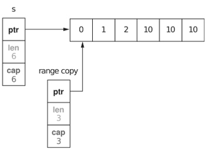
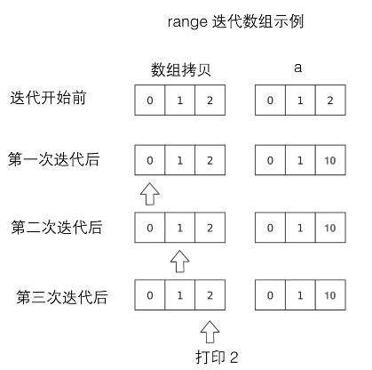

# 相关问题

### 1、map不可以拷贝

如果想要拷贝map，只可以循环赋值。

如果含有指针，则需要进行深拷贝。

如果value是一个结构体，可以直接替换结构体，但无法更新结构体内部的值。


### 2、slice复制陷阱

slice3 := slice2[:]

上述拷贝为浅拷贝，slice3和slice2是同一个切片，无论改动哪个，另一个都会发生改变


### 3、go的map中不含某个键时，会被计算为对应类型的零值。


### 4、go语言中不存在未初始化的变量。


### 5、任何类型的指针的零值都是nil。指针之间可以进行相等测试，只有当它们指向同一个变量或全部为nil时才相等。


### 6、flag包可以使用命令行参数来设置对应变量的值。


### 7、在任何情况下，运行时不会发生转换失败的错误（错误只会发生在编译阶段）。

底层数据类型决定了内部结构和表达方式，也决定是否可以像底层类型一样对内置运算符的支持。


### 8、对于将一个大尺寸的整数类型转为一个小尺寸的整数类型，或者将一个浮点数转为整数，可能会改变数值或丢失精度。

<span style='color:red'>浮点数到整数的转换将丢失任何小数部分，向数轴零方向截断。</span>


### 9、printf细节

```go
// %之后的[1]副词告诉Printf函数再次使用第一个操作数
fmt.Printf("%[1]c, %[1]q", '互')
```


### 10、浮点数

计算机浮点数表示：https://zhuanlan.zhihu.com/p/358417700

一个float32类型的浮点数可以提供大约6个十进制数的精度，float64可以提供约15个十进制数的精度，通常应该优先使用float64类型，float32类型的计算误差很容易扩散，并且float32能精确表示的正整数并不是很大。

<span style='color:red'>（float32的有效bit位只有23个，其他bit位用于指数和符号，当整数大于23位能表达的范围时，float32的表示将出现误差）</span>

```go
var f float32 = 16777216 // 1 << 24
fmt.Println(f == f+1)    // "true"!
```

math包提供大量常用的数学函数，还提供IEEE754浮点数标准中定义特殊值的创建和测试：正无穷大和负无穷大，分别用于表示太大溢出的数字和除零的结果，还有NaN非数，一般用于表示无效的除法操作结果0/0或者Sqrt(-1)。

```go
var z float64
fmt.Println(z, -z, 1/z, -1/z, z/z) // "0 -0 +Inf -Inf NaN"
```

函数math.IsNaN用于测试一个数是否是非数NaN，math.NaN则返回非数对应的值，虽然可以用math.NaN表示一个非法的结果，<span style='color:red'>但是测试一个结果是否是非数则是充满风险的，因为NaN和任何数都是不相等的（在浮点数中，NaN，正无穷大和负无穷大都不是唯一的，每个都有非常多种bit模式表示）。</span>

```go
nan := math.NaN()
fmt.Println(nan == nan, nan < nan, nan > nan) // "false false false"
```

如果函数返回的浮点数结果可能失败，最好的做法是用单独的标志报告失败。


### 11、原生的字符串面值形式是``，使用反引号代替双引号。在原生的字符串面值中，没有转义操作，全部的内容都是字面意思，包含退格和换行，因此一个程序的原生字符串面值可以跨越多行。

在原生字符串面值内部是无法直接写`字符的，可以采用+"`"来连接字符串完成。

唯一的特殊处理是会删除回车以保证在所有平台的值都是一样的，包括那些 把回车也放入文本文件中的系统（windows）。

```go
rawString := `This is a raw string with a ` + "`" + ` (backtick) inside!`
fmt.Println(rawString)
```


### 12、常量表达式的值是在编译期计算的，而不是在运行期，每种常量的潜在类型都是基础类型。

iota

```go
const (
    _ = 1 << (10 * iota)
    KiB // 1024
    MiB // 1048576
    GiB // 1073741824
    TiB // 1099511627776             (exceeds 1 << 32)
    PiB // 1125899906842624
    EiB // 1152921504606846976
    ZiB // 1180591620717411303424    (exceeds 1 << 64)
    YiB // 1208925819614629174706176
)
```


### 13、无类型常量：只有常量可以是无类型的

go中许多常量并没有明确的基础类型，包含6种 

无类型的布尔型、无类型的整数、无类型的字符、无类型的浮点数、无类型的复数、无类型的字符串

编译器为这些没有明确基础类型的数字常量提供比基础类型更高精度的算数运算，可以认为至少有256bit的运算精度。

通过延迟明确常量的具体类型，无类型的常量不仅可以提供更高的运算精度，而且<span style='color:red'>可以直接用于更多的表达式而不需要显式的类型转换。</span>

```go
var x float32 = math.Pi
var y float64 = math.Pi
var z complex128 = math.Pi
```

当一个无类型常量被赋值给一个变量的时候

1）出现在有明确类型的变量的声明的右边，转换合法的话，无类型的常量将会被隐式转换为对应的类型。

```go
var f float64 = 3 + 0i // untyped complex -> float64
f = 2                  // untyped integer -> float64
f = 1e123              // untyped floating-point -> float64
f = 'a'                // untyped rune -> float64
```

2）对于一个没有显式类型的变量声明，常量形势将隐式决定变量的默认类型

```go
i := 0      // untyped integer;        implicit int(0)
r := '\000' // untyped rune;           implicit rune('\000')
f := 0.0    // untyped floating-point; implicit float64(0.0)
c := 0i     // untyped complex;        implicit complex128(0i)
```

无类型整数常量转换为int，它的内存大小是不确定的，但是无类型浮点数和复数常量则转换为内存大小明确的float64和complex128。如果不知道浮点数类型的内存大小很难写出正确的数值算法，go不存在整数类似的不确定内存大小的浮点数和复数类型。


### 14、当调用一个函数的时候，函数的每个调用参数将会被赋值给函数内部的参数变量，所以函数参数变量接收的是一个赋值的副本，并不是原始调用的变量。

​	<span style='color:red'>在这种机制下，会导致传递大的数组类型将是低效的，并且数组参数的任何的修改都将发生在复制的数组上，并不能直接修改调用时原始的数组变量。</span>

​	在这个方面，go对待数组和方式和其他编程语言不同。

​	go中的数组包含僵化的长度信息，不同长度的数组代表不同的类型。

```go
// [16]byte 的类型与 [32]byte 的类型并不相同
```


### 15、如果切片操作超出了cap上限将导致一个panic异常，但是超过len(s)则是意味着扩展了slice，新的slice长度会变大

```go
months := [...]string{1: "January", 2: "February", 3: "March", 4: "April",
        5: "May", 6: "June", 7: "July", 8: "August",
        9: "September", 10: "October", 11: "November", 12: "December"}
Q2 := months[4:7]
summer := months[6:9]
fmt.Println(Q2)     // ["April" "May" "June"]
fmt.Println(summer) // ["June" "July" "August"]
// fmt.Println(summer[:20]) // panic: out of range
endlessSummer := summer[:5] // extend a slice (within capacity)
fmt.Println(endlessSummer)  // "[June July August September October]"
```


### 16、slice之间不可以比较，但是数组可以。

​	<span style='color:red'>在操作slice时不能使用==符号来判断两个slice是否有全部相等元素，必须自己展开每个元素进行比较</span>

```go
func equal(x, y []string) bool {
    if len(x) != len(y) {
        return false
    }
    for i := range x {
        if x[i] != y[i] {
            return false
        }
    }
    return true
}
```

​	在运行的时间方面并不比支持==操作的数组字符串更多，主要的原因有两个

- 一个slice元素是间接引用的，一个slice元素甚至可以包括自身（[]interface{}），没有一个简单有效的办法处理这种情况。
- 由于slice是间接引用的，一个固定的slice值在不同的时刻可能包含不同的元素，因为底层数组的元素可能会被修改。<span style='color:red'>在Go语言中map的key只做简单的浅拷贝，key仅支持可以比较的类型，并且要求key在整个周期内保持不变性，slice在扩容时会导致本身的值/地址发生变化，所以key不可以使用slice</span>，显然，map的key在这种场合并不合适。

​	<span style='color:red'>slice的唯一合法比较操作是和nil进行比较</span>，一个零值的slice等于nil，一个nil值的slice并没有底层数组，一个nil值的slice的长度和容量都为0.

```go
if summer == nil { /* ... */ }
```

​		如果需要判断slice是否为空，应该使用len(s) == 0来判断，不应该使用s == nil来判断。

​		一个nil值的slice的行为和其他任意0长度的slice一样


### 17、make函数创建slice

​	可以创建一个指定元素类型、长度、容量的slice，容量部分可以省略，在这种情况下，容量等于长度

```go
// 这种情况下，slice使整个数组的view
make([]T, len)
// 这种情况下，slice只引用了
make([]T, len, cap) // same as make([]T, cap)[:len]
```

​	在底层，make创建了一个匿名的数组变量，然后返回一个slice，只有通过返回的slice才能引用底层匿名的数组变量。


### 18、nil可以强转为任意类型赋值给变量

```go
var s []int    // len(s) == 0, s == nil
s = nil        // len(s) == 0, s == nil
s = []int(nil) // len(s) == 0, s == nil
s = []int{}    // len(s) == 0, s != nil
```


### 19、append

​	通常并不知道append调用是否导致了内存的重新分配，因此不能确认新的slice和原始的slice是否引用了相同的底层数组空间，也不能确认原先slice上的操作是否会影响到新的slice。


### 20、map中的元素并不是一个变量，不能对map的元素进行取址操作

​	禁止对map元素取址的原因是可能随着元素数量的增长而重新分配更大的内存空间，可能导致之前的地址失效

```Go
_ = &ages["bob"] // compile error: cannot take address of map element
```


### 21、map上的大部分操作，包括<span style='color:red'>查找，删除、len和range循环</span>都可以工作在nil值的map上，它们的行为和一个空map类似。<span style='color:red'>但是向一个nil值的map存入一个元素将导致panic异常</span>

在向map存数据前必须创建map。查询失败将返回对应类型的零值

```Go
ages["carol"] = 21 // panic: assignment to entry in nil map
```


### 22、和slice一样，map之间不能进行相等比较。


### 23、有时需要一个map或set的key是一个slice类型，但是map的key必须是可比较的类型，slice不可以，可以通过以下方案来绕过这个限制。

​	1）定义一个辅助函数k，将slice转为map对应的string类型的key，确保x和y相等时，k(x) == k(y)。

​	2）创建一个key为string类型的map，在每次对map操作时先用辅助函数将slice转化为string类型。


### 24、结构体类型的零值是每个成员都是零值。


### 25、如果结构体没有任何成员的话就是空结构体，写作struct{}，它的大小为0，不包含任何信息，但是有时候依然有价值。

​	比如，当用map来模拟set数据结构时，用来代替map中布尔类型的value值，只是强调key的重要性，但是节约的空间有限，语法也较为复杂，通常避免这样使用。

```Go
seen := make(map[string]struct{}) // set of strings
// ...
if _, ok := seen[s]; !ok {
    seen[s] = struct{}{}
    // ...first time seeing s...
}
```


### 26、结构体可以作为函数的参数和返回值。

​	考虑到效率，较大的结构体通常会用指针的方式传入和返回。

​	<span style='color:red'>如果需要在函数内部修改结构体成员，指针传入是必须的。在go语言中，所有的函数参数都是值拷贝传入的，函数参数将不再是函数调用时的原始变量</span>


### 27、如果结构体的全部成员都是可以比较的，那么结构体也是可以比较的，那样的话两个结构体可以使用==或者!=运算符进行比较。

```Go
type Point struct{ X, Y int }

p := Point{1, 2}
q := Point{2, 1}
fmt.Println(p.X == q.X && p.Y == q.Y) // "false"
fmt.Println(p == q)                   // "false"
```

​	可比较的结构体类型和其他可比较的类型一样，可用于map的key类型

```Go
type address struct {
    hostname string
    port     int
}

hits := make(map[address]int)
hits[address{"golang.org", 443}]++
```


### 28、go的结构体可以进行匿名嵌入，我们可以直接访问叶子属性而不需要给出完整的路径，其中匿名成员也都有自己的名字，就是命名的类型的名字。这些名字在点操作符中是可选的。在访问子成员的时候可以忽略任何匿名成员部分。

​	匿名成员也存在一个隐式的名字，因此不能同时包含两个类型相同的匿名成员，会导致名字冲突。

​	匿名成员如果不可导出，那么在包外部也就不可以访问嵌套的匿名成员。

​	<span style='color:red'>结构体字面值并没有简短表示匿名成员的语法</span>

```Go
type Point struct {
    X, Y int
}

type Circle struct {
    Point
    Radius int
}

type Wheel struct {
    Circle
    Spokes int
}

w = Wheel{8, 8, 5, 20}                       // compile error: unknown fields
w = Wheel{X: 8, Y: 8, Radius: 5, Spokes: 20} // compile error: unknown fields
```


### 29、text/template和html/template，提供一个将变量值填充到一个文本或html格式的模版的机制。

```Go
const templ = `{{.TotalCount}} issues:
{{range .Items}}----------------------------------------
Number: {{.Number}}
User:   {{.User.Login}}
Title:  {{.Title | printf "%.64s"}}
Age:    {{.CreatedAt | daysAgo}} days
{{end}}`
```


### 30、函数类型的零值是nil，调用值为nil的函数值会引起panic错误。

```Go
var f func(int) int
    f(3) // 此处f的值为nil, 会引起panic错误
```

​	函数值可以和nil进行比较，但是函数值之间是不可比较的，也不能用函数值作为map的key


### 31、匿名内部函数可以访问和更新局部变量，因为函数值属于引用类型。所以函数值不可比较。

​	go使用闭包技术来实现函数值。在go中变量的生命周期不由它的作用域决定

```Go
// squares返回一个匿名函数。
// 该匿名函数每次被调用时都会返回下一个数的平方。
func squares() func() int {
    var x int
    return func() int {
        x++
        return x * x
    }
}
func main() {
    f := squares()
    fmt.Println(f()) // "1"
    fmt.Println(f()) // "4"
    fmt.Println(f()) // "9"
    fmt.Println(f()) // "16"
}
```


### 32、defer语句中的函数会在return语句更新返回值变量后再执行，又因为在函数中定义的匿名函数可以访问该函数包括返回值在内的所有变量，对匿名函数采用defer机制，可以使其观察函数的返回值。


### 33、函数名中带有Must前缀不能接受不合法的输入，是一种针对此类函数的命名约定。


### 34、runtime包允许程序员输出堆栈信息。

​	<span style='color:red'>在Go的Panic机制中，延迟函数的调用在释放堆栈信息之前，所以能输出已经被释放函数的信息</span>

```Go
func main() {
    defer printStack()
    f(3)
}
func printStack() {
    var buf [4096]byte
    n := runtime.Stack(buf[:], false)
    os.Stdout.Write(buf[:n])
}
```


### 35、nil也是一个合法的接收器类型

```go
// An IntList is a linked list of integers.
// A nil *IntList represents the empty list.
type IntList struct {
    Value int
    Tail  *IntList
}
// Sum returns the sum of the list elements.
func (list *IntList) Sum() int {
    if list == nil {
        return 0
    }
    return list.Value + list.Tail.Sum()
}
```


### 36、方法值和方法表达式

​	通常在使用go时，经常会选择一个方法，并在同一个表达式里使用。

​	事实上可以分为两步来执行，先选择具体函数，然后执行。

```go
p := Point{1, 2}
q := Point{4, 6}

distanceFromP := p.Distance        // method value
fmt.Println(distanceFromP(q))      // "5"
var origin Point                   // {0, 0}
fmt.Println(distanceFromP(origin)) // "2.23606797749979", sqrt(5)

scaleP := p.ScaleBy // method value
scaleP(2)           // p becomes (2, 4)
scaleP(3)           //      then (6, 12)
scaleP(10)          //      then (60, 120)
```


### 37、封装优点

1、因为调用方不能直接修改对象的变量值，只需关注少量的语句并且只要弄懂部分变量的值即可。

2、隐藏实现细节，防止调用方依赖可能变化的具体实现。

3、阻止了外部调用方对对象内部的值任意进行修改.


### 38、在go语言中，变量总被一个定义明确的值初始化，即使接口类型也不例外。对于一个接口的零值就是它的类型和值的部分都为nil。

​	可以通过使用判断是否等于nil来判断接口值是否为空。<span style='color:red'>调用一个空接口值的任意方法都会产生panic。</span>

```go
var w io.Writer
w = os.Stdout // 调用了一个具体类型到接口类型的隐式转换，和显式使用io.Writer(os.Stdout)是等价的
w = new(bytes.Buffer)
w = nil // 恢复到和它之前定义时相同的状态
```

​	<span style='color:red'>通常在编译期，不知道接口值的动态类型是什么，所以一个接口上的调用必须使用动态分配</span>


### 39、不论接口值多大，动态值总是可以容下它。接口类型是非常与众不同的。其他类型要么是安全的可比较类型，要么是完全不可比较的类型（切片，映射和函数），但是在比较接口值或者包含接口值的聚合类型时，必须意识到潜在的Panic。同样的风险也存在于使用接口作为map的键或者switch的操作数。

接口值可以使用==和！=来进行比较。两个接口值相等仅当它们都是nil值，或者他们的动态类型相同，并且动态值也根据这个动态类型的==操作相等。因为接口值是可比较的，所以它们可以用在map的键或者作为switch语句的操作数。

<span style='color:red'>如果两个接口值的动态类型相同，但是这个动态类型是不可比较的（比如切片），将它们进行比较就会失败并且Panic</span>

```go
var x interface{} = []int{1, 2, 3}
fmt.Println(x == x) // panic: comparing uncomparable type []int
```


### 40、一个包含nil指针的接口不是nil接口

一个不包含任何值的nil接口值和一个刚好包含nil指针的接口值是不同的。

只有在类型值和动态值都是nil的时候才等于nil接口值。

```go
const debug = true

func main() {
    var buf *bytes.Buffer
    if debug {
        buf = new(bytes.Buffer) // enable collection of output
    }
    f(buf) // NOTE: subtly incorrect!
    if debug {
        // ...use buf...
    }
}

// If out is non-nil, output will be written to it.
func f(out io.Writer) {
    // ...do something...
    if out != nil {
        out.Write([]byte("done!\n")) // debug为false时会发生panic
    }
}
```

```go
// 正确方式
var buf io.Writer
if debug {
    buf = new(bytes.Buffer) // enable collection of output
}
f(buf) // OK
```


### 41、sort.Reverse

采用组合思想。sort包定义了一个不公开的struct类型reverse，它嵌入了一个sort.Interface。reverse的Less方法调用了内嵌的sort.Interface值的Less方法，但是通过交换索引的方式使排序结果变成逆序。

```go
package sort

type reverse struct{ Interface } // that is, sort.Interface

func (r reverse) Less(i, j int) bool { return r.Interface.Less(j, i) }

func Reverse(data Interface) Interface { return reverse{data} }
```


### 42、适配器：让函数值满足一个接口的适配器。

```go
package http

// 函数适配器
type HandlerFunc func(w ResponseWriter, r *Request)

func (f HandlerFunc) ServeHTTP(w ResponseWriter, r *Request) {
    f(w, r)
}
```


### 43、syscall包提供了Go语言底层系统调用API。在多个平台上，它定义了一个实现error接口的数字类型Errno，并且在Unix平台上，Errno的Error方法会从一个字符串表中查找错误信息。

```go
package syscall

type Errno uintptr // operating system error code

var errors = [...]string{
    1:   "operation not permitted",   // EPERM
    2:   "no such file or directory", // ENOENT
    3:   "no such process",           // ESRCH
    // ...
}

func (e Errno) Error() string {
    if 0 <= int(e) && int(e) < len(errors) {
        return errors[e]
    }
    return fmt.Sprintf("errno %d", e)
}
```


### 44、类型断言

是一个使用在接口值上的操作。语法上x.(T)被称为断言类型，x表示一个接口类型和T表示一个类型。一个类型断言检查它操作对象的动态类型是否和断言类型匹配。

如果断言的类型T是一个具体的类型，然后类型断言检查x的动态类型是否和T相同。如果这个检查成功了，类型断言的结果是x的动态值，当然它的类型是T。

具体类型的类型断言从它的操作对象中获取具体的值，检查失败会抛出panic。

```go
var w io.Writer
w = os.Stdout
f := w.(*os.File)      // success: f == os.Stdout
c := w.(*bytes.Buffer) // panic: interface holds *os.File, not *bytes.Buffer
```

<span style='color:red'>如果类型断言的T是一个接口类型，类型断言检查是否x的动态类型满足T。如果检查成功，动态值没有获取到，这个结果仍然是一个有相同动态类型和值部分的接口值，但是结果为类型T，对于一个接口类型的类型断言改变了类型的表述方式，改变了可以获取的方法集合，但是保留了接口值内部的动态类型和值的部分</span>

```go
// w和rw都持有os.Stdout，因此都有一个动态类型*os.File，但w只对外公开Write方法，而rw还公开了Read方法
var w io.Writer
w = os.Stdout
rw := w.(io.ReadWriter) // success: *os.File has both Read and Write
w = new(ByteCounter)
rw = w.(io.ReadWriter) // panic: *ByteCounter has no Read method
```

如果断言操作的对象是一个nil接口值，那么不论被断言的类型是什么，这个类型断言都会失败。

```go
w = rw             // io.ReadWriter is assignable to io.Writer
w = rw.(io.Writer) // fails only if rw == nil
```

采用如下操作，不会在失败的时候发生panic

```go
var w io.Writer = os.Stdout
f, ok := w.(*os.File)      // success:  ok, f == os.Stdout
b, ok := w.(*bytes.Buffer) // failure: !ok, b == nil
```


### 45、避免不必要的抽象，一个接口只被一个单一的具体类型实现时有一个例外<span style='color:red'>就是由于它的依赖，这个具体的类型不能和这个接口存在在一个相同的包中。这种情况下，一个接口是解耦这两个包的一个好方式，</span>新的类型出现的时候，小的接口更容易满足。对于接口设计的一个好的标准就是<span style='color:red'> ask only for what you need（只考虑你需要的东西）</span>


### 46、主函数返回时，所有的goroutine都会被直接打断，程序退出。除了从主函数退出或者意外终止程序之外，没有其他的编程方法能够让一个goroutine来打断另一个的执行。


### 47、两个相同类型的channel可以使用==运算符比较。如果两个channel引用的是相同的对象，那么比较结果为真。


### 48、channel支持close操作，用于关闭channel。随后基于channel的任何发送操作都将导致Panic一场。对一个已经被close的channel进行接收操作依然可以接收到之前已经成功发送的数据，<span style='color:red'>如果channel中已经没有数据将产生一个零值数据。</span>


### 49、关闭网络连接中的写方向的连接将导致server程序收到一个文件结束的信号。关闭网络连接中读方向的连接将导致后台goroutine的io.Copy函数调用返回一个“read from closed connection”（“从关闭的连接读”）类似的错误。

```Go
func main() {
    conn, err := net.Dial("tcp", "localhost:8000")
    if err != nil {
        log.Fatal(err)
    }
    done := make(chan struct{})
    go func() {
        io.Copy(os.Stdout, conn) // NOTE: ignoring errors
        log.Println("done")
        done <- struct{}{} // signal the main goroutine
    }()
    mustCopy(conn, os.Stdin)
    conn.Close()
    <-done // wait for background goroutine to finish
}
```


### 50、channels可以用于将多个goroutine连接在一起，一个channel的输出作为下一个channel的输入。这种串联的channels就是管道（pipeline）。

pipeline是一种用于处理连续操作的机制，它将多个操作链接在一起，以便顺序执行。

pipeline并不是事务的，因为没有提供事务的ACID属性（原子性，一致性，隔离性和持久性）。事务是一种保证数据操作的完整性和一致性的机制，要么全部成功执行，要么全部回滚到初始状态。

相比之下，pipeline的操作是连续执行的，每个步骤的结果会传递给下一个步骤，但没有提供回滚或撤销的机制。如果pipeline中的某个步骤失败，整个流程可能就会，但之前已经执行的步骤无法自动回滚。


### 51、没有办法直接测试一个channel是否被关闭，但是接收操作有一个变体形式。

不管一个channel是否被关闭，当它没有被引用时将会被垃圾回收器回收

```Go
// Squarer
go func() {
    for {
      	// ok 为true表示成功从channel中接收到值，false表示channels已经被关闭并且没有值可接收。
        x, ok := <-naturals
        if !ok {
            break // channel was closed and drained
        }
        squares <- x * x
    }
    close(squares)
}()

go func() {
  			// range循环可直接在channels上面迭代，当channel被关闭并且没有值可接收时跳出循环。
        for x := range naturals {
            squares <- x * x
        }
        close(squares)
    }()
```


### 52、打开文件忘记关闭，会导致一些问题

1. 资源泄漏：打开的文件会占用系统资源，包括内存描述符。如果不关闭文件，这些资源将一直被占用，可能导致系统资源的浪费和不足。
2. 文件锁定：在某些操作系统中，打开的文件可能被锁定，阻止其他进该文件的访问。如果忘记关闭文件，其他进程可能无法访问或修改该文件，导致操作失败或数据不一致。
3. 内存泄漏：如果在打开文件时分配了内存，但在不关闭文件的情况下不释放内存，可能导致内存泄漏，随着时间推移，内存泄漏可能导致系统性能下降或者崩溃。
4. 数据丢失：如果在打开进行了写操作，但在不关闭文件的情况下终止程序或系统崩溃，可能导致数据丢失或者文件损坏。


### 53、当一个channel作为一个函数参数时，一般总是被专门用于只发送或者只接收。

任何双向channel向单向channel变量的赋值操作都将导致隐式转换，但是不能将一个单向型的channel转换为双向型channel。


### 54、goroutines泄漏

慢的goroutines没有人接收会产生这样的问题，泄漏的goroutines不会自动回收，因此需要确保每个不再需要的goroutine能正常退出。

防止泄漏，最好使用带合适缓存的channel。

```go
// makeThumbnails4 makes thumbnails for the specified files in parallel.
// It returns an error if any step failed.
// 当遇到第一个非nil的error时会直接将error返回调用方，使得没有一个goroutine去排空errors channel，剩下的goroutine发送值时，就会阻塞，并且永远不会退出，导致goroutine泄漏。
func makeThumbnails4(filenames []string) error {
    errors := make(chan error)

    for _, f := range filenames {
        go func(f string) {
            _, err := thumbnail.ImageFile(f)
            errors <- err
        }(f)
    }

    for range filenames {
        if err := <-errors; err != nil {
            return err // NOTE: incorrect: goroutine leak!
        }
    }

    return nil
}
```


### 55、无缓存的channel更强的保证了每个发送操作与相应的同步接收操作，对于带缓存的channel，这些操作是解耦的，根据生产各个阶段的要求选择合适的channel。


### 56、限制并发过度

1. 限制最大并发协程
2. 创建常驻协程


### 57、channel的零值是nil，nil的channel也有用处，对一个nil的channel发送和接收操作会永远阻塞，在select语句操作nil的channel永远不会被select到，所以nil的channel会在select里的case相当于禁用了。


### 58、数据竞争

<span style='color:red'>不要使用共享数据来通信，使用通信来共享数据</span>

数据竞争会在两个以上的goroutine并发访问相同的变量且至少其中一个为写操作的时候发生。

避免数据竞争的方法：

1. 避免不必要的写变量。
2. 避免从多个goroutine访问变量。
3. 允许很多goroutine去访问变量，但是在同一个时刻最多只有一个goroutine在访问。


### 59、互斥锁

可以使用一个带缓存的channel作为一个计数信号量，当容量只有1的时候可以保证最多只有一个goroutine在同一时刻访问一个共享变量。一个只能为1和0的信号量叫做二元信号量。

```go
var (
    sema    = make(chan struct{}, 1) // a binary semaphore guarding balance
    balance int
)

func Deposit(amount int) {
    sema <- struct{}{} // acquire token
    balance = balance + amount
    <-sema // release token
}

func Balance() int {
    sema <- struct{}{} // acquire token
    b := balance
    <-sema // release token
    return b
}

// 第二次获取互斥锁，无法被重入，go里没有重入锁。
// NOTE: incorrect!
func Withdraw(amount int) bool {
    mu.Lock()
    defer mu.Unlock()
    Deposit(-amount)
    if Balance() < 0 {
        Deposit(amount)
        return false // insufficient funds
    }
    return true
}
```

重入锁：一种同步机制，允许同一个线程多次获取锁而不会发生死锁。当一个线程已经获取锁而不会被阻塞。可重入锁是一种可重入的互斥锁，也被称为递归锁。它可以避免同一个线程对同一个锁的重复获取导致的死锁问题。

<span style='color:red'>go不支持重入锁</span>

通用解决方案是将一个函数分离为多个函数。当使用互斥锁时，确保mutex和其保护的变量没有被导出

```go
func Withdraw(amount int) bool {
    mu.Lock()
    defer mu.Unlock()
    deposit(-amount)
    if balance < 0 {
        deposit(amount)
        return false // insufficient funds
    }
    return true
}

func Deposit(amount int) {
    mu.Lock()
    defer mu.Unlock()
    deposit(amount)
}

func Balance() int {
    mu.Lock()
    defer mu.Unlock()
    return balance
}

// This function requires that the lock be held.
func deposit(amount int) { balance += amount }
```


### 60、读写锁

允许多个只读操作并行执行，但写操作完全互斥。

只有当获得锁的大部分goroutine都是读操作，读写锁才能带来好处。


### 61、内存同步

现代计算机中可能有一堆处理器，每一个都会有其本地缓存。为了效率，对内存的写入一般会在每个处理器中缓冲，并在必要时一起flush到主存。这种情况下这些数据可能会以与当初goroutine写入顺序不同的顺序被提交到主存。像channel通信或者互斥量操作这样的原语会使处理器将其聚集的写入flush并commit，这样goroutine在某个时间点上的执行结果才能被其他处理器上运行的goroutine得到。

```go
var x, y int
go func() {
    x = 1 // A1
    fmt.Print("y:", y, " ") // A2
}()
go func() {
    y = 1                   // B1
    fmt.Print("x:", x, " ") // B2
}()

// y:0 x:1
// x:0 y:1
// x:1 y:1
// y:1 x:1
// 重要
// 在不使用mutex和channel这样的显式同步操作时，没法保证事件在不同的goroutine中看到的执行顺序是一致的
// A中一定需要观察到x=1执行成功之后才会去读y，但是A没法确保自己观察得到B中对y的写入，A还可能会打印出y的一个旧值
// x:0 y:0
// y:0 x:0
```

在一个独立的goroutine中，每一个语句的执行顺序是可以保证的，也就是说goroutine内顺序是连贯的。

赋值和打印语句指向不同的变量，编译器可能会断定两条语句的顺序不会影响执行结果，并且会交换两个语句的执行顺序。

如果两个goroutine在不同的cpu上执行，每一个核心有自己的缓存，这样一个goroutine的写入对于其他goroutine的Print，在主存同步之前是不可见的。

<span style='color:red'>所有并发问题都可以用一致，简单的既定模式来规避。可能的话，将变量限定在goroutine内部；如果是goroutine都需要访问的变量，使用互斥条件来访问</span>


### 62、惰性初始化

如果初始化成本比较大，那么将初始化延迟到需要的时候再去做是一个比较好的选择，还可以减少程序启动时间，并且因为执行的时候可能不需要这些变量，可以避免产生浪费。

<span style='color:red'>当缺少显式同步时，编译器和CPU是可以随意更改访问内存的指令顺序，以任意方式，只要保证每一个goroutine自己的执行顺序一致。</span>

使用sync.Once进行惰性初始化

一次性的初始化需要一个互斥量mutex来保护boolean变量和客户端数据结构和一个boolean变量来记录初始化是不是已经完成了

```go
var loadIconsOnce sync.Once
var icons map[string]image.Image
// Concurrency-safe.
func Icon(name string) image.Image {
  	// 先判断boolean变量是否为1，不为1才会锁定mutex，不需要每次都锁定
  	// 第一次调用时，boolean变量的值为false，Do会调用并会将boolean变量设置为true，随后的调用什么都不做
    loadIconsOnce.Do(loadIcons)
    return icons[name]
}
```


### 63、Goroutines和线程

1、动态栈

每一个OS线程都有一个固定大小的内存块来做栈，一般是2MB，这个栈会用来存储当前正在被调用或挂起的函数的内部变量。固定大小的栈可能会造成很大的内存浪费，固定大小的栈对于更复杂或者更深层次的递归函数调用来说显然是不够的。<span style='color:red'>修改固定的大小可以提升空间的利用率，允许创建更多的线程，并且可以允许更深的递归调用，这两者不可同时兼备。</span>

一个goroutine会以一个很小的栈开始生命周期，一般只需要2KB，栈的大小会根据需要动态的伸缩。goroutine的栈的最大值有1GB。

2、调度

OS线程会被操作系统内核调度。每几毫秒，一个硬件计时器会中断处理器，这会调用一个叫做scheduler的内核函数。这个函数会挂起当前执行的线程并将它的寄存器内容保存到内存中，检查线程列表并决定下一次哪个线程可以被运行，并从内存中恢复该线程的寄存器信息，然后恢复执行该线程的现场并开始执行线程。

因为操作系统线程是被内核所调度，所以一个线程向另一个移动需要完整的上下文切换。这几步操作很慢，因为其局部性很差需要几次内存访问，并且会增加运行CPU的周期。

Go的运行时包含其自己的调度器，这个调度器使用了一些技术手段，比如m:n调度，因为其会在n个操作系统线程上多工m个goroutine。Go调度器的工作和内核的调度是相似的，但这个调度器只关注单独的Go程序中的goroutine。

<span style='color:red'>和操作系统的线程调度不同，Go调度器并不是用一个硬件定时器，而是被go语言建筑本身进行调度，这种调度方式不需要进入内核的上下文，所以重新调度一个goroutine比调度一个线程代价要低的多。</span>

3、GOMAXPROCS

go的调度器通过一个全局变量来决定会有多少个操作系统的线程同时执行Go的代码。

其默认的值是运行机器上的CPU的核心数。

在休眠中的或者在通信中被阻塞的goroutine是不需要一个对应的线程来做调度的。

在I/O中或系统调用中或调用非Go语言函数时，是需要一个对应的操作系统线程的，但是这个全局变量不要将这些情况考虑在内。

4、Goroutine没有ID号

在大多数支持多线程的操作系统和程序语言中，当前线程会有一个独特的身份id，这个信息可以被很容易获取到，可以实现线程本地存储。

goroutine是不可以的，线程本地存储总是被滥用


### 64、Go语言编译器的编译速度较快的原因

1. 所有导入的包必须在每个文件开头显式声明，使得编译器没有必要读取和分析整个源文件来判断包的依赖关系。
2. <span style='color:red'>禁止包的环状依赖，因为没有循环依赖，包的依赖关系形成一个有向无环图，每个包可以独立编译，甚至可以并发编译。</span>
3. 编译后的目标文件不仅仅记录包本身的导出信息，目标文件同时还记录了包的依赖关系。在编译一个包的时候，编译器只需要读取每个直接导入包的目标文件，而不需要遍历所有依赖的文件。


### 65、包声明

在每个Go语言源文件的开头都必须有包声明语句。包声明语句的主要目的是确定当前包被其他包导入时默认的标识符。

通常来说，默认的包名就是包导入路径名的最后一段，即使两个包的导入路径不相同，它们依然可能有一个相同的包名。

但采用导入路径名的最后一段的约定也有三种例外情况。

1. 包对应一个可执行程序，也就是main包，这个时候main包本身的导入路径是无关紧要的。名字为main包是给go build构建命令一个信息，这个包编译完之后必须调用连接器生成一个可执行程序。
2. 包所在的目录中可能有一些文件名是以_test.go为后缀的Go源文件。<span style='color:red'>前面必须有其他的字符，以下划线或者.开头的源文件会被构建工具忽略，</span>并且这些源文件声明的包名也是以下划线test为后缀名的。这种目录可以包含两种包：一种是普通包，另一种则是测试的外部扩展包。所有以下划线test为后缀包名的测试外部扩展包都由go test命令独立编译，普通包和外部扩展包是相互独立的。测试的外部扩展包一般用来避免测试代码中的循环导入依赖。
3. 一些依赖版本号的管理工具会在导入路径后追加版本号信息，这种情况下包的名字并不包含版本号后缀

​	gopkg.in/yaml.v2 的包名是yaml


### 66、包构建

针对不同的操作系统平台和CPU架构可以交叉构建，只要设置好目标对应的GOOS和GOARCH，运行构建命令就行。

有些包可能需要针对不同平台和处理器类型使用不同版本的代码文件，以便于处理底层的可移植性问题或为一些特定代码提供优化。如果一个文件名包含一个操作系统或处理器类型名字，例如net_linux.go或asm_amd64.s，Go语言的构建工具将只在对应的平台编译这些文件。

还有一个特别的构建注释参数可以提供更多的构建过程控制。

```Go
// +build linux darwin
// 在包声明和包注释的前面，该构建注释参数告诉go build只在编译程序对应的目标操作系统是Linux或Mac OS X时才编译这个文件
// +build ignore
// 表示不编译这个文件
```


### 67、内部包

有时候一个中间的状态可能是有用的，标识符对于一小部分信任的包是可见的，但并不是对所有调用者都是可见的。

为了满足需求，Go语言的构建工具对包含internal名字的路径段的包导入路径做了特殊处理。这种包叫internal包，一个internal包只能被和internal目录有同一个父目录的包导入。

```
net/http // 可以导入
net/http/internal/chunked // 可以导入
net/http/httputil // 可以导入
net/url // 不可导入
```


### 68、每个测试函数必须导入testing包，测试函数的名字必须以Test开头，可选的后缀名必须以大写字母开头。

```Go
func TestSin(t *testing.T) { /* ... */ }
func TestCos(t *testing.T) { /* ... */ }
func TestLog(t *testing.T) { /* ... */ }
```


### 69、一旦已经修复了失败的测试用例，在提交代码更新之前，我们应该以不带参数的go test命令运行全部的测试用例，以确保修复失败测试的同时没有引入新的问题。


### 70、main包可作为一个包被测试代码导入，里面mian函数并没有被导出，而是被忽略的。


### 71、通过创建外部测试包，可以避免循环的导入依赖。外部测试包可以更灵活的编写测试，特别是集成测试（需要测试多个组件之间的交互）。

可以用go list命令查看包对应目录中哪些go源文件是产品代码，哪些是包内测试，还有哪些是外部测试包。

源码

```shell
$ go list -f={{.GoFiles}} fmt
[doc.go format.go print.go scan.go]
```

内部测试代码

```shell
$ go list -f={{.TestGoFiles}} fmt
[export_test.go]
```

外部测试包的测试代码

```shell
$ go list -f={{.XTestGoFiles}} fmt
[fmt_test.go scan_test.go stringer_test.go]
```

有时候外部测试包也需要访问被测试包内部的代码。这种情况可以通过一些技巧解决，在包内的test文件中导出一个内部的实现给外部测试包。这些代码只有在测试的时候才需要，因此一般会放在export_test.go文件中。这个技巧可以广泛用于外部测试包的白盒测试。


### 72、Go中的结构体匿名组合时，需要注意组合的结构体是否需要调用他的链式方法

当匿名组合结构体和当前结构体实现了相同的接口，如果需要调用匿名结构体的链式方法，则要小心是否覆盖了当前结构体。


### 73、Go中的真随机和伪随机

1、伪随机数：使用一个确定性的算法计算出来的似乎是随机的数序，因此伪随机数实际上并不随机。如果在一开始输入这个算法的创世参数固定的话，算法生成的结果就是固定的结果。

Go中的math/rand库会使用默认的随机种子1来生成随机数。

使用时间戳生成所谓的随机数，每次运行的时候的随机种子不一样，生成的随机数也就不一样。

```go
package main

import "fmt"
import "math/rand"
import "time"

func main() {
   rand.Seed(int64(time.Now().UnixNano()))
   fmt.Println(rand.Int())
}
```

2、真随机数：真正的随机数是使用物理现象产生的：比如掷钱币、骰子、转轮、使用电子元件的噪音、核裂变等等，这样的随机数发生器叫做物理性随机数发生器，对技术要求较高。

<span style='color:red'>真随机的随机样本不可重现。</span>

通常情况下使用时间戳生成的随机数可以满足需求。<span style='color:red'>但是，伪随机数其实是有周期的。在高安全要求下的身份验证、加密等情况使用伪随机数有风险。</span>

Go中使用真随机数的方法是使用crypto/rand包

```go
package main

import (
	"crypto/rand"
	"fmt"
	"math/big"
)

func main() {
	// 生成 20 个 [0, 100) 范围的真随机数。
	for i := 0; i < 20; i++ {
		result, _ := rand.Int(rand.Reader, big.NewInt(100))
		fmt.Println(result)
	}
}
```

原理

```go
// Package rand implements a cryptographically secure
// pseudorandom number generator.
package rand

import "io"

// Reader is a global, shared instance of a cryptographically
// strong pseudo-random generator.
//
// On Linux, Reader uses getrandom(2) if available, /dev/urandom otherwise.
// On OpenBSD, Reader uses getentropy(2).
// On other Unix-like systems, Reader reads from /dev/urandom.
// On Windows systems, Reader uses the CryptGenRandom API.
// 在Linux系统中，优先调用getrandom(2)，其实就是/dev/random优先。与/dev/urandom两个文件，他们产生随机数的
// 原理差不多。都是利用当前系统的熵池来计算出固定一定数量的随机比特，然后将这些比特作为字节流返回。
```

熵池就是当前系统的环境噪音，系统噪音可以通过很多参数来评估，如内存的使用，文件的使用量，不同类型的进程数量等等。

<span style='color:red'>这种方式比math.rand慢大约10倍。</span>


### 74、math/rand的线程安全性

rand的默认的Source为了实现并发安全使用了全局的排他锁。

如果采用NewSource的rand，则不是并发安全的，需要自行加锁。


### 75、Go语言不允许隐式类型转换，也就是说=两边，不允许出现类型不相同的变量。


### 76、类型转换与断言的区别

对于类型转换而言，转换前后的两个类型要相互兼容才行。

断言是因为空接口没有定义任何函数，因此Go中所有类型都实现了空接口，当一个函数的形参是空接口，那么在函数中，需要对形参进行断言，从而得到它的真实类型。

<span style='color:red'>fmt.Println函数的参数是空接口。对于内置类型，函数内部会用穷举法，得出它的真实类型，然后转换为字符串打印。对于自定义类型，首先确定该类型是否实现了String()方法，如果实现了，则直接打印输出String()方法的结果，否则，会通过反射来遍历对象的成员进行打印。</span>

```golang
package main

import "fmt"

type Student struct {
	Name string
	Age int
}

// 类型T只有接收者是T的方法，而类型*T拥有接收者T和*T的方法。语法上T能直接调用*T的方法是因为go的语法糖。
func (s Student) String() string {
	return fmt.Sprintf("[Name: %s], [Age: %d]", s.Name, s.Age)
}

func (s *Student) String() string {
	return fmt.Sprintf("[Name: %s], [Age: %d]", s.Name, s.Age)
}

func main() {
	var s = Student{
		Name: "qcrao",
		Age: 18,
	}

	fmt.Println(s)
  fmt.Println(&s)
}
```


### 77、“unexpected signal during runtime execution”错误

​	运行时系统检测到操作系统信号（如SIGSEGV、SIGBUS等）时出现的一种错误。这些信号通常表示程序访问了非法内存地址或发生了硬件错误。可能的原因和处理方法：

​	常见原因：

​		1）空指针引用：尝试访问空指针的字段或调用其方法。

​		2）数组越界：尝试访问数组或切片的无效索引。

​		3）内存对齐问题：对齐要求较高的结构体在内存中的位置不正确。

​		4）CGO调用错误：调用C代码时出现问题，如错误的内存访问。

​	处理方法：

​		1）检查代码中的潜在错误：确保所有指针在使用前已经正确初始化，并且没有越界访问数组或切片。

​		2）使用调试工具：在调试器中运行程序，检查崩溃发生时的调用堆栈和变量状态。

​		3）启用竟态检测：数据竞争可能会导致不可预测的行为和内存访问错误。

​		4）如果你在使用CGO（调用C代码）：确保所有C代码都是安全的，并且遵循Go和C之间的交互规则。

​		5）分析崩溃日志：检查崩溃时生成的日志信息，通常会包含导致崩溃的信号和调用堆栈。

​	<span style='color: red'>go中的panic和recover机制可以用于恢复由panic引发的运行时错误。但是并非所有的运行时错误都能被recover捕获和处理。</span>

​	这类错误通常是由底层的严重问题引起的，例如访问非法内存地址，这类错误包括：

1）SIGSEGV`(段错误)：指程序试图访问其不允许访问的内存区域时发生的错误。这个错误通常是由于指针错误、越界访问数组或其他内存访问违规导致的。

​	如何避免这类错误？

​	（1）检查指针是否为nil

​	（2）避免越界访问数组

​	（3）使用安全的并发机制：在并发编程中，确保正确使用锁或其他同步机制，防止数据竞争和并发访问错误。

​	（4）启用运行时检查：使用Go语言的race检测工具，可以帮助检测并发访问中的数据竞争问题。

2）SIGBUS（总线错误）：一种严重的运行时错误，通常由以下几种情况引起：

​	（1）内存对齐错误：某些架构（如RISC架构）要求特定类型的数据在特定的地址对齐上访问。例如，访问一个4字节的整数（int32）时，其地址必须是4的倍数。如果尝试访问不正确对齐的地址，就会触发SIGBUS。

​	（2）非法地址访问：访问未映射到物理内存的地址。这通常是由于程序错误或无效的指针引用引起的。

​	（3）硬件故障：硬件问题或总线错误，也可能触发

3）SIGFPE（浮点异常信号）通常在执行浮点运算时发生异常时触发。

​		这些异常包括

​			（1）除以0。（2）浮点溢出。（3）浮点下溢   （4）非法的浮点操作


### 78、go优雅地退出一个正在运行的协程

1）使用context包 （较为强大）

​	context包提供了一种方便的方法来管理协程的生命周期。可以创建一个可以取消的context，并在需要退出时调用取消函数。

```go
package main

import (
	"context"
	"fmt"
	"time"
)

func main() {
	ctx, cancel := context.WithCancel(context.Background())

	go worker(ctx)

	time.Sleep(2 * time.Second)
	fmt.Println("Main: sending cancel signal")
	cancel() // 发送取消信号

	time.Sleep(1 * time.Second)
	fmt.Println("Main: done")
}

func worker(ctx context.Context) {
	for {
		select {
		case <-ctx.Done():
			fmt.Println("Worker: received cancel signal")
			return
		default:
			fmt.Println("Worker: working...")
			time.Sleep(500 * time.Millisecond)
		}
	}
}
```

2）使用channel

​	创建一个专用的通道用于发送退出信号，当需要退出时向该通道发送信号。

```go
package main

import (
	"fmt"
	"time"
)

func main() {
	stop := make(chan struct{})

	go worker(stop)

	time.Sleep(2 * time.Second)
	fmt.Println("Main: sending stop signal")
	close(stop) // 关闭通道，发送退出信号

	time.Sleep(1 * time.Second)
	fmt.Println("Main: done")
}

func worker(stop chan struct{}) {
	for {
		select {
		case <-stop:
			fmt.Println("Worker: received stop signal")
			return
		default:
			fmt.Println("Worker: working...")
			time.Sleep(500 * time.Millisecond)
		}
	}
}
```


### 79、Go中的select语句用于监听多个通道的操作，但它并不能保证case分支的执行顺序。select语句会随机选择一个可以执行的case分支。这意味着如果有多个case可以同时执行，Go运行时会随机选择其中一个来执行。

<span style='color: red'>如果确实需要保证某些操作的顺序，可以采用一些变通的方法。</span>

1）使用多个select语句：有明确的优先级顺序，可以将select语句嵌套或分开来实现。

2）使用标志变量来单独操作。

```go
package main

import (
	"fmt"
	"time"
)

func main() {
	ch1 := make(chan int, 1)
	ch2 := make(chan int, 1)

	go func() {
		time.Sleep(1 * time.Second)
		ch1 <- 1
	}()

	go func() {
		time.Sleep(2 * time.Second)
		ch2 <- 2
	}()

	handledCh1 := false

	for i := 0; i < 2; i++ {
		if !handledCh1 {
			select {
			case val := <-ch1:
				fmt.Println("Received from ch1:", val)
				handledCh1 = true
			default:
			}
		}

		if handledCh1 {
			select {
			case val := <-ch2:
				fmt.Println("Received from ch2:", val)
			default:
			}
		}
	}

	fmt.Println("Main: done")
}
```

3）使用单独的通道操作

可以在select语句外部使用通道的单独操作来确保顺序。


### 80、go中nil的channel

1）从一个nil的channel进行读取操作时，程序会永久阻塞。

2）向一个nil的channel写入数据也会导致永久阻塞

3）在select语句中，nil的channel是无效的通道操作，它的效果相当于该case永远不会被选择。

在编写GO代码时，应确保channel在使用前已被正确初始化，以避免意外的永久阻塞情况。


### 81、Go的指针和引用

1）指针：一个变量，它存储另一个变量的内存地址，并使用*操作符解引用指针以获取指针指向的值。

- 函数参数传递：使用指针可以避免复制大数据结构，节省内存和提高效率。
- 共享和修改数据：多个函数可以通过指针共享和修改同一数据。

2）引用：Go语言本身没有像C++中的引用类型，但可以通过指针和切片等机制来实现引用语义。引用语义允许多个函数或变量共享数据，并且对数据的修改可以相互影响。

​	切片是对底层数组的引用，因此对切片的修改会影响底层数组。


### 82、阻塞协程的几种方式

1）使用channel：通过使用无缓冲或有缓冲的channel，可以有效阻塞协程，直到有数据发送或接收。

```go
package main

import (
    "fmt"
    "time"
)

func main() {
    done := make(chan bool)

    go func() {
        fmt.Println("协程开始执行")
        time.Sleep(2 * time.Second)
        done <- true
    }()

    <-done  // 阻塞主协程，直到接收到数据
    fmt.Println("协程执行完毕")
}
```

2）使用sync.WaitGroup：可以用来等待一组协程完成。

```go
package main

import (
    "fmt"
    "sync"
    "time"
)

func main() {
    var wg sync.WaitGroup

    wg.Add(1)
    go func() {
        defer wg.Done()
        fmt.Println("协程开始执行")
        time.Sleep(2 * time.Second)
        fmt.Println("协程执行完毕")
    }()

    wg.Wait()  // 阻塞主协程，直到所有 WaitGroup 计数器归零
    fmt.Println("所有协程已完成")
}
```

3）使用time.sleep：可以使当前协程暂停执行一段时间。

4）使用sync.Mutex和sync.Cond：通过互斥锁和条件变量，可以实现复杂的阻塞和唤醒机制

```go
package main

import (
    "fmt"
    "sync"
    "time"
)

func main() {
    var mu sync.Mutex
    cond := sync.NewCond(&mu)
    ready := false

    go func() {
        mu.Lock()
        for !ready {
            cond.Wait()  // 阻塞，直到条件满足
        }
        fmt.Println("条件满足，继续执行")
        mu.Unlock()
    }()

    time.Sleep(2 * time.Second)  // 模拟一些工作
    mu.Lock()
    ready = true
    cond.Signal()  // 唤醒等待的协程
    mu.Unlock()
}
```


### 83、控制协程数量的几种方式

1）使用sync.WaitGroup和带缓冲的channel

使用带缓冲的Channel来限制并发协程的数量，可以创建一个容量为N的Channel，当有新的任务需要启动时，向Channel中写入一个值，如果Channel已满，则会阻塞，直到有协程完成任务并从Channel中读取一个值。

2）使用worker pool模式：通过预先创建固定数量的工作协程来处理任务。

```go
package main

import (
	"fmt"
	"time"
)

func worker(id int, jobs <-chan int, results chan<- int) {
	for j := range jobs {
		fmt.Printf("worker %d 开始处理任务 %d\n", id, j)
		time.Sleep(2 * time.Second)
		fmt.Printf("worker %d 完成任务 %d\n", id, j)
		results <- j * 2
	}
}

func main() {
	const numJobs = 5
	jobs := make(chan int, numJobs)
	results := make(chan int, numJobs)

	// 启动3个worker
	for w := 1; w <= 3; w++ {
		go worker(w, jobs, results)
	}

	// 发送任务到jobs通道
	for j := 1; j <= numJobs; j++ {
		jobs <- j
	}
	close(jobs)

	// 收集结果
	for a := 1; a <= numJobs; a++ {
		<-results
	}
	fmt.Println("所有任务完成")
}
```

3）使用semaphore包

semaphore包提供了一个信号量实现

```go
package main

import (
	"context"
	"fmt"
	"golang.org/x/sync/semaphore"
	"time"
)

func main() {
	sem := semaphore.NewWeighted(3) // 控制并发协程数量
	ctx := context.TODO()

	for i := 0; i < 10; i++ {
		i := i // 避免闭包问题

		if err := sem.Acquire(ctx, 1); err != nil {
			fmt.Println("无法获取信号量:", err)
			break
		}

		go func(i int) {
			defer sem.Release(1)

			fmt.Printf("开始处理任务 %d\n", i)
			time.Sleep(2 * time.Second)
			fmt.Printf("任务 %d 完成\n", i)
		}(i)
	}

	// 等待所有信号量释放
	sem.Acquire(ctx, 3)
	fmt.Println("所有任务完成")
}
```


### 84、go的文件名

_linux，_darwin为后缀的表示不同系统的条件编译。

以_或者.开头的文件通常会被go的官方工具链忽略，不建议这样命名。


### 85、go的源码中使用系统堆栈的原因

1. 栈空间：普通的goroutine的堆栈较小（通常起始为2KB），而某些操作（如垃圾收集、系统调用）可能需要更多的栈空间，切换到系统堆栈可以提供足够的栈空间。
2. 稳定性：在执行关键操作时，使用系统堆栈可以避免栈溢出，提高系统的稳定性和可靠性。
3. 信号处理：信号处理通常需要在特定的堆栈上执行，以避免与正在执行的代码发生冲突。

### 86、双冒号语法

在go语言中，双冒号语法用于在切片操作中同时指定新切片的长度和容量。

```go
slice[i:j:k]
```

i表示起始索引，包含在切片中。j表示结束索引，不包含在切片中，切片的长度为j-i，k为容量的上限，切片容量为k-i。

合法性规则

1. 操作的对象必须是切片或者数组
2. 索引范围必须合法：0 <= i <= j <= k：必须满足这个条件。i 和 j 必须在切片或数组的范围内，即 0 <= i <= j <= len(slice) 或 0 <= i <= j <= len(array)。k 必须在 i 到原始切片或数组容量的范围内，即 i <= k <= cap(slice) 或 i <= k <= len(array)。

### 87、map内存泄漏

map内容大幅新增再删除、内存不会按照预期降低，从map中删除元素不会影响现有存储桶的数量。这种情况下，可以考虑重新创建一个当前map的副本。

### 88、range遍历元素append

不会产生死循环

当使用range循环时，只在开始循环前对提供的表达式求值一次，将表达式复制到一个临时变量，range循环迭代这个临时变量。

以下的例子只会append3次

```go
func rangeCal1() []int {
    s := []int{1, 2, 3}
    for range s {
        s = append(s, 10)
    }
    return s
}
```



### 89、range遍历slice

range表达式是在循环开始前求值的，循环临时变量并未修改。

```go
func rangeCal2() {
    a := [3]int{0, 1, 2}
    for i, v := range a {
        a[2] = 10
        if i == 2 {
            fmt.Println(v)
        }
    }
}
// 2
```



### 90、range中使用指针

现象：

存储在map中的所有元素引用相同的Customer结构体：c，而不是存储3个不同的Customer

原因：

每次迭代存入map中的的customer变量指针是唯一固定的，导致同一指针在map中存了3次

```go
type Customer struct {
    Name    string
    Balance int64
}
type Store struct {
    m map[string]*Customer
}
func (s *Store) storeCustomers(customers []Customer) {
    for _, customer := range customers {
        s.m[customer.Name] = &customer
    }
}
customers := []Customer{
    {Name: "a", Balance: 100},
    {Name: "b", Balance: 200},
    {Name: "c", Balance: 300},
}
s := Store{m: make(map[string]*Customer)}
s.storeCustomers(customers)
for name, balance := range s.m {
    fmt.Printf("name:%s balance:%#v\n", name, *balance)
}

```

使用range循环迭代一个数据结构时，所有值都被赋给一个具有唯一地址的唯一变量。

```go
// 使用局部变量指针
func (s *Store) storeCustomers2(customers []Customer) {
    for _, customer := range customers {
        current := customer
        s.m[customer.Name] = &current
    }
}

// 使用基于下表获取元素的指针
func (s *Store) storeCustomers3(customers []Customer) {
    for i := range customers {
        customer := &customers[i]
        s.m[customer.Name] = customer
    }
}
```

### 91、range中使用defer

如果某些函数不返回，这些文件描述符将一直打开，导致内存泄漏

```go
func readFiles1(ch <-chan string) error {
    for path := range ch {
        file, err := os.Open(path)
        if err != nil {
            return err
        }

        defer file.Close()

        // Do something with file
    }
    return nil
}
```

解决方法：

1、defer调用独立函数

```go
func readFiles2(ch <-chan string) error {
    for path := range ch {
        if err := readFile(path); err != nil {
            return err
        }
    }
    return nil
}

func readFile(path string) error {
    file, err := os.Open(path)
    if err != nil {
        return err
    }

    defer file.Close()

    // Do something with file
    return nil
}
```

2、defer基于闭包进行调用

```go
func readFiles3(ch <-chan string) error {
    for path := range ch {
        err := func() error {
            file, err := os.Open(path)
            if err != nil {
                return err
            }

            defer file.Close()

            // Do something with file
            return nil
        }()
        if err != nil {
            return err
        }
    }
    return nil
}
```

### 92、select随机选择可能造成数据无法全部处理

现象：

​	消息管道数据未接收完毕，收到断连管道数据后直接返回。

原因：

​	为防止可能的饥饿，select语句是随机选择的。

```go
func Listing1(messageCh <-chan int, disconnectCh chan struct{}) {
    for {
        select {
        case v := <-messageCh:
            fmt.Println(v)
        case <-disconnectCh:
            fmt.Println("disconnection, return")
            return
        }
    }
}
func TestListing1(t *testing.T) {
    messageCh := make(chan int, 10)
    disconnectCh := make(chan struct{})
    go Listing1(messageCh, disconnectCh)
    for i := 0; i < 10; i++ {
        messageCh <- i
    }
    disconnectCh <- struct{}{}
    time.Sleep(10 * time.Millisecond)
}
```

解决：

​	如果收到断开链接消息，使用select读取messageCh中的所有现有消息，再返回。

### 93、acquire语义和release语义

用于并发编程中的两种内存操作语义，帮助控制多线程环境中的内存访问顺序，以确保正确的数据同步和一致性。

Acquire语义常用于读取操作，确保在这个操作之后的所有内存访问都不会被重排序到这个操作之前。它保证在执行完一个带有acquire语义的读取操作后，当前线程可以看到所有其他线程在此操作之前的所有写操作的结果。

常见场景

- 获取锁：当一个线程获取锁时，通常使用acquire语义，以确保在锁被获取后，所有共享数据的访问都能看到其他线程的修改。
- 加载共享数据：在读取某个标志位或共享变量之前，确保先前的所有写入操作已经完成，并且在读取时是可见的。

Release语义用于写操作，确保在这个操作之前的所有内存访问都不会被重排到这个操作之后。它保证一个带有release语义的写操作之前的所有写操作都在这个操作之前完成，并且对其他线程可见。

常见场景：

- 释放锁：当一个线程释放锁时，通常使用release语义，确保在锁释放之前，所有对共享数据的写入操作都已经完成并对其他线程可见。
- 发布共享数据：在设置某个标志位或共享变量时，确保在此前的所有写入操作已经完成。

<span style='color: red'>编译器或处理器通过内存屏障来实现。</span>

