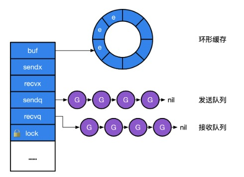
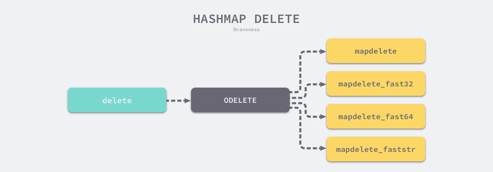

# 类型

## 1、channel

本质上是一个锁加上一个环状缓存、一个发送方队列和一个接收方队列。

```go
// src/runtime/chan.go
type hchan struct {
    qcount   uint           // total data in the queue 队列中所有数据数
    dataqsiz uint           // size of the circular queue 环形队列的大小
    buf      unsafe.Pointer // points to an array of dataqsiz elements 指向环形队列数组的指针
    elemsize uint16         // 元素大小
    closed   uint32         // 是否关闭
    elemtype *_type         // element type 元素类型
    sendx    uint           // send index 发送索引
    recvx    uint           // receive index 接收索引
    recvq    waitq          // list of recv waiters 接收等待列表
    sendq    waitq          // list of send waiters 发送等待列表

    // lock protects all fields in hchan, as well as several
    // fields in sudogs blocked on this channel.
    //
    // Do not change another G's status while holding this lock
    // (in particular, do not ready a G), as this can deadlock
    // with stack shrinking.
    lock mutex
}

type waitq struct {
    first *sudog
    last  *sudog
}
```



### channel的创建

将一个make语句转换为makechan调用。makechan实现的本质是根据需要创建的元素大小，对mallocgc进行封装。<span style='color:red'>channel总是在堆上进行分配，它们会被垃圾回收器进行回收，所以说channel不一定总是需要调用close进行显示关闭。	</span>

```go
// src/runtime/chan.go
func makechan(t *chantype, size int) *hchan {
    elem := t.elem

    // compiler checks this but be safe.
    // 通道元素的大小不能超过64KB
    // 虽然编译器会进行类型检查，但这里仍加一层检查，确保安全性
    if elem.size >= 1<<16 {
        throw("makechan: invalid channel element type")
    }
    // 检查通道的对齐情况
    // 检查通道的大小是否可以被最大对齐值整除或者检查通道元素的对齐值是否超过了最大对齐值
    if hchanSize%maxAlign != 0 || elem.align > maxAlign {
        throw("makechan: bad alignment")
    }

    // 计算元素大小与个数的乘积，返回结果和溢出标志
    mem, overflow := math.MulUintptr(elem.size, uintptr(size))
    // 溢出标志：乘积超出了uintptr类型的范围
    // 如果乘积mem大于了maxAlloc-hchanSize，说明需要分配的内存超出了最大允许分配的内存量。
    // size小于0，说明是一个无效通道
    if overflow || mem > maxAlloc-hchanSize || size < 0 {
        panic(plainError("makechan: size out of range"))
    }

    // Hchan does not contain pointers interesting for GC when elements stored in buf do not contain pointers.
    // buf points into the same allocation, elemtype is persistent.
    // SudoG's are referenced from their owning thread so they can't be collected.
    // TODO(dvyukov,rlh): Rethink when collector can move allocated objects.
    var c *hchan
    switch {
    case mem == 0:
        // Queue or element size is zero.
        // 队列或元素大小为0，仅需分配一个hchan结构体的内存
        c = (*hchan)(mallocgc(hchanSize, nil, true))
        // Race detector uses this location for synchronization.
        // 竟态检测
        c.buf = c.raceaddr()
    case elem.ptrdata == 0:
        // Elements do not contain pointers.
        // Allocate hchan and buf in one call.
        // 元素不包含指针
        // 一次性分配hchan和缓冲区buf的内存
        c = (*hchan)(mallocgc(hchanSize+mem, nil, true))
        // 将buf指针设置为c指针后面的内存位置
        c.buf = add(unsafe.Pointer(c), hchanSize)
    default:
        // Elements contain pointers.
        // 包含指针，分别分配hchan和缓冲区buf的内存
        c = new(hchan)
        c.buf = mallocgc(mem, elem, true)
    }

    // 初始化通道结构体
    c.elemsize = uint16(elem.size)
    c.elemtype = elem
    c.dataqsiz = uint(size)
    // 初始化通道的锁
    lockInit(&c.lock, lockRankHchan)

    if debugChan {
        print("makechan: chan=", c, "; elemsize=", elem.size, "; dataqsiz=", size, "\n")
    }
    return c
}
```

<span style='color:red'>在GO语言中，通道元素的大小限制在小于64KB，主要是出于性能和实现的考虑，确保通道的高效实现和避免潜在的问题。</span>

性能考虑：

- 内存分配：当通道的元素大小较大时，每次传输一个元素所需的内存分配和拷贝成本也会增加，导致性能显著下降。
- 缓存局部性：较大的元素会影响CPU缓存的使用效率。较小的元素可以更好的利用缓存，提高程序的运行效率。

内存管理：

- 内存碎片：较大的内存块可能会导致内存碎片问题，影响内存的分配和管理。
- GC压力：增加垃圾回收器的负担。

实现简化：

- 通道实现：通道的底层实现需要处理元素的存储和传输。限制元素的大小可以简化通道的实现，使代码易于维护。
- 缓冲区管理：通道的缓冲区管理会变的更加复杂，如果元素的大小不受限制，可能需要处理不同大小的内存块。

channel并不严格支持int64大小的缓冲，当make时的大小为int64类型时，运行时会将其强转为int，提供了对int转型是否成功的检查：

```go
func makechan64(t *chantype, size int64) *hchan {
    // 确保了size在转换为int类型时不会发生溢出，由于makechan可能依赖于int类型来处理通道的容量，
    // 这个检查是必要的，以避免潜在的内存分配错误或其他逻辑错误，
    // 如果size超出int类型的表示范围，则会引发panic，避免不合法的通道创建
    if int64(int(size)) != size {
        panic(plainError("makechan: size out of range"))
    }

    return makechan(t, int(size))
}
```

### 向channel发送数据：

1. <span style='color:red'>如果一个channel为零值（比如没有初始化），这个时候发送操作会阻塞当前的协程，发生死锁。</span>
2. 当channel上有接收方等待，可以直接将数据发送走，并返回。
3. 没有接收方，但缓存中还有空间来存放没有读取的数据，则存储在缓冲区。
4. 没有接收方，缓存也满了，则阻塞当前的协程

```go
// 向channel发送数据的实现
// entry point for c <- x from compiled code.
//
//go:nosplit
func chansend1(c *hchan, elem unsafe.Pointer) {
    chansend(c, elem, true, getcallerpc())
}

/*
 * generic single channel send/recv
 * If block is not nil,
 * then the protocol will not
 * sleep but return if it could
 * not complete.
 *
 * sleep can wake up with g.param == nil
 * when a channel involved in the sleep has
 * been closed.  it is easiest to loop and re-run
 * the operation; we'll see that it's now closed.
 */
// c 指向目标channel的指针
// ep 指向待发送数据的指针
// block 是否为阻塞操作
// callerpc 调用方的程序计数器
func chansend(c *hchan, ep unsafe.Pointer, block bool, callerpc uintptr) bool {
    // 向nil的channel发送数据，会调用gopark
    if c == nil {
        if !block {
            return false
        }
        // gopark会将当前的协程休眠，发生死锁崩溃
        gopark(nil, nil, waitReasonChanSendNilChan, traceEvGoStop, 2)
        throw("unreachable")
    }

    if debugChan {
        print("chansend: chan=", c, "\n")
    }

    // 如果启用了竟态检测，会记录相应的读操作
    if raceenabled {
        racereadpc(c.raceaddr(), callerpc, abi.FuncPCABIInternal(chansend))
    }

    // Fast path: check for failed non-blocking operation without acquiring the lock.
    //
    // After observing that the channel is not closed, we observe that the channel is
    // not ready for sending. Each of these observations is a single word-sized read
    // (first c.closed and second full()).
    // Because a closed channel cannot transition from 'ready for sending' to
    // 'not ready for sending', even if the channel is closed between the two observations,
    // they imply a moment between the two when the channel was both not yet closed
    // and not ready for sending. We behave as if we observed the channel at that moment,
    // and report that the send cannot proceed.
    //
    // It is okay if the reads are reordered here: if we observe that the channel is not
    // ready for sending and then observe that it is not closed, that implies that the
    // channel wasn't closed during the first observation. However, nothing here
    // guarantees forward progress. We rely on the side effects of lock release in
    // chanrecv() and closechan() to update this thread's view of c.closed and full().
    // 非阻塞操作并且没有关闭并且满了
    if !block && c.closed == 0 && full(c) {
        return false
    }

    // 启用性能分析，记录当前时间戳
    var t0 int64
    if blockprofilerate > 0 {
        t0 = cputicks()
    }

    // 加锁，确保并发安全
    lock(&c.lock)

    // 双重检验
    // channel关闭了，解锁并且panic
    if c.closed != 0 {
        unlock(&c.lock)
        panic(plainError("send on closed channel"))
    }

    // 检查是否有等待的接收者
    if sg := c.recvq.dequeue(); sg != nil {
        // Found a waiting receiver. We pass the value we want to send
        // directly to the receiver, bypassing the channel buffer (if any).
        // 有，直接将数据发送给接收者，绕过缓冲区，并解锁
        send(c, sg, ep, func() { unlock(&c.lock) }, 3)
        return true
    }

    if c.qcount < c.dataqsiz {
        // 有缓冲区空间
        // Space is available in the channel buffer. Enqueue the element to send.
        // 获取要拷贝到的缓冲区地址空间
        qp := chanbuf(c, c.sendx)
        if raceenabled {
            racenotify(c, c.sendx, nil)
        }
        // 将数据复制到缓冲区
        typedmemmove(c.elemtype, qp, ep)
        // 更新缓冲区计数和索引，解锁并返回
        c.sendx++
        if c.sendx == c.dataqsiz {
            c.sendx = 0
        }
        c.qcount++
        unlock(&c.lock)
        return true
    }

    // 非阻塞操作，没有空间，解锁返回
    if !block {
        unlock(&c.lock)
        return false
    }

    // 没有等待的并且也没有缓冲空间了则会阻塞协程
    // Block on the channel. Some receiver will complete our operation for us.
    gp := getg()

    // 创建sudog
    mysg := acquireSudog()
    mysg.releasetime = 0
    if t0 != 0 {
        mysg.releasetime = -1
    }
    // No stack splits between assigning elem and enqueuing mysg
    // on gp.waiting where copystack can find it.
    mysg.elem = ep
    mysg.waitlink = nil
    mysg.g = gp
    mysg.isSelect = false
    mysg.c = c
    gp.waiting = mysg
    gp.param = nil
    // 加入发送等待队列
    c.sendq.enqueue(mysg)
    // Signal to anyone trying to shrink our stack that we're about
    // to park on a channel. The window between when this G's status
    // changes and when we set gp.activeStackChans is not safe for
    // stack shrinking.
    // 将当前协程状态设置为等待，并将其挂起，等待被唤醒
    gp.parkingOnChan.Store(true)
    gopark(chanparkcommit, unsafe.Pointer(&c.lock), waitReasonChanSend, traceEvGoBlockSend, 2)
    // Ensure the value being sent is kept alive until the
    // receiver copies it out. The sudog has a pointer to the
    // stack object, but sudogs aren't considered as roots of the
    // stack tracer.
    // 确保待发送的数据在接收者复制之前不会被回收
    KeepAlive(ep)

    // someone woke us up.
    // 被唤醒后，检查等待队列是否被破坏
    if mysg != gp.waiting {
        throw("G waiting list is corrupted")
    }
    // 更新相应状态
    gp.waiting = nil
    gp.activeStackChans = false
    closed := !mysg.success
    gp.param = nil
    if mysg.releasetime > 0 {
        blockevent(mysg.releasetime-t0, 2)
    }
    mysg.c = nil
    // 释放
    releaseSudog(mysg)
    // channel 已经关闭 触发panic
    if closed {
        if c.closed == 0 {
            throw("chansend: spurious wakeup")
        }
        panic(plainError("send on closed channel"))
    }
    return true
}
```

```go
// send processes a send operation on an empty channel c.
// The value ep sent by the sender is copied to the receiver sg.
// The receiver is then woken up to go on its merry way.
// Channel c must be empty and locked.  send unlocks c with unlockf.
// sg must already be dequeued from c.
// ep must be non-nil and point to the heap or the caller's stack.
func send(c *hchan, sg *sudog, ep unsafe.Pointer, unlockf func(), skip int) {
    // todo 启用竟态检测相关，待研究
    if raceenabled {
        if c.dataqsiz == 0 {
            racesync(c, sg)
        } else {
            // Pretend we go through the buffer, even though
            // we copy directly. Note that we need to increment
            // the head/tail locations only when raceenabled.
            racenotify(c, c.recvx, nil)
            racenotify(c, c.recvx, sg)
            c.recvx++
            if c.recvx == c.dataqsiz {
                c.recvx = 0
            }
            c.sendx = c.recvx // c.sendx = (c.sendx+1) % c.dataqsiz
        }
    }
    // 直接发送数据
    if sg.elem != nil {
        sendDirect(c.elemtype, sg, ep)
        sg.elem = nil
    }
    // 唤醒接收者
    gp := sg.g
    // 解锁channel
    unlockf()
    gp.param = unsafe.Pointer(sg)
    // 标志改为true，表示发送成功
    sg.success = true
    // 更新释放时间
    if sg.releasetime != 0 {
        sg.releasetime = cputicks()
    }
    // 唤醒接收者gp
    goready(gp, skip+1)
}

// Sends and receives on unbuffered or empty-buffered channels are the
// only operations where one running goroutine writes to the stack of
// another running goroutine. The GC assumes that stack writes only
// happen when the goroutine is running and are only done by that
// goroutine. Using a write barrier is sufficient to make up for
// violating that assumption, but the write barrier has to work.
// typedmemmove will call bulkBarrierPreWrite, but the target bytes
// are not in the heap, so that will not help. We arrange to call
// memmove and typeBitsBulkBarrier instead.

func sendDirect(t *_type, sg *sudog, src unsafe.Pointer) {
    // src is on our stack, dst is a slot on another stack.
    // src在当前goroutine的栈上，dst是另一个goroutine栈上的槽位。

    // Once we read sg.elem out of sg, it will no longer
    // be updated if the destination's stack gets copied (shrunk).
    // So make sure that no preemption points can happen between read & use.
    // 读取目标槽位的地址到dst。一旦读取出来，如果目标goroutine的栈被复制，例如栈缩小
    // sg.elem将不会被更新。因此，在读取和使用之间确保没有抢占点（即不允许当前goroutine被挂起）
    dst := sg.elem
    // todo 一种内存屏障，用于确保在内存复制操作之前正确处理写屏障
    typeBitsBulkBarrier(t, uintptr(dst), uintptr(src), t.size)
    // No need for cgo write barrier checks because dst is always
    // Go memory.
    // 将数据从src复制到dst。这是一种低级别的内存复制操作，不需要额外的cgo写屏障检查
    // dst始终是go内存
    memmove(dst, src, t.size)
}
```

send操作中隐含了有接收方阻塞在channel上，当我们发送完数据后，唤醒接收方。

这个send操作其实是一种优化，原因在于，已经处于等待状态的协程是没有被执行的。因此用户态代码不会与当前所发生的数据发生任何竞争。所以没有必要将冗余的数据写到缓存中，再让接收方读取，所以sendDirect的调用，本质上是将数据直接写入接收方的执行栈。

### 从channel中接收数据

1. <span style='color:red'>如果一个channel为零值（比如没有初始化），这个时候接收操作会阻塞当前的协程，发生死锁。</span>
2. channel已经被关闭，且channel中没有数据，立即返回。
3. 如果存在正在阻塞的发送方，说明缓存已满，从缓存队头取一个数据，再唤醒一个发送方。
4. 否则，检查缓存，如果缓存中仍有数据，则从缓存中读取，读取过程会将队列中的数据拷贝一份到接收方的执行栈中
5. 没有能接收的数据，就阻塞当前接收方的协程。

```go
// 从channel接收数据的实现
// entry points for <- c from compiled code.
//
//go:nosplit
func chanrecv1(c *hchan, elem unsafe.Pointer) {
    chanrecv(c, elem, true)
}

//go:nosplit
func chanrecv2(c *hchan, elem unsafe.Pointer) (received bool) {
    _, received = chanrecv(c, elem, true)
    return
}

// chanrecv receives on channel c and writes the received data to ep.
// ep may be nil, in which case received data is ignored.
// If block == false and no elements are available, returns (false, false).
// Otherwise, if c is closed, zeros *ep and returns (true, false).
// Otherwise, fills in *ep with an element and returns (true, true).
// A non-nil ep must point to the heap or the caller's stack.
func chanrecv(c *hchan, ep unsafe.Pointer, block bool) (selected, received bool) {
    // raceenabled: don't need to check ep, as it is always on the stack
    // or is new memory allocated by reflect.

    if debugChan {
        print("chanrecv: chan=", c, "\n")
    }

    // nil的channel
    if c == nil {
        // 非阻塞模式，直接返回
        if !block {
            return
        }
        // 阻塞，直接休眠当前goroutine，导致死锁崩溃
        gopark(nil, nil, waitReasonChanReceiveNilChan, traceEvGoStop, 2)
        throw("unreachable")
    }

    // Fast path: check for failed non-blocking operation without acquiring the lock.
    // 非阻塞并且协程为空
    if !block && empty(c) {
        // After observing that the channel is not ready for receiving, we observe whether the
        // channel is closed.
        //
        // Reordering of these checks could lead to incorrect behavior when racing with a close.
        // For example, if the channel was open and not empty, was closed, and then drained,
        // reordered reads could incorrectly indicate "open and empty". To prevent reordering,
        // we use atomic loads for both checks, and rely on emptying and closing to happen in
        // separate critical sections under the same lock.  This assumption fails when closing
        // an unbuffered channel with a blocked send, but that is an error condition anyway.
        // 检查channel是否关闭
        if atomic.Load(&c.closed) == 0 {
            // 未关闭，则返回
            // Because a channel cannot be reopened, the later observation of the channel
            // being not closed implies that it was also not closed at the moment of the
            // first observation. We behave as if we observed the channel at that moment
            // and report that the receive cannot proceed.
            return
        }
        // The channel is irreversibly closed. Re-check whether the channel has any pending data
        // to receive, which could have arrived between the empty and closed checks above.
        // Sequential consistency is also required here, when racing with such a send.
        // 未关闭但为空，清空接收的指针ep并返回
        if empty(c) {
            // The channel is irreversibly closed and empty.
            if raceenabled {
                raceacquire(c.raceaddr())
            }
            if ep != nil {
                typedmemclr(c.elemtype, ep)
            }
            return true, false
        }
    }

    var t0 int64
    if blockprofilerate > 0 {
        t0 = cputicks()
    }

    lock(&c.lock)

    if c.closed != 0 {
        // channel 关闭且为空，则清空ep并返回
        if c.qcount == 0 {
            if raceenabled {
                raceacquire(c.raceaddr())
            }
            unlock(&c.lock)
            if ep != nil {
                typedmemclr(c.elemtype, ep)
            }
            return true, false
        }
        // The channel has been closed, but the channel's buffer have data.
    } else {
        // Just found waiting sender with not closed.
        // 有阻塞的发送方，则直接接收数据
        if sg := c.sendq.dequeue(); sg != nil {
            // Found a waiting sender. If buffer is size 0, receive value
            // directly from sender. Otherwise, receive from head of queue
            // and add sender's value to the tail of the queue (both map to
            // the same buffer slot because the queue is full).
            recv(c, sg, ep, func() { unlock(&c.lock) }, 3)
            return true, true
        }
    }

    // 缓冲区有数据，不管channel是否关闭
    if c.qcount > 0 {
        // Receive directly from queue
        // 接收数据，解锁并返回
        qp := chanbuf(c, c.recvx)
        if raceenabled {
            racenotify(c, c.recvx, nil)
        }
        if ep != nil {
            typedmemmove(c.elemtype, ep, qp)
        }
        typedmemclr(c.elemtype, qp)
        c.recvx++
        if c.recvx == c.dataqsiz {
            c.recvx = 0
        }
        c.qcount--
        unlock(&c.lock)
        return true, true
    }

    // 非阻塞，解锁c并返回
    if !block {
        unlock(&c.lock)
        return false, false
    }

    // no sender available: block on this channel.
    // 没有数据可以接收，则阻塞协程
    gp := getg()
    // 获取并初始化sudog
    mysg := acquireSudog()
    mysg.releasetime = 0
    if t0 != 0 {
        mysg.releasetime = -1
    }
    // No stack splits between assigning elem and enqueuing mysg
    // on gp.waiting where copystack can find it.
    mysg.elem = ep
    mysg.waitlink = nil
    gp.waiting = mysg
    mysg.g = gp
    mysg.isSelect = false
    mysg.c = c
    gp.param = nil
    // 加入到接收等待队列
    c.recvq.enqueue(mysg)
    // Signal to anyone trying to shrink our stack that we're about
    // to park on a channel. The window between when this G's status
    // changes and when we set gp.activeStackChans is not safe for
    // stack shrinking.
    // 阻塞当前协程
    gp.parkingOnChan.Store(true)
    gopark(chanparkcommit, unsafe.Pointer(&c.lock), waitReasonChanReceive, traceEvGoBlockRecv, 2)

    // someone woke us up
    // 被唤醒后，检查sudog的状态
    if mysg != gp.waiting {
        throw("G waiting list is corrupted")
    }
    gp.waiting = nil
    gp.activeStackChans = false
    if mysg.releasetime > 0 {
        blockevent(mysg.releasetime-t0, 2)
    }
    success := mysg.success
    gp.param = nil
    mysg.c = nil
    // 释放sudog
    releaseSudog(mysg)
    return true, success
}
```

接收数据同样包含直接往接收方的执行栈中拷贝要发送的数据，但这种情况当且仅当缓存大小为0时，即采用无缓冲的channel。

```go
// recv processes a receive operation on a full channel c.
// There are 2 parts:
//  1. The value sent by the sender sg is put into the channel
//     and the sender is woken up to go on its merry way.
//  2. The value received by the receiver (the current G) is
//     written to ep.
//
// For synchronous channels, both values are the same.
// For asynchronous channels, the receiver gets its data from
// the channel buffer and the sender's data is put in the
// channel buffer.
// Channel c must be full and locked. recv unlocks c with unlockf.
// sg must already be dequeued from c.
// A non-nil ep must point to the heap or the caller's stack.
func recv(c *hchan, sg *sudog, ep unsafe.Pointer, unlockf func(), skip int) {
    if c.dataqsiz == 0 {
        // 无缓冲channel的处理
        if raceenabled {
            racesync(c, sg)
        }
        if ep != nil {
            // copy data from sender
            // 接收数据指针不是nil，则直接从发送着处复制数据到ep。
            recvDirect(c.elemtype, sg, ep)
        }
    } else {
        // Queue is full. Take the item at the
        // head of the queue. Make the sender enqueue
        // its item at the tail of the queue. Since the
        // queue is full, those are both the same slot.
        // 有缓冲的channel，进入这个函数表示队列已满
        // 获取队列头部元素的位置
        qp := chanbuf(c, c.recvx)
        if raceenabled {
            racenotify(c, c.recvx, nil)
            racenotify(c, c.recvx, sg)
        }
        // copy data from queue to receiver
        if ep != nil {
            // 将数据从缓冲区复制到接收者
            // 环形队列，取出头部和塞入的尾部在同一个位置
            typedmemmove(c.elemtype, ep, qp)
        }
        // copy data from sender to queue
        // 从发送方拷贝到缓冲队列中
        typedmemmove(c.elemtype, qp, sg.elem)
        // 更新索引
        c.recvx++
        if c.recvx == c.dataqsiz {
            c.recvx = 0
        }
        c.sendx = c.recvx // c.sendx = (c.sendx+1) % c.dataqsiz
    }
    // 唤醒发送着
    sg.elem = nil
    gp := sg.g
    unlockf()
    gp.param = unsafe.Pointer(sg)
    // 发送成功
    sg.success = true
    if sg.releasetime != 0 {
        sg.releasetime = cputicks()
    }
    goready(gp, skip+1)
}
```

<span style='color:red'>对于无缓冲的channel，接收操作发生在发送操作之前，无缓冲channel的接收方会先从发送方栈拷贝数据后，发送方才会被放回调度队列中，等待重新调度。</span>

在无缓冲的channel中，发送和接收操作是同步的。发送方执行发送操作时会阻塞，直到接收方接收数据。接收方在执行接收操作时也会阻塞，直到发送方调用发送数据。

数据拷贝完成之前，发送方一直处于阻塞状态，无法继续执行。只有在接收方成功接收到数据并解除阻塞后，发送方才会解除阻塞。

```go
package main

import (
	"fmt"
	"time"
)
// 具体哪个打印先执行，由调度器决定
func main() {
	ch := make(chan int)

	go func() {
		// 向无缓冲 channel 发送数据
		ch <- 42
		fmt.Println("Sent value")
	}()

	time.Sleep(time.Second) // 模拟一些延迟

	// 从无缓冲 channel 接收数据
	value := <-ch
	fmt.Println("Received value:", value)
}
```

### channel的关闭

具体的实现中，首先对channel上锁，而后依次将阻塞在channel的g添加到一个gList中，当所有的g均从channel上移除时，可释放锁，并唤醒gList中的所有接收方和发送方。

```go
func closechan(c *hchan) {
    if c == nil {
        // close一个空的channel会产生panic
        panic(plainError("close of nil channel"))
    }

    lock(&c.lock)
    if c.closed != 0 {
        unlock(&c.lock)
        // 重复关闭channel也会产生panic
        panic(plainError("close of closed channel"))
    }

    // 数据竞争检测，记录相关信息
    if raceenabled {
        callerpc := getcallerpc()
        racewritepc(c.raceaddr(), callerpc, abi.FuncPCABIInternal(closechan))
        racerelease(c.raceaddr())
    }

    // 设置关闭状态
    c.closed = 1

    // 定义一个goroutine列表
    var glist gList

    // release all readers
    // 释放所有等待接收的goroutine
    for {
        sg := c.recvq.dequeue()
        if sg == nil {
            break
        }
        if sg.elem != nil {
            // 清理
            typedmemclr(c.elemtype, sg.elem)
            sg.elem = nil
        }
        // 更新释放时间
        if sg.releasetime != 0 {
            sg.releasetime = cputicks()
        }
        gp := sg.g
        gp.param = unsafe.Pointer(sg)
        sg.success = false
        if raceenabled {
            raceacquireg(gp, c.raceaddr())
        }
        glist.push(gp)
    }

    // release all writers (they will panic)
    // 释放所有发送方
    for {
        sg := c.sendq.dequeue()
        if sg == nil {
            break
        }
        sg.elem = nil
        if sg.releasetime != 0 {
            sg.releasetime = cputicks()
        }
        gp := sg.g
        gp.param = unsafe.Pointer(sg)
        sg.success = false
        if raceenabled {
            raceacquireg(gp, c.raceaddr())
        }
        glist.push(gp)
    }
    unlock(&c.lock)

    // Ready all Gs now that we've dropped the channel lock.
    // 就绪所有的协程
    for !glist.empty() {
        gp := glist.pop()
        gp.schedlink = 0
        goready(gp, 3)
    }
}
```

当channel关闭时，必须让所有阻塞的接收方重新被调度，让所有的发送方也重新被调度，这个时候的实现将协程统一添加到一个列表中，然后逐个重新启动。

## 2、error

错误error在Go中表现为一个内建的接口类型，任何实现这个方法的类型都能作为error类型进行传递，成为错误值。

```go
// src/builtin/builtin.go
// The error built-in interface type is the conventional interface for
// representing an error condition, with the nil value representing no error.
// 内置错误接口类型
type error interface {
    Error() string
}
```

作为内建接口类型，编译器负责在参数传递检查时，对值类型所实现的方法进行检查，当类型实现了这个方法后，才允许其作为error进行传递

```go
// src/cmd/compile/internal/types/universe.go
func makeErrorInterface() *Type {
    sig := NewSignature(NoPkg, FakeRecv(), nil, nil, []*Field{
        NewField(src.NoXPos, nil, Types[TSTRING]),
    })
    // 查找是否实现了Error
    method := NewField(src.NoXPos, LocalPkg.Lookup("Error"), sig)
    return NewInterface(NoPkg, []*Field{method}, false)
}
```

### 常见的错误处理策略

哨兵错误：通过特定值表示成功和不同错误，依靠调用方对错误进行检查。

```go
func readf(path string) error {
	err := file.Open(path)
	if err != nil {
		return fmt.Errorf("cannot open file: %v", err)
	}
}

func main() {
	err := readf("~/.ssh/id_rsa.pub")
	if strings.Contains(err.Error(), "not found") {
		...
	}
}
```

​	这类错误处理的方式是非常危险的，因为它在调用方和被调用方之间建立了牢不可破的依赖关系。

​	除此之外，哨兵错误还有一个相当致命的危险，那就是这种方式所定义的错误并非常量。

```go
package io
var EOF = errors.New("EOF")
```

很难避免被导出后进行重新赋值。

```go
package main
import "io"
func init() {
	io.EOF = nil
}
```

​	如果在引入的依赖中，有人恶意将这样验证错误的值进行修改的代码包含进去，将导致重大的安全问题。

```go
import "cropto/rsa"
func init() {
	rsa.ErrVerification = nil
}
```

​	当我们在项目中无法保证这种恶意代码不会出现在某个依赖包中，为了安全起见，变量的错误类型可以修改为常量错误。

自定义错误

```go
if err, ok := err.(SomeErrorType); ok { ... }
```

​	通过自定义的错误类型来表示特定的错误，同样依赖上层代码对错误值进行检查，不同的是需要使用类型断言进行检查。

```go
type CustomizedError struct {
	Line int
	Msg  string
	File string
}
func (e CustomizedError) Error() string {
	return fmt.Sprintf("%s:%d: %s", e.File, e.Line, e.Msg)
}
```

​	这种错误处理的好处在于可以将错误包装起来，提供更多的上下文信息，但错误的实现方必须向上公开实现的错误类型，不可避免的同样产生依赖关系。

隐式错误

```go
if err != nil { return err }
```

​	这种错误处理的方式直接返回错误的任何细节，直接将错误进一步报告给上层。这种情况下错误在当前调用方完全没有任何加工，与没有进行处理几乎是等价的，这会产生一个致命的问题，丢失调用的上下文信息，如果某个错误连续向上层传播了多次，那么上层代码可能输出某个错误时，根本无法判断该错误的错误信息究竟从哪里来。

### 处理错误的本质

1. 错误值检查：如何对一个传播链条中的错误类型进行断言
2. 错误格式与上下文：出现错误时，没有足够的堆栈信息，如何增强错误发生时的上下文信息并合理格式化一个错误？
3. 错误处理语义：每个返回错误的函数都要求调用方进行显式处理，处理方式啰嗦而冗长，如何减少这种代码出现的密集程度？

#### 错误值检查

1、错误传播链

为了建立错误传播链，fmt.Errorf函数允许使用%w动词对一个错误进行包装，它会将需要包装的err包装为一个新结构，其包含需要封装的新错误消息以及原始错误：

```go
type wrapError struct {
    msg string
    err error
}

func (e *wrapError) Error() string {
    return e.msg
}

func (e *wrapError) Unwrap() error {
    return e.err
}
```

fmt包本身对格式化的支持定义了pp结构，会将格式化后的内容存储到buf中。但在错误传播链条的包装上，为了不破坏原始错误值，额外使用了两个字段

```go
// pp is used to store a printer's state and is reused with sync.Pool to avoid allocations.
type pp struct {
    buf buffer // 格式化的内容存储到buffer

    // arg holds the current item, as an interface{}.
    arg any

    // value is used instead of arg for reflect values.
    value reflect.Value

    // fmt is used to format basic items such as integers or strings.
    fmt fmt

    // reordered records whether the format string used argument reordering.
    reordered bool
    // goodArgNum records whether the most recent reordering directive was valid.
    goodArgNum bool
    // panicking is set by catchPanic to avoid infinite panic, recover, panic, ... recursion.
    panicking bool
    // erroring is set when printing an error string to guard against calling handleMethods.
    erroring bool
    // wrapErrs is set when the format string may contain a %w verb.
    // 用于格式化过程中判断是否对错误进行了包装
    wrapErrs bool
    // wrappedErrs records the targets of the %w verb.
    // 记录w%在第几个参数上
    wrappedErrs []int
}
```

Errorf方法会首先进行对格式的处理，将带有动词的字符串和参数进行拼接

```go
// src/fmt/errors.go
// Errorf formats according to a format specifier and returns the string as a
// value that satisfies error.
//
// If the format specifier includes a %w verb with an error operand,
// the returned error will implement an Unwrap method returning the operand.
// If there is more than one %w verb, the returned error will implement an
// Unwrap method returning a []error containing all the %w operands in the
// order they appear in the arguments.
// It is invalid to supply the %w verb with an operand that does not implement
// the error interface. The %w verb is otherwise a synonym for %v.
func Errorf(format string, a ...any) error {
    p := newPrinter()
    p.wrapErrs = true     // 假设格式化过程中可能包含%w，所以设置为true
    p.doPrintf(format, a) // 拼接格式化的结果，方便打印
    s := string(p.buf)    // 拼接好的内容取出来
    // 包装原始错误
    var err error
    switch len(p.wrappedErrs) {
    case 0:
        err = errors.New(s)
    case 1:
        w := &wrapError{msg: s}
        w.err, _ = a[p.wrappedErrs[0]].(error)
        err = w
    default:
        if p.reordered {
            sort.Ints(p.wrappedErrs)
        }
        var errs []error
        for i, argNum := range p.wrappedErrs {
            if i > 0 && p.wrappedErrs[i-1] == argNum {
                continue
            }
            if e, ok := a[argNum].(error); ok {
                errs = append(errs, e)
            }
        }
        err = &wrapErrors{s, errs}
    }
    p.free()
    return err
}
```

```go
// 调用链 doPrintf -> printArg -> handleMethods
func (p *pp) handleMethods(verb rune) (handled bool) {
	...
	if verb == 'w' {
		err, ok := p.arg.(error)
		// 判断与 %w 对应的值是否为 error 类型，否则处理为错误的动词组合
		if !ok || !p.wrapErrs || p.wrappedErr != nil {
			...
			return true
		}
		// 保存 err，并将其退化为 %v 动词
		p.wrappedErr = err
		verb = 'v'
	}
	...
}
```

%w这个动词的主要目的是将err记录到wrappedErr中，从而安全的将verb转化为%v对参数进行后续的格式化拼接。

#### 错误值拆包

采用类型断言进行拆包

```go
// src/errors/wrap.go
func Unwrap(err error) error {
	u, ok := err.(interface {
		Unwrap() error
	})
	if !ok {
		return nil
	}
	return u.Unwrap()
}
```

#### 错误断言

Is 用于检查当前的两个错误是否相等。之所以需要这个函数是因为一个错误可能被包装了多层，那么我们需要支持这个错误在包装多层后的判断。

```go
// src/errors/wrap.go
// Is reports whether any error in err's tree matches target.
//
// The tree consists of err itself, followed by the errors obtained by repeatedly
// calling Unwrap. When err wraps multiple errors, Is examines err followed by a
// depth-first traversal of its children.
//
// An error is considered to match a target if it is equal to that target or if
// it implements a method Is(error) bool such that Is(target) returns true.
//
// An error type might provide an Is method so it can be treated as equivalent
// to an existing error. For example, if MyError defines
//
//	func (m MyError) Is(target error) bool { return target == fs.ErrExist }
//
// then Is(MyError{}, fs.ErrExist) returns true. See syscall.Errno.Is for
// an example in the standard library. An Is method should only shallowly
// compare err and the target and not call Unwrap on either.
func Is(err, target error) bool {
    if target == nil {
        return err == target
    }

    isComparable := reflectlite.TypeOf(target).Comparable()
    for {
        // 如果target错误是可比较的，则直接进行比较
        if isComparable && err == target {
            return true
        }
        // 判断是否实现了Is方法，实现了则调用Is方法进行判断
        if x, ok := err.(interface{ Is(error) bool }); ok && x.Is(target) {
            return true
        }
        // 否则解除包装
        switch x := err.(type) {
        case interface{ Unwrap() error }:
            err = x.Unwrap()
            if err == nil {
                return false
            }
        case interface{ Unwrap() []error }:
            for _, err := range x.Unwrap() {
                if Is(err, target) {
                    return true
                }
            }
            return false
        default:
            return false
        }
    }
}
```

Is方法的目的是替换使用==形式的错误断言

```go
if err == io.ErrUnexpectedEOF {
	// ... 处理错误
}

=>

if errors.Is(err, io.ErrUnexpectedEOF) {
	// ... 处理错误
}
```

<span style='color:red'>Is方法要求自定义的错误值实现Is(error) bool方法来进行自定义的错误断言，否则错误的比较仍然只使用==算符。</span>

方法As的实现与Is基本类似，但不同之处在于As的目的是将某个错误给拆封到具体的变量中，因此对于一个错误链而言，需要一个循环不断对错误进行Unwrap，当错误值实现了As(interface{}) bool方法时，则可完成拆封。

```go
// src/errors/wrap.go
// As finds the first error in err's tree that matches target, and if one is found, sets
// target to that error value and returns true. Otherwise, it returns false.
//
// The tree consists of err itself, followed by the errors obtained by repeatedly
// calling Unwrap. When err wraps multiple errors, As examines err followed by a
// depth-first traversal of its children.
//
// An error matches target if the error's concrete value is assignable to the value
// pointed to by target, or if the error has a method As(interface{}) bool such that
// As(target) returns true. In the latter case, the As method is responsible for
// setting target.
//
// An error type might provide an As method so it can be treated as if it were a
// different error type.
//
// As panics if target is not a non-nil pointer to either a type that implements
// error, or to any interface type.
func As(err error, target any) bool {
    if err == nil {
        return false
    }
    if target == nil {
        panic("errors: target cannot be nil")
    }
    val := reflectlite.ValueOf(target)
    typ := val.Type()
    if typ.Kind() != reflectlite.Ptr || val.IsNil() {
        panic("errors: target must be a non-nil pointer")
    }
    targetType := typ.Elem()
    if targetType.Kind() != reflectlite.Interface && !targetType.Implements(errorType) {
        panic("errors: *target must be interface or implement error")
    }
    for {
        // 若可分配，则直接将err拆封到target
        if reflectlite.TypeOf(err).AssignableTo(targetType) {
            val.Elem().Set(reflectlite.ValueOf(err))
            return true
        }
        // 判断err是否实现as方法，实现则直接调用
        if x, ok := err.(interface{ As(any) bool }); ok && x.As(target) {
            return true
        }
        // 否则继续解包装
        switch x := err.(type) {
        case interface{ Unwrap() error }:
            err = x.Unwrap()
            if err == nil {
                return false
            }
        case interface{ Unwrap() []error }:
            for _, err := range x.Unwrap() {
                if As(err, target) {
                    return true
                }
            }
            return false
        default:
            return false
        }
    }
}
```

由于错误链的存在，errors.As方法的目的是替换类型断言式的错误断言：

```go
if e, ok := err.(*os.PathError); ok {
	// ... 处理错误
}

=>

var e *os.PathError
if errors.As(err, &e) {
	// ... 处理错误
}
```

## 3、map

实现一个性能优异的哈希表，需要考虑两个方面，一个是哈希函数，另一个是哈希冲突的解决方案。

装载因子:=元素数量÷桶数量

如果使用结果分布较为均匀的哈希函数，那么哈希的增删改查的时间复杂度为O（1），但是如果哈希函数的结果分布不均匀，那么所有操作的时间复杂度可能会达到O（n）。

解决哈希冲突的方法：

1）开放寻址法，这种方法的核心思想是依次探测和比较数组中的元素以判断目标键值对是否存在于哈希表中。当我们向哈希表写入新的数据时，如果发生了冲突，就会将键值对写入到下一个索引不为空的位置。当需要查找某个键对应的值时，会从索引的位置开始线性探测数组，找到目标键值对或者遇到空内存就结束。

开放寻址法中对性能影响最大的是装载率，它是表中元素的数量与表大小的比值。随着装载因子的增加，线性探测的平均用时就会逐渐增加，这会影响哈希表的读写性能。一般达到70%后，哈希表的性能就会急剧下降，而一旦达到100%，整个哈希表就会完全失效，因为这时查找和插入任意元素的时间复杂度都来到了O（n）。

2）拉链法

大部分的编程语言都是拉链法来实现的哈希表。实现拉链法一般会使用数组加上链表，一些编程语言会在拉链法的哈希中引入红黑树以优化性能。拉链法中有一个概念就是装载因子，即元素数量与桶数量的比值，装载因子越大，哈希表的读写性能就越差。一般情况下使用拉链法的哈希表装载因子不会超过1，当哈希表的装载因子较大时会触发哈希表的扩容，创建更多的桶来存储哈希中的元素，保证性能不会出现严重的下降。

<span style='color:red'>Go语言使用拉链法来解决哈希碰撞的问题去实现哈希表，它的访问、写入和删除等操作都在编译期间转换成了运行时的函数或者方法。哈希在每一个桶中存储键对应哈希的前八位，当对哈希进行操作时，这些tophash就成为可以帮助哈希快速遍历桶中元素的缓存。</span>

<span style='color:red'>哈希表的每个桶都只能存储8个键值对，一旦当前哈希的某个桶超出8个，新的键值对就会存储到哈希的溢出桶中。随着键值对数量的增加，溢出桶的数量和哈希的装载因子也会逐渐升高，超过一定范围就会触发扩容，扩容会将桶的数量翻倍，元素再分配的过程也是调用写操作时增量进行的，不会造成性能的瞬时巨大抖动。</span>

### 1）数据结构

```go
type hmap struct {
	count     int
	flags     uint8
	B         uint8
	noverflow uint16
	hash0     uint32

	buckets    unsafe.Pointer
	oldbuckets unsafe.Pointer
	nevacuate  uintptr

	extra *mapextra
}

type mapextra struct {
	overflow    *[]*bmap
	oldoverflow *[]*bmap
	nextOverflow *bmap
}
```

1. `count` 表示当前哈希表中的元素数量；
2. `B` 表示当前哈希表持有的 `buckets` 数量，但是因为哈希表中桶的数量都 2 的倍数，所以该字段会存储对数，也就是 `len(buckets) == 2^B`；
3. `hash0` 是哈希的种子，它能为哈希函数的结果引入随机性，这个值在创建哈希表时确定，并在调用哈希函数时作为参数传入；
4. `oldbuckets` 是哈希在扩容时用于保存之前 `buckets` 的字段，它的大小是当前 `buckets` 的一半；


- 当桶的数量小于 2424 时，由于数据较少、使用溢出桶的可能性较低，会省略创建的过程以减少额外开销；
- 当桶的数量多于 2424 时，会额外创建 2𝐵−42B−4 个溢出桶；

### 2）查找过程

赋值语句左侧接受参数的个数会决定使用的运行时方法：

- 当接受一个参数时，会使用 [`runtime.mapaccess1`](https://draveness.me/golang/tree/runtime.mapaccess1)，该函数仅会返回一个指向目标值的指针；
- 当接受两个参数时，会使用 [`runtime.mapaccess2`](https://draveness.me/golang/tree/runtime.mapaccess2)，除了返回目标值之外，它还会返回一个用于表示当前键对应的值是否存在的 `bool` 值：

[`runtime.mapaccess1`](https://draveness.me/golang/tree/runtime.mapaccess1) 会先通过哈希表设置的哈希函数、种子获取当前键对应的哈希，再通过 [`runtime.bucketMask`](https://draveness.me/golang/tree/runtime.bucketMask) 和 [`runtime.add`](https://draveness.me/golang/tree/runtime.add) 拿到该键值对所在的桶序号和哈希高位的 8 位数字。

```go
func mapaccess1(t *maptype, h *hmap, key unsafe.Pointer) unsafe.Pointer {
	alg := t.key.alg
	hash := alg.hash(key, uintptr(h.hash0))
	m := bucketMask(h.B)
	b := (*bmap)(add(h.buckets, (hash&m)*uintptr(t.bucketsize)))
	top := tophash(hash)
bucketloop:
	for ; b != nil; b = b.overflow(t) {
		for i := uintptr(0); i < bucketCnt; i++ {
			if b.tophash[i] != top {
				if b.tophash[i] == emptyRest {
					break bucketloop
				}
				continue
			}
			k := add(unsafe.Pointer(b), dataOffset+i*uintptr(t.keysize))
			if alg.equal(key, k) {
				v := add(unsafe.Pointer(b), dataOffset+bucketCnt*uintptr(t.keysize)+i*uintptr(t.valuesize))
				return v
			}
		}
	}
	return unsafe.Pointer(&zeroVal[0])
}
```


哈希会依次遍历正常桶和溢出桶中的数据，它会先比较哈希的高 8 位和桶中存储的 `tophash`，后比较传入的和桶中的值以加速数据的读写。用于选择桶序号的是哈希的最低几位，而用于加速访问的是哈希的高 8 位，这种设计能够减少同一个桶中有大量相等 `tophash` 的概率影响性能。

每一个桶都是一整片的内存空间，当发现桶中的 `tophash` 与传入键的 `tophash` 匹配之后，我们会通过指针和偏移量获取哈希中存储的键 `keys[0]` 并与 `key` 比较，如果两者相同就会获取目标值的指针 `values[0]` 并返回。

### 3）写入过程

首先是函数会根据传入的键拿到对应的哈希和桶，然后通过遍历比较桶中存储的 `tophash` 和键的哈希，如果找到了相同结果就会返回目标位置的地址。其中 `inserti` 表示目标元素的在桶中的索引，`insertk` 和 `val` 分别表示键值对的地址，获得目标地址之后会通过算术计算寻址获得键值对 `k` 和 `val`。

上述的 for 循环会依次遍历正常桶和溢出桶中存储的数据，整个过程会分别判断 `tophash` 是否相等、`key` 是否相等，遍历结束后会从循环中跳出。

```go
func mapassign(t *maptype, h *hmap, key unsafe.Pointer) unsafe.Pointer {
	alg := t.key.alg
	hash := alg.hash(key, uintptr(h.hash0))

	h.flags ^= hashWriting

again:
	bucket := hash & bucketMask(h.B)
	b := (*bmap)(unsafe.Pointer(uintptr(h.buckets) + bucket*uintptr(t.bucketsize)))
	top := tophash(hash)
	var inserti *uint8
	var insertk unsafe.Pointer
	var val unsafe.Pointer
bucketloop:
	for {
		for i := uintptr(0); i < bucketCnt; i++ {
			if b.tophash[i] != top {
				if isEmpty(b.tophash[i]) && inserti == nil {
					inserti = &b.tophash[i]
					insertk = add(unsafe.Pointer(b), dataOffset+i*uintptr(t.keysize))
					val = add(unsafe.Pointer(b), dataOffset+bucketCnt*uintptr(t.keysize)+i*uintptr(t.valuesize))
				}
				if b.tophash[i] == emptyRest {
					break bucketloop
				}
				continue
			}
			k := add(unsafe.Pointer(b), dataOffset+i*uintptr(t.keysize))
			if !alg.equal(key, k) {
				continue
			}
			val = add(unsafe.Pointer(b), dataOffset+bucketCnt*uintptr(t.keysize)+i*uintptr(t.valuesize))
			goto done
		}
		ovf := b.overflow(t)
		if ovf == nil {
			break
		}
		b = ovf
	}
```


如果当前桶已经满了，哈希会调用 [`runtime.hmap.newoverflow`](https://draveness.me/golang/tree/runtime.hmap.newoverflow) 创建新桶或者使用 [`runtime.hmap`](https://draveness.me/golang/tree/runtime.hmap) 预先在 `noverflow` 中创建好的桶来保存数据，新创建的桶不仅会被追加到已有桶的末尾，还会增加哈希表的 `noverflow` 计数器。

```go
	if inserti == nil {
		newb := h.newoverflow(t, b)
		inserti = &newb.tophash[0]
		insertk = add(unsafe.Pointer(newb), dataOffset)
		val = add(insertk, bucketCnt*uintptr(t.keysize))
	}

	typedmemmove(t.key, insertk, key)
	*inserti = top
	h.count++

done:
	return val
}
```

### 4）扩容

[`runtime.mapassign`](https://draveness.me/golang/tree/runtime.mapassign) 函数会在以下两种情况发生时触发哈希的扩容：

1. 装载因子已经超过 6.5；
2. 哈希使用了太多溢出桶；

```go
func mapassign(t *maptype, h *hmap, key unsafe.Pointer) unsafe.Pointer {
	...
	if !h.growing() && (overLoadFactor(h.count+1, h.B) || tooManyOverflowBuckets(h.noverflow, h.B)) {
		hashGrow(t, h)
		goto again
	}
	...
}
```

不过因为 Go 语言哈希的扩容不是一个原子的过程，所以 [`runtime.mapassign`](https://draveness.me/golang/tree/runtime.mapassign) 还需要判断当前哈希是否已经处于扩容状态，避免二次扩容造成混乱。

根据触发的条件不同扩容的方式分成两种，如果这次扩容是溢出的桶太多导致的，那么这次扩容就是等量扩容 `sameSizeGrow`，`sameSizeGrow` 是一种特殊情况下发生的扩容，当我们持续向哈希中插入数据并将它们全部删除时，如果哈希表中的数据量没有超过阈值，就会不断积累溢出桶造成缓慢的内存泄漏[4](https://draveness.me/golang/docs/part2-foundation/ch03-datastructure/golang-hashmap/#fn:4)。[runtime: limit the number of map overflow buckets](https://github.com/golang/go/commit/9980b70cb460f27907a003674ab1b9bea24a847c) 引入了 `sameSizeGrow` 通过复用已有的哈希扩容机制解决该问题，一旦哈希中出现了过多的溢出桶，它会创建新桶保存数据，垃圾回收会清理老的溢出桶并释放内存[5](https://draveness.me/golang/docs/part2-foundation/ch03-datastructure/golang-hashmap/#fn:5)。

```go
func hashGrow(t *maptype, h *hmap) {
	bigger := uint8(1)
	if !overLoadFactor(h.count+1, h.B) {
		bigger = 0
		h.flags |= sameSizeGrow
	}
	oldbuckets := h.buckets
	newbuckets, nextOverflow := makeBucketArray(t, h.B+bigger, nil)

	h.B += bigger
	h.flags = flags
	h.oldbuckets = oldbuckets
	h.buckets = newbuckets
	h.nevacuate = 0
	h.noverflow = 0

	h.extra.oldoverflow = h.extra.overflow
	h.extra.overflow = nil
	h.extra.nextOverflow = nextOverflow
}
```

哈希在扩容的过程中会通过 [`runtime.makeBucketArray`](https://draveness.me/golang/tree/runtime.makeBucketArray) 创建一组新桶和预创建的溢出桶，随后将原有的桶数组设置到 `oldbuckets` 上并将新的空桶设置到 `buckets` 上，溢出桶也使用了相同的逻辑更新，下图展示了触发扩容后的哈希：


我们在 [`runtime.hashGrow`](https://draveness.me/golang/tree/runtime.hashGrow) 中还看不出来等量扩容和翻倍扩容的太多区别，等量扩容创建的新桶数量只是和旧桶一样，该函数中只是创建了新的桶，并没有对数据进行拷贝和转移。哈希表的数据迁移的过程在是 [`runtime.evacuate`](https://draveness.me/golang/tree/runtime.evacuate) 中完成的，它会对传入桶中的元素进行再分配。

```go
func evacuate(t *maptype, h *hmap, oldbucket uintptr) {
	b := (*bmap)(add(h.oldbuckets, oldbucket*uintptr(t.bucketsize)))
	newbit := h.noldbuckets()
	if !evacuated(b) {
		var xy [2]evacDst
		x := &xy[0]
		x.b = (*bmap)(add(h.buckets, oldbucket*uintptr(t.bucketsize)))
		x.k = add(unsafe.Pointer(x.b), dataOffset)
		x.v = add(x.k, bucketCnt*uintptr(t.keysize))

		y := &xy[1]
		y.b = (*bmap)(add(h.buckets, (oldbucket+newbit)*uintptr(t.bucketsize)))
		y.k = add(unsafe.Pointer(y.b), dataOffset)
		y.v = add(y.k, bucketCnt*uintptr(t.keysize))
```

[`runtime.evacuate`](https://draveness.me/golang/tree/runtime.evacuate) 会将一个旧桶中的数据分流到两个新桶，所以它会创建两个用于保存分配上下文的 [`runtime.evacDst`](https://draveness.me/golang/tree/runtime.evacDst) 结构体，这两个结构体分别指向了一个新桶：


如果这是等量扩容，那么旧桶与新桶之间是一对一的关系，所以两个 [`runtime.evacDst`](https://draveness.me/golang/tree/runtime.evacDst) 只会初始化一个。而当哈希表的容量翻倍时，每个旧桶的元素会都分流到新创建的两个桶中，这里仔细分析一下分流元素的逻辑：

```go
		for ; b != nil; b = b.overflow(t) {
			k := add(unsafe.Pointer(b), dataOffset)
			v := add(k, bucketCnt*uintptr(t.keysize))
			for i := 0; i < bucketCnt; i, k, v = i+1, add(k, uintptr(t.keysize)), add(v, uintptr(t.valuesize)) {
				top := b.tophash[i]
				k2 := k
				var useY uint8
				hash := t.key.alg.hash(k2, uintptr(h.hash0))
				if hash&newbit != 0 {
					useY = 1
				}
				b.tophash[i] = evacuatedX + useY
				dst := &xy[useY]

				if dst.i == bucketCnt {
					dst.b = h.newoverflow(t, dst.b)
					dst.i = 0
					dst.k = add(unsafe.Pointer(dst.b), dataOffset)
					dst.v = add(dst.k, bucketCnt*uintptr(t.keysize))
				}
				dst.b.tophash[dst.i&(bucketCnt-1)] = top
				typedmemmove(t.key, dst.k, k)
				typedmemmove(t.elem, dst.v, v)
				dst.i++
				dst.k = add(dst.k, uintptr(t.keysize))
				dst.v = add(dst.v, uintptr(t.valuesize))
			}
		}
		...
}

```

只使用哈希函数是不能定位到具体某一个桶的，哈希函数只会返回很长的哈希，例如：`b72bfae3f3285244c4732ce457cca823bc189e0b`，我们还需一些方法将哈希映射到具体的桶上。我们一般都会使用取模或者位操作来获取桶的编号，假如当前哈希中包含 4 个桶，那么它的桶掩码就是 0b11(3)，使用位操作就会得到 3， 我们就会在 3 号桶中存储该数据：

如果新的哈希表有 8 个桶，在大多数情况下，原来经过桶掩码 `0b11` 结果为 3 的数据会因为桶掩码增加了一位变成 `0b111` 而分流到新的 3 号和 7 号桶，所有数据也都会被 [`runtime.typedmemmove`](https://draveness.me/golang/tree/runtime.typedmemmove) 拷贝到目标桶中：


[`runtime.evacuate`](https://draveness.me/golang/tree/runtime.evacuate) 最后会调用 [`runtime.advanceEvacuationMark`](https://draveness.me/golang/tree/runtime.advanceEvacuationMark) 增加哈希的 `nevacuate` 计数器并在所有的旧桶都被分流后清空哈希的 `oldbuckets` 和 `oldoverflow`：

```go
func advanceEvacuationMark(h *hmap, t *maptype, newbit uintptr) {
	h.nevacuate++
	stop := h.nevacuate + 1024
	if stop > newbit {
		stop = newbit
	}
	for h.nevacuate != stop && bucketEvacuated(t, h, h.nevacuate) {
		h.nevacuate++
	}
	if h.nevacuate == newbit { // newbit == # of oldbuckets
		h.oldbuckets = nil
		if h.extra != nil {
			h.extra.oldoverflow = nil
		}
		h.flags &^= sameSizeGrow
	}
}
```

之前在分析哈希表访问函数 [`runtime.mapaccess1`](https://draveness.me/golang/tree/runtime.mapaccess1) 时其实省略了扩容期间获取键值对的逻辑，当哈希表的 `oldbuckets` 存在时，会先定位到旧桶并在该桶没有被分流时从中获取键值对。

```go
func mapaccess1(t *maptype, h *hmap, key unsafe.Pointer) unsafe.Pointer {
	...
	alg := t.key.alg
	hash := alg.hash(key, uintptr(h.hash0))
	m := bucketMask(h.B)
	b := (*bmap)(add(h.buckets, (hash&m)*uintptr(t.bucketsize)))
	if c := h.oldbuckets; c != nil {
		if !h.sameSizeGrow() {
			m >>= 1
		}
		oldb := (*bmap)(add(c, (hash&m)*uintptr(t.bucketsize)))
		if !evacuated(oldb) {
			b = oldb
		}
	}
bucketloop:
	...
}
```

因为旧桶中的元素还没有被 [`runtime.evacuate`](https://draveness.me/golang/tree/runtime.evacuate) 函数分流，其中还保存着我们需要使用的数据，所以旧桶会替代新创建的空桶提供数据。

我们在 [`runtime.mapassign`](https://draveness.me/golang/tree/runtime.mapassign) 函数中也省略了一段逻辑，当哈希表正在处于扩容状态时，每次向哈希表写入值时都会触发 [`runtime.growWork`](https://draveness.me/golang/tree/runtime.growWork) 增量拷贝哈希表中的内容：

```go
func mapassign(t *maptype, h *hmap, key unsafe.Pointer) unsafe.Pointer {
	...
again:
	bucket := hash & bucketMask(h.B)
	if h.growing() {
		growWork(t, h, bucket)
	}
	...
}
```

当然除了写入操作之外，删除操作也会在哈希表扩容期间触发 [`runtime.growWork`](https://draveness.me/golang/tree/runtime.growWork)，触发的方式和代码与这里的逻辑几乎完全相同，都是计算当前值所在的桶，然后拷贝桶中的元素。

哈希在存储元素过多时会触发扩容操作，每次都会将桶的数量翻倍，扩容过程不是原子的，而是通过 [`runtime.growWork`](https://draveness.me/golang/tree/runtime.growWork) 增量触发的，在扩容期间访问哈希表时会使用旧桶，向哈希表写入数据时会触发旧桶元素的分流。除了这种正常的扩容之外，为了解决大量写入、删除造成的内存泄漏问题，哈希引入了 `sameSizeGrow` 这一机制，在出现较多溢出桶时会整理哈希的内存减少空间的占用。

### 5）删除

如果想要删除哈希中的元素，就需要使用 Go 语言中的 `delete` 关键字，这个关键字的唯一作用就是将某一个键对应的元素从哈希表中删除，无论是该键对应的值是否存在，这个内建的函数都不会返回任何的结果。



```go
func mapdelete(t *maptype, h *hmap, key unsafe.Pointer) {
	...
	if h.growing() {
		growWork(t, h, bucket)
	}
	...
search:
	for ; b != nil; b = b.overflow(t) {
		for i := uintptr(0); i < bucketCnt; i++ {
			if b.tophash[i] != top {
				if b.tophash[i] == emptyRest {
					break search
				}
				continue
			}
			k := add(unsafe.Pointer(b), dataOffset+i*uintptr(t.keysize))
			k2 := k
			if !alg.equal(key, k2) {
				continue
			}
			*(*unsafe.Pointer)(k) = nil
			v := add(unsafe.Pointer(b), dataOffset+bucketCnt*uintptr(t.keysize)+i*uintptr(t.valuesize))
			*(*unsafe.Pointer)(v) = nil
			b.tophash[i] = emptyOne
			...
		}
	}
}
```

### 6）for range 遍历map

表时，编译器会使用 [`runtime.mapiterinit`](https://draveness.me/golang/tree/runtime.mapiterinit) 和 [`runtime.mapiternext`](https://draveness.me/golang/tree/runtime.mapiternext) 两个运行时函数重写原始的 for-range 循环：

```go
ha := a
hit := hiter(n.Type)
th := hit.Type
mapiterinit(typename(t), ha, &hit)
for ; hit.key != nil; mapiternext(&hit) {
    key := *hit.key
    val := *hit.val
}
```

上述代码是展开 `for key, val := range hash {}` 后的结果，在 [`cmd/compile/internal/gc.walkrange`](https://draveness.me/golang/tree/cmd/compile/internal/gc.walkrange) 处理 `TMAP` 节点时，编译器会根据 range 返回值的数量在循环体中插入需要的赋值语句：


这三种不同的情况分别向循环体插入了不同的赋值语句。遍历哈希表时会使用 [`runtime.mapiterinit`](https://draveness.me/golang/tree/runtime.mapiterinit) 函数初始化遍历开始的元素：

```go
func mapiterinit(t *maptype, h *hmap, it *hiter) {
	it.t = t
	it.h = h
	it.B = h.B
	it.buckets = h.buckets

	r := uintptr(fastrand())
	it.startBucket = r & bucketMask(h.B)
	it.offset = uint8(r >> h.B & (bucketCnt - 1))
	it.bucket = it.startBucket
	mapiternext(it)
}
```

该函数会初始化 [`runtime.hiter`](https://draveness.me/golang/tree/runtime.hiter) 结构体中的字段，并通过 [`runtime.fastrand`](https://draveness.me/golang/tree/runtime.fastrand) 生成一个随机数帮助我们随机选择一个遍历桶的起始位置。Go 团队在设计哈希表的遍历时就不想让使用者依赖固定的遍历顺序，所以引入了随机数保证遍历的随机性。

遍历哈希会使用 [`runtime.mapiternext`](https://draveness.me/golang/tree/runtime.mapiternext)，我们在这里简化了很多逻辑，省去了一些边界条件以及哈希表扩容时的兼容操作，这里只需要关注处理遍历逻辑的核心代码，我们会将该函数分成桶的选择和桶内元素的遍历两部分，首先是桶的选择过程：

```go
func mapiternext(it *hiter) {
	h := it.h
	t := it.t
	bucket := it.bucket
	b := it.bptr
	i := it.i
	alg := t.key.alg

next:
	if b == nil {
		if bucket == it.startBucket && it.wrapped {
			it.key = nil
			it.value = nil
			return
		}
		b = (*bmap)(add(it.buckets, bucket*uintptr(t.bucketsize)))
		bucket++
		if bucket == bucketShift(it.B) {
			bucket = 0
			it.wrapped = true
		}
		i = 0
	}
```

这段代码主要有两个作用：

1. 在待遍历的桶为空时，选择需要遍历的新桶；
2. 在不存在待遍历的桶时。返回 `(nil, nil)` 键值对并中止遍历；

[`runtime.mapiternext`](https://draveness.me/golang/tree/runtime.mapiternext) 剩余代码的作用是从桶中找到下一个遍历的元素，在大多数情况下都会直接操作内存获取目标键值的内存地址，不过如果哈希表处于扩容期间就会调用 [`runtime.mapaccessK`](https://draveness.me/golang/tree/runtime.mapaccessK) 获取键值对：

```go
for ; i < bucketCnt; i++ {
		offi := (i + it.offset) & (bucketCnt - 1)
		k := add(unsafe.Pointer(b), dataOffset+uintptr(offi)*uintptr(t.keysize))
		v := add(unsafe.Pointer(b), dataOffset+bucketCnt*uintptr(t.keysize)+uintptr(offi)*uintptr(t.valuesize))
		if (b.tophash[offi] != evacuatedX && b.tophash[offi] != evacuatedY) ||
			!(t.reflexivekey() || alg.equal(k, k)) {
			it.key = k
			it.value = v
		} else {
			rk, rv := mapaccessK(t, h, k)
			it.key = rk
			it.value = rv
		}
		it.bucket = bucket
		it.i = i + 1
		return
	}
	b = b.overflow(t)
	i = 0
	goto next
}
```

当上述函数已经遍历了正常桶后，会通过 [`runtime.bmap.overflow`](https://draveness.me/golang/tree/runtime.bmap.overflow) 遍历哈希中的溢出桶。


简单总结一下哈希表遍历的顺序，首先会选出一个绿色的正常桶开始遍历，随后遍历所有黄色的溢出桶，最后依次按照索引顺序遍历哈希表中其他的桶，直到所有的桶都被遍历完成。
