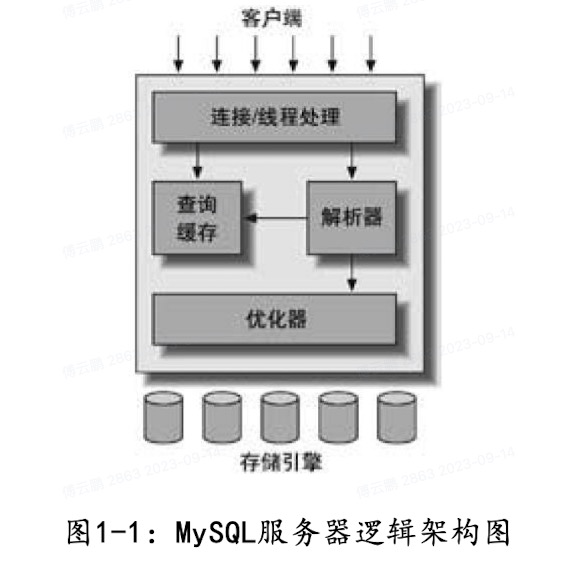

# mysql

### 一、mysql的架构

#### 1.1 逻辑架构

第一层大多数基于网络的客户端/服务器的工具或者服务都有类似的架构。连接管理，授权认证，安全等。

每个客户端连接都会在服务器进程中拥有一个线程，这个连接的查询只会在这个单独的线程中执行。服务器会负责缓存线程，不需要为每一个新建的连接创建或销毁线程。

服务器会先进行认证（用户名、原始主机信息和密码），使用安全套接字SSL的方式连接，可以使用X.509证书认证==》然后验证该客户端是否具有执行某个特定查询的权限。

第二层包含mysql大多数的核心服务功能，比如查询解析、分析、优化、缓存以及所有的内置函数，所有跨存储引擎的功能都在这一层实现：存储过程、触发器、视图等。

Mysql会解析查询，并创建内部数据结构（解析树），然后对其进行各种优化，包括重写查询、决定表的读取顺序，以及选择合适的索引等。用户可以通过特殊的关键字提示优化器，影响它的决策过程。优化器并不关心表使用的是什么存储引擎，但存储引擎对于优化查询是有影响的。

对于Select语句，在解析查询之前。服务器会先检查查询缓存，如果能够在其中找到对应的查询，服务器就不必再执行查询解析、优化和执行的整个过程，而是直接返回查询缓存中的结果集。

第三层包含了存储引擎。存储引擎负责mysql中数据的存储和提取。服务器通过API与存储引擎进行通信。这些接口屏蔽了不同存储引擎之间的差异，使得这些差异对上层的查询过程透明。

存储引擎API包含几十个底层函数，用于执行诸如“开始一个事务”或者“根据主键提取一行记录”等操作。但存储引擎不会去解析sql，不同存储引擎之间也不会相互通信，只是简单响应上层服务器的请求。

#### 1.2 并发控制

锁策略就是在锁的开销和数据的安全性之间寻求平衡。

每种Mysql存储引擎都可以实现自己的锁策略和锁粒度。

表锁：锁定整张表。服务器会为诸如alter table之类的语句使用表锁，而忽略存储引擎的锁机制。

行级锁：可以最大程度地支持并发处理（同时也会带来最大的锁开销）。在InnoDB和XtraDB，以及其他一些存储引擎中实现了行级锁。行级锁只在存储引擎层实现，Mysql服务器层没有实现。

#### 1.3 事务

事务就是一组原子性的SQL查询，或者说是一个独立的工作单元。事务内的语句，要么全部执行成功，要么全部执行失败。

---

ACID

- 原子性：一个事务必须被视为一个不可分割的最小工作单元，整个事务中的所有操作要么全部提交成功，要么全部失败回滚。
- 一致性：数据库总是从一个一致性的状态转换到另外一个一致性状态。
- 隔离性：通常来说，一个事务所做的修改在最终提交前，对其他事务是不可见的。
- 持久性：一旦事务提交，则其所做的修改将会永久保存到数据库中。

隔离级别：SQL标准中定义了四种隔离级别。

- 未提交读：事务中的修改，即使没有提交，对其它事务也都是可见的。事务可以读取未提交的数据，也被称为脏读。
- 提交读：大多数数据库系统的默认隔离级别（mysql不是），一个事务从开始直到提交之前，所做的任何修改对其它事务都是不可见的。这个级别也叫不可重复读，当两次执行同样的查询，可能会得到不一样的结果。
- 可重复读：这个级别解决了脏读的问题。该级别保证了在同一个事务中多次读取同样记录的结果是一致的。但是存在幻读的问题，所谓幻读，指的是当某个事务在读取某个范围的记录时，另外一个事务又在该范围内插入了新的记录，当之前的记录再次读取该范围内的记录时，会产生幻行。InnoDB和XtraDB存储引擎通过多版本并发控制解决了幻读的问题。可重复读是Mysql的默认事务隔离级别。
- 可串行化：是最高的隔离级别。通过强制事务串行执行，避免了前面说的幻读问题。可串行化会在读取的每一行数据上都加锁，所以可能导致大量的超时和锁争用的问题。实际应用中很少用到这个隔离级别，只有在非常需要确保数据的一致性而且可以接受没有并发的情况下，才考虑用该级别。

---

死锁：两个或者多个事务在同一资源上相互占用，并请求锁定对方占用的资源，从而导致恶性循环的现象。

​	当多个事务试图以不同的顺序锁定资源时，就可能会产生死锁。多个事务同时锁定同一个资源时，也会产生死锁。

​	InnoDB目前处理死锁的方法是将持有最少行级拍他锁的事务进行回滚。

​	锁的行为和顺序是和存储引擎相关的。死锁的产生双重原因，有些是因为真正的数据冲突，有些则完全是由于存储引擎的实现方式导致的。大多数情况下只需要重新执行因死锁回滚的事务即可。

---

事务日志

​	事务日志可以帮助提高事务的效率。

​	当使用事务日志的时候，存储引擎在修改表的数据时只需要修改其内存拷贝，再把该修改行为记录到持久在硬盘上的事务日志中，不用每次都将修改的数据本身持久到硬盘。

​	事务日志采用的是追加的方式，因此写日志的操作是磁盘上一小块区域内的顺序I/O，而不像随机I/O需要在磁盘的多个地方移动磁头，所以采用事务日志的方式相对来说要快得多。

​	事务日志持久以后，内存中被修改的数据在后台可以慢慢地刷回磁盘。目前大多数存储引擎都是这样实现的，通常称之为预写式日志，修改数据需要写两次磁盘。

​	如果数据的修改已经记录到事务日志并持久化，但数据本身还没有写回磁盘，此时系统崩溃，存储引擎在重启时能够自动恢复这部分修改的数据。

---

Mysql中的事务

​	Mysql提供了两种事务型引擎：InnoDB和NDB Cluster。另外还有一些第三方存储引擎也支持事务，比如XtraDB和PBXT。

1、自动提交：Mysql默认开启，如果不是显式地开始一个事务，则每个查询都被当作一个事务执行提交操作。

​	关闭自动提交后，所有的查询都是在一个事务中，直到显式的执行COMMIT提交或者ROLLBACK回滚，该事务结束，同时又开启一个新的事务。是否修改自动提交对非事务型的表，比如MyISAM或者内存表，不会有任何影响。对这类表来说，没有COMMIT或者ROLLBACK的概念，也可以说是相当于一直处于自动提交启用的模式。

​	存在一些命令，在执行之前会强制执行COMMIT提交当前的活动事务。比如在数据定义语言中，如果是会导致大量数据改变的操作，就会如此，例如ALTER TABLE，LOCK TABLES等。

​	Mysql可以通过执行SET TRANSACTION ISOLATION LEVEL命令来设置隔离级别。新的隔离级别会在下一个事务开始的时候生效。

​	MYSQL能够识别所有的4个隔离级别，InnoDB引擎也支持所有的隔离级别。

2、在事务中混合使用存储引擎

​	Mysql服务器层不管理事务，事务由下层的存储引擎实现。所以在同一个事务中，使用多种存储引擎是不可靠的。

​	如果在事务中混合使用了事务型和非事务型的表，正常的提交下不会有什么问题。但如果事务需要回滚，非事务型的表上的变更无法撤销，会导致数据库处于不一致的状态，这种情况很难修复，事务的最终结果将无法确定。所以，为每张表选择合适的存储引擎非常重要。

​	在非事务型的表上 执行事务相关操作的时候，Mysql通常不会发出提醒，也不会报错。有时候只有在回滚的时候才会发出警告。大多数情况下，对非事务型的表的操作不会有提示。

3、隐式和显式锁定

​	InnoDB采用的是两阶段锁定协议。在事务执行过程中，随时都可以执行锁定，锁只有在执行COMMIT或者ROLLBACK的时候才会释放，并且所有的锁是在同一时刻被释放。InnoDB会根据隔离级别在需要的时候自动加锁。

​	InnoDB也支持通过特定的语句进行显式锁定，但这些语句不属于SQL规范。

​	Mysql也支持LOCK TABLES和UNLOCK TABLES语句，这是在服务器层实现的，和存储引擎无关。有自己的用途，并不能代替事务处理。如果应用需要用到事务，还是应该选择事务型存储引擎。

​	当应用已经将表从MyISAM转换到InnoDB，但还是显式地使用LOCK TABLES语句。这不但没有没有必要，还会严重影响性能，实际上InnoDB的行级锁工作的更好。

​	除了事务中禁用了AUTOCOMMIT，可以使用LOCK TABLES之外，其他任何时候都不要显式地执行LOCK TABLES，不管使用的是什么存储引擎。

---

#### 1.4 多版本并发控制

​	Mysql的大多数事务型存储引擎实现的都不是简单的行级锁。基于提升并发性能的考虑，它们一般都同时实现了多版本并发控制。

​	MVCC的实现，是通过保存数据在某个时间点的快照来实现的。

​	InnoDB的MVCC是通过在每行记录后面保存两个隐藏的列来实现的。这两个列一个保存了行的创建时间，一个保存行的过期时间（或删除时间）。当然存储的并不是实际的时间值，而是系统版本号。每开始一个新的事务，系统版本号都会自动递增。事务开始时刻的系统版本号会作为事务的版本号，用来和查询到的每行记录的版本号进行比较。

​	InnoDB 可重复读级别下的MVCC

| SQL    | 描述                                                         |
| ------ | ------------------------------------------------------------ |
| SELECT | 1、InnoDB只查找版本遭遇当前事务版本的数据行（也就是行的系统版本号小于或等于事务的系统版本号），这样可以确保事务读取的行，要么是在事务开始前已经存在的，要么是事务自身插入或者修改过的2、行的删除版本要么未定义，要么大于当前事务版本号。这可以确保事务读取到的行，在事务开始之前未被删除。 |
| INSERT | InnoDB为新插入的每一行保存当前系统版本号作为行版本号。       |
| DELETE | InnoDB为删除的每一行保存当前系统版本号作为行删除标识。       |
| UPDATE | InnoDB为插入一行新纪录，保存当前系统版本号作为行版本号，同时保存当前系统版本号到原来的行作为行删除标识。 |

​	保存这两个额外系统版本号，使大多数读操作都可以不用加锁。这样设计使得读数据操作很简单，性能很好，并且也能保证只会读到符合标准的行。不足之处是每行记录都需要额外的存储空间，需要做更多的行检查工作，以及一些额外的工作。

​	MVCC只在可重复读和可提交读两个级别下工作，其他两个隔离级别都和MVCC不兼容。因为未提交读总是读取最新的数据行，而不是符合当前事务版本的数据行。可串行化则会对所有读取的行都加锁。

---

#### 1.5 Mysql存储引擎

在文件系统中，Mysql将每个数据库保存为数据目录下的一个子目录。创建表时，Mysql会在数据库子目录下创建一个和表同名的.frm文件保存表的定义。因为Mysql使用文件系统的目录和文件来保存数据库和表的定义，大小写敏感性和具体的平台密切相关。

不同的存储引擎保存数据和索引的方式是不同的，但表的定义则是在Mysql服务层统一处理。

内建引擎

1、InnoDB

​	InnoDB是Mysql的默认事务型引擎，也是最重要的，使用最广泛的存储引擎。它被设计用来处理大量的短期事务，短期事务大部分情况下是正常提交，很少被回滚。InnoDB的性能和自动崩溃恢复特性，使得它在非事务型存储的需求中也很流行。

​	InnoDB的数据存储在表空间，表空间是由InnoDB管理的一个黑盒子，由一系列的数据文件组成。

​	InnoDB采用MVCC来支持高并发，并且实现了四个标准隔离级别，默认级别为可重复读，并且通过间隙锁策略防止幻读的出现。间隙锁使得InnoDB不仅仅锁定查询涉及的行，还会对索引中的间隙进行锁定，以防止幻影行的插入。

​	InnoDB表是基于聚簇索引建立的，聚簇索引对主键查询有很高的性能，不过二级索引中必须包含主键列，所以如果主键列很大的话，其他的所有索引都会很大。因此，如果表上的索引较多的话，主键应当尽可能的小。

​	InnoDB的存储格式是平台独立的，可以将数据和索引文件从Intel平台复制到PowerPC或者其他平台。

​	InnoDB内部做了很多优化，包括从磁盘读取数据时采用可预测性读，能够自动在内存中创建hash索引以加速读操作的自适应哈希索引，以及能够加速插入操作的插入缓冲区等。

​	存储引擎要为所有用户甚至包括修改数据的用户维持一致性视图，是非常复杂的工作。

​	作为事务型的存储，InnoDB通过一些机制和工具支持真正的热备份。

​	Mysql的其他存储引擎不支持热备份，要获取一致性视图需要停止对所有表的写入，而在读写混合场景中，停止写入可能也意味着停止读取。

2、MyISAM存储引擎

​	MyISAM是5.1版本以前的默认存储引擎。它提供了大量特性，包括全文索引、压缩、空间函数等，但不支持事务和行级锁，而且崩溃后无法安全恢复。

​	对于只读的数据，或者表比较小、可以忍受修复操作，则可以使用。

​	MyISAM会将表存储在两个文件中：数据文件和索引文件。MyISAM表可以包含动态或者静态行。Mysql会根据表的定义来决定采用何种行格式。MyISAM表可以存储的行记录数，一般受限于可用的磁盘空间，或者操作系统中单个文件的最大尺寸。

​	在Mysql 5.0中，MyISAM表如果是变长行，则会默认配置只能处理256TB的数据，因为指向数据记录的指针长度是6个字节，在更早的版本中则是4个字节，只能处理4GB的数据。所有的Mysql版本都支持8字节的指针。要改变MyISAM表指针的长度，可以通过修改表的MAX_ROWS和AVG_ROW_LENGTH选项的值来实现，两者相乘就是表可能达到的最大大小。修改这两个参数会导致重建整个表和表的所有索引。

​	MyISAM对整张表加锁，而不是针对行。读取时会对需要读到的所有表加共享锁，写入时则对表加排他锁，但是在表有读取查询的同时，也可以往表中插入新的记录，也就是并发插入。

​	对于MyISAM表，即使是BLOB和TEXT等长字段，也可以基于其前500个字符创建索引。MyISAM也支持全文索引，这是一种基于分词创建的索引，可以支持复杂的查询。

​	创建MyISAM表的时候，如果指定了DELAY_KEY_WRITE选项，在每次修改完成时，不会立刻将修改的索引数据写入磁盘，而是会写到内存中的键缓冲区，只有在清理键缓冲区或者关闭表的时候才会将对应的索引块写入到磁盘。这种方式可以极大地提升写入性能，但是在数据库或者主机崩溃时会造成索引损坏，需要执行修复操作。延迟更新索引键的特性，可以在全局设置，也可以为单个表设置。

​	如果表在创建并导入数据以后，不会再进行修改操作，那么这样的表或许适合采用MyISAM亚索表。可以使用myisampack对MyISAM表进行压缩。压缩表是不能进行修改的（除非先将表解除压缩，修改数据，然后再次压缩）。压缩表可以极大地减少磁盘空间的占用，因此也可以减少磁盘I/O，从而提升查询性能。压缩表也支持索引，但索引也是只读的。以现在的硬件能力，对大多数应用场景，读取压缩表数据时的解压带来的开销影响并不大，而减少I/O带来的好处则要大得多。压缩时表中的记录是独立压缩的，所以读取单行的时候不需要去解压整个表（甚至也不解压行所在的整个页面）。

​	MyISAM引擎设计简单，数据以紧密格式存储，所以在某些场景下性能很好。MyISAM有一些服务器级别的性能扩展限制，比如对索引键缓冲区的Mutex锁。MariaDB基于段的索引键缓冲区机制来避免该问题。MyISAM最典型的性能问题还是表锁的问题。

3、Archive引擎

​	Archive存储引擎只支持INSERT和SELECT操作，在Mysql 5.1之前也不支持索引。

​	Archive引擎会缓存所有的写并利用zlib对插入的行进行压缩，所以比MyISAM表的磁盘I/O少。但是每次SELECT查询都需要执行全表扫描。所以Archive表适合日志和数据采集类应用，这类应用做数据分析时往往需要全表扫描。或者在一些需要快速INSERT的情况下也可以使用。

​	Archive引擎支持行级锁和专用的缓冲区，所以可以实现高并发的插入。在一个查询开始直到返回表中存在的所有行数之前，Archive引擎会阻止其他的SELECT执行，以实现一致性读。另外，也实现了批量插入在完成之前对读操作是不可见的。这种机制模仿了事务和MVCC的一些特性，但Archive引擎不是一个事务型引擎，而是一个针对高速插入和压缩做了优化的引擎。

4、Blackhole引擎

​	Blackhole引擎没有实现任何存储机制，他会丢弃所有插入的数据，不做任何保存。但是服务器会记录Blackhole表的日志，所以可以用于复制数据到备库，或者只是简单地记录到日志。这种特殊的存储引擎可以在一些特殊的复制架构和日志审核时发挥作用。但存在很多问题，因此并不推荐。

5、CSV引擎

​	CSV引擎可以将普通的CSV文件（逗号分割值的文件）作为Mysql的表来处理，但这种表不支持索引。CSV引擎可以在数据库运行时拷入或者拷出文件。可以将Execl等电子表格软件中的数据存储为CSV文件，然后复制到Mysql数据目录下，就能在Mysql中打开使用。同样，如果将数据写入到一个CSV引擎表，其他的外部程序也能立即从表的数据文件中读取CSV格式的数据。因此CSV引擎可以作为一种数据交换的机制。

6、Federated引擎

​	Federated引擎是访问其他Mysql服务器的一个代理，它会创建一个到远程Mysql服务器的客户端连接，并将查询传输到远程服务器执行，然后提取或者发送需要的数据。

7、Memory引擎

​	如果需要快速地访问数据，并且这些数据不会被修改，重启以后丢失也没有关系，那么使用Memory表是非常有用的。

​	Memory表至少比MyISAM表快一个数量级，因为所有的数据都保存在内存中，不需要进行磁盘I/O。Memory表的结构在重启以后还会保留，但数据会丢失。

​	Memory表在很多场景可以发挥好的作用：

- 用于查找或者映射表。
- 用于缓存周期性聚合数据的结果。
- 用于保存数据分析中产生的中间数据。

​	Memory表支持Hash索引，因此查找操作非常快。虽然Memory表的速度非常快，但还是无法取代传统的基于磁盘的表。Memory表是表级锁，因此并发写入的性能较低。它不支持BLOB或TEXT类型的列，并且每行的长度是固定的，所以即使指定了VARCHAR列，实际存储时也会转换成CHAR，这可能导致部分内存的浪费。

​	如果Mysql在执行查询的过程中需要使用临时表来保存中间结果，内部使用的临时表就是Memory表。如果中间结果太大超出了Memory表的限制，或者含有BLOB或TEXT字段，则临时表会转换成MyISAM表。

8、Merge引擎

​	Merge引擎是MyISAM引擎的一个变种。Merge表由多个MyISAM表合并而来的虚拟表。如果将Mysql用于日志或者数据仓库类应用，该引擎可以发挥作用。在引入分区功能后，该引擎已经被废弃。

9、NDB集群引擎

​	作为SQL和NDB原生协议之间的接口。

第三方存储引擎归类

1、OLTP类引擎：Online Transaction Processing 在线交易处理，用于处理高并发的事务性工作负载。常用的有InnoDB和SQL SERVER等。

​	OLTP类存储引擎专注于支持快速、可靠和高效地处理大量小型事务，通常应用于需要频繁读写的在线业务环境。

​	通常具有以下特点：

- 并发处理：能够同时处理多个并发事务请求，确保数据的一致性和隔离性。
- 事务支持：提供ACID事务特性，确保数据操作的正确性和完整性。
- 快速响应时间：优化查询性能，使得查询和数据修改操作可以在较短的时间内完成。
- 高可用性：通过故障转移、备份和恢复机制来保证系统可用性和数据的安全性。
- 数据完整性：实施各种约束条件和验证规则，以确保数据的完整性和有效性。
- 数据一致性：使用锁定机制、并发控制和事务隔离级别来保证数据的一致性。

2、面向列的存储引擎

​	Mysql默认是面向行的，每一行的数据是一起存储的，服务器的查询也是以行为单位处理的。在大数据量处理时，面向列的方式可能效率更高。如果不需要整行的数据，面向列的方式可以传输更少的数据。如果每一列都单独存储，那么压缩的效率也会更高。

3、社区存储引擎

如何选择合适的存储引擎

​	大部分情况下，InnoDB都是正确的选择。除非万不得已，否则建议不要混合使用多种存储引擎，不然会可能会带来一系列复杂的问题。

优先考虑以下几个因素：

1、事务：如果应用需要事务支持，那么InnoDB是目前最稳定并且经过验证的选择。如果不需要事务，并且主要是SELECT和INSERT操作，那么MyISAM是不错的选择。一般日志型应用比较符合这一特性。

2、备份：如果可以定期地关闭服务器来执行备份，那么备份的因素可以忽略。如果需要在线热备份，那么选择InnoDB就是基本的需求。

3、崩溃恢复：数据量比较大的时候，系统崩溃后如何快速的恢复是一个需要考虑的问题。相对而言，MyISAM崩溃后发生损坏的概率比InnoDB要高很多，而且恢复速度较慢。因此，即使不需要事务支持，很多人也选择InnoDB引擎，这是一个非常重要的因素。

4、特有的特性：有些应用可能依赖一些存储引擎所独有的特性或者优化，比如很多应用依赖聚簇索引的优化。

转换表引擎

​	1、ALTER TABLE mytable ENGINE=InnoDB;

​	上述语法可以适用任何存储引擎，但需要执行很长时间。Mysql会按行将数据从原表复制到一张新的表中，在复制期间可能会消耗系统所有的I/O能力，同时原表 上会加上读锁。

​	一个替代方案是采用接下来将讨论的导出与导入的方法，手工进行表的复制。

​	如果转换表的存储引擎，将会失去和原引擎相关的所有特性。

​	如果将一张InnoDB表转换为MyISAM，然后再转回InnoDB，原InnoDB表上所有的外键将消失。

​	2、可以使用mysqldump工具将数据导出到文件，然后修改文件中CREATE TABLE语句的存储引擎选项，注意同时修改表名，因为同一个数据库中不能存在相同的表名，即使它们使用的是不同的存储引擎。同时注意mysqldump默认会自动在CREATE TABLE语句前加上DROP TABLE语句，不注意这一点可能导致数据丢失。

​	3、创建与查询的方式

​	这种方式十分的高效和安全。

​	CREATE TABLE innodb_table LIKE myisam_table;

​	ALTER TABLE innodb_table ENGINE=InnoDB;

​	INSERT INTO innodb_table SELECT * FROM myisam_table;

​	数据量不大的话，这样可以工作的很好。如果数据量很大的话，则可以考虑分批处理，针对每一段数据执行事务提交操作，以避免大事务产生过多的undo。

---

#### 1.7 总结

​	Mysql拥有分层架构。上层是服务器层的服务和查询执行引擎，下层是存储引擎。

---

### 二、Mysql基准测试

基准测试是针对系统设计的一种压力测试。

基准测试可以观察系统在不同压力下的行为，评估系统的容量，掌握哪些是重要的变化，或者观察系统如何处理不同的数据。

基准测试可以完成的工作：

- 验证基于系统的一些假设，确认这些假设是否符合实际情况。
- 重现系统中的某些异常行为，以解决这些异常。
- 测试系统当前的运行情况。
- 模拟比当前系统更高的负载，以找出系统随着压力增加而可能遇到的扩展瓶颈。
- 规划未来业务增长。
- 测试应用适应可变环境的能力。
- 测试不同的硬件、软件和操作系统配置。
- 证明新采购的设备是否配置正确。

基准测试施加给系统的压力相对于真实压力来说，通常比较简单。

基准测试要尽量简单直接，结果之间容易相互比较，成本低易于执行。

---

#### 2.1 基准测试策略

一是针对整个系统的整体测试，另外是单独测试Mysql。这两种策略也被称为集成式以及单组件式基准测试。

需要针对整个系统做集成测试，而不是单独测试Mysql的原因：

- 测试整个应用系统，包括web服务器、应用代码、网络和数据库是非常有用的，因为用户关注的并不仅仅是Mysql本身的性能，而是应用整体的性能。
- Mysql并非总是应用的瓶颈，通过整体的测试可以揭示这一点。
- 只有对应用做整体测试，才能发现各部分之间的缓存带来的影响。
- 整体应用的集成式测试更能揭示应用的真实实现，单独的组件测试很难做到。

测试指标：

- 吞吐量：单位时间内的事务处理数。这类基准测试主要针对在线事务处理的吞吐量，非常适用于多用户的交互式应用。常用的测试单位是每秒事务数（TPS），有些也采用每分钟事务数（TPM）。
- 响应时间或者延迟中：用于测试任务所需的整体时间。通常可以使用百分比响应时间来代替最大响应时间。
- 并发性：在任意时间有多少同时发生的请求。
- 可扩展性：给系统增加一倍的工作，在理想情况下就能获得两倍的结果。大多是系统是无法做到线性扩展的。

---

#### 2.2 基准测试方法

避免一些常见错误导致测试结果无用或者不精确：

- 使用真实数据的子集而不是全集。
- 使用错误的数据分布。
- 使用不真实的分布参数。
- 在多用户场景中，只做单用户的测试。
- 在单服务器上测试分布式应用。
- 与真实用户行为不匹配。
- 反复执行同一个查询。
- 没有检查错误。
- 忽略了系统预热的过程。
- 使用默认的服务器配置。
- 测试时间太短。

设计和规划基准测试

提出问题并明确目标，然后决定采用标准的基准测试，还是设计专用的测试。

如果采用标准的基准测试，应该确认选择了合适的测试方案。

设计专用的基准测试是很复杂的，往往需要一个迭代的过程。首先需要获得生产数据集的快照，并且该快照很容易还原，以便进行后续的测试。然后，针对数据运行查询。

即使不需要创建专用的基准测试，详细地写下测试规划也是必须的。

应当建立将参数和结果文档化的规范，每一轮测试都必须进行详细记录。

基准测试应该运行多长时间？

一个简单的测试规则，就是等系统看起来稳定的时间至少等于系统预热的时间。

一个常见的错误的测试方式是，只执行一系列短期测试。

获取系统性能和状态

在执行基准测试时，需要尽可能多地收集被测试系统的信息。最好为基准测试建立一个目录，并且每执行一轮测试都创建单独的子目录，将测试结果、配置文件、测试指标、脚本和其他相关说明都保存在其中。

准确的测试结果

是否选择了正确的基准测试？是否为问题 收集相关的数据？是否采用了错误的测试标准？

确认测试结果是否可重复。

要注意很多因素，包括外部的压力、性能分析和监控系统、详细的日志记录、周期性作业，以及其他一些因素，都会影响到测试结果。

每次测试中，修改的参数应该尽量少。

一般情况下，都是通过迭代逐步地修改基准测试的参数，而不是每次运行时都做大量的修改。比如，如果要通过调整参数来创造一个特定的行为，可以通过使用分治法（每次运行时将参数对分减半）来找到正确的值。

如果测试中出现异常结果，不要轻易当作坏数据点而丢弃。应当认真研究并找到产生这种结果的原因。测试可能会得到有价值的结果，或者一个严重的错误，抑或基准测试的设计缺陷。

运行基准测试并分析结果

尽可能做自动化基准测试，可以采用MakeFile文件或者一组脚本来实现，脚本语言可以根据需要选择，尽可能使所有测试过程都自动化，包括装载数据、系统预热、执行测试、记录结果等。

基准测试通常需要运行很多次。

分析结果的最终目的是回答在设计测试时的问题。最好画图分析。

---

#### 2.4  基准测试工具

1、集成式测试工具

- ab：一个Apache HTTP服务器基准测试工具。可以测试HTTP服务器每秒最多可以处理多少请求。如果测试的是Web应用服务，这个结果可以转换成整个应用每秒可以满足多少请求。但是只能针对单个URL进行尽可能快的压力测试。
- http_load：也是针对web服务器进行测试，与ab类似，但是更加灵活，可以通过一个输入文件提供多个URL，http_load在这些URL中随机选择进行测试。
- JMeter：一个Java应用程序，可以加载其他应用并测试性能。

2、单组件式测试工具

- mysqlslap：可以模拟服务器负载，并输出计时信息。测试时可以执行并发连接数，并指定SQL语句。

- MySQL Benchmark Suite：mysql发行包提供的一款自己的基准测试套件。它是单线程的，主要用于测试服务器执行查询的速度。结果会显示哪种类型的操作在服务器上执行的更快。这些测试大部分是CPU密集型。

  好处是包含了大量预定义测试，容易使用，可以很轻松地用于比较不同存储引擎或者不同配置的性能测试。可以用于高层次测试，比较两个服务器的总体性能。

  缺点主要是单用户模式的，测试的数据集很小且用户无法使用指定的数据，并且同一个测试多次运行的结果可能会相差很大。

- Super Smack：用于Mysql和PostgreSQL的基准测试工具，可以提供压力测试和负载生成。可以模拟多用户访问，可以加载测试数据到数据库，并支持使用随机数据填充测试表。

- Database Test Suite：由开源软件开发实验室设计的一款类似某些工业标准测试的测试工具集。

- Percona‘s TPCC-Mysql Tool：可以评估大压力下Mysql的一些行为。

- sysbench：一款多线程压力测试工具。可以根据影响数据库服务器性能的各种因素来评估系统的性能。支持Mysql、操作系统和硬件的硬件测试。

- Mysql内置Benchmark()函数：可以测试某些特定操作的执行速度。参数可以是需要执行的次数和表达式。表达式可以是任意的标量表达式。

  执行后的返回值永远是0。这个函数只是简单地返回服务器执行表达式的时间，而不会涉及分析和优化的开销，而且表达式必须包含用户定义的变量，否则多次执行同样的表达式会因为系统缓存命中而影响结果。

  这个函数不适合用来做真正的基准测试，因为很难理解真正要测试的是什么，测试的只是整个执行周期的一部分环节。

---

### 三、服务器性能剖析

最常碰到的三个性能相关的服务请求：

- 如何确认服务器是否达到了性能最佳的状态？
- 某条语句为什么执行不够快？
- 诊断被用户描述成“停顿”、“堆积”或者“卡死”的某些间歇性疑难故障。

主要关注三个问题：

- 优化整机性能
- 优化单条语句的执行速度
- 诊断或者解决那些很难观察到的问题

数据库服务器的目的是执行SQL语句，所以关注的任务是查询或者语句。数据库服务器的性能用查询的响应时间来度量，单位是每个查询花费的时间。

优化的前提需要合适的测量范围，也就是只测量需要优化的活动。有两种比较常见的情况会导致不合适的测量：

- 在错误的时间启动和停止测量。
- 测量的是聚合后的信息，而不是目标活动本身。

一个常见的错误是先查看慢查询，然后又去排查整个服务器来判断问题在哪里。如果确认有慢查询，那么应该测量慢查询，而不是测量整个服务器。测量的应该是从慢查询的开始到结束的时间，而不是查询之前或者查询之后的时间。

完成一项任务所需要的时间可以分成两部分：执行时间和等待时间。

如果要优化任务的执行时间，最好的办法是通过测量定位不同子任务花费的时间，然后优化去掉一些子任务、降低子任务的执行频率或者提升子任务的效率。

优化任务的等待时间则相对要复杂一些，因为等待有可能是由其他系统间接影响导致，任务之间也可能由于争用磁盘或者CPU资源而相互影响。

根据时间是花在执行还是等待上的不同，诊断也需要不同的工具和技术。

性能剖析一般有两个步骤：测量任务所花费的时间，然后对结果进行统计和排序，将重要的任务排到前面。

性能剖析的过程中有很多需要的信息是缺失的：

- 值得优化的查询：一些只占总响应时间比重很小的查询是不值得优化的。如果优化的成本大于收益，也应该停止优化。
- 异常情况：某些任务即使没有出现在性能剖析输出的前面也需要优化。比如某些任务执行次数很少，但每次执行都非常慢，严重影响用户体验。因为其执行频率低，所以总的响应时间占比并不突出。
- 未知的未知：一款好的性能剖析工具会显示可能“丢失的时间”。丢失的时间指的是任务的总时间和实际测量到的时间之间的差。
- 被掩藏的细节：性能剖析无法显示所有响应时间的分布。只相信平均值是非常危险的，它会隐藏很多信息，而且无法表达全部情况。

#### 1、对应用程序进行性能剖析

对系统进行性能剖析还是建议自上而下的进行，这样可以追踪自用户发起服务器响应的整个流程。

性能瓶颈可能有很多影响因素：

- 外部资源，比如调用了外部的Web服务或者搜索引擎。
- 应用需要处理大量的数据，比如分析一个超大的XML文件。
- 在循环中执行昂贵的操作，比如滥用正则表达式。
- 使用了低效的算法。 

#### 2、剖析Mysql查询

在服务器端可以有效地审计效率低下的查询。定位和优化“坏”查询能够显著地提升应用的性能，也能解决某些特定的难题，还可以降低服务器的整体压力。

捕获Mysql的查询到日志文件中

​	在Mysql中，慢查询日志最初只是捕获比较慢的查询，性能剖析需要针对所有的查询。

​	在Mysql的当前版本中，慢查询日志的开销最低、精度最高的测量查询时间工具。慢查询带来的开销几乎可以忽略不计。更需要担心的是日志可能消耗大量的磁盘空间。如果长期开启慢查询日志，注意要部署日志轮转工具。或者不要长期启用慢查询日志，只在需要收集负载样本的期间开启即可。

​	Mysql还有另外一种查询日志，被称之为“通用日志”，但很少用于分析和剖析服务器性能。通用日志在查询请求到服务器时进行记录，所以不包含响应时间和执行计划等重要信息。

​	Mysql 5.1之后支持将日志记录到数据库的表中，但多数情况下这样做没什么必要，这不但对性能有很大影响，本来慢查询记录到文件中已经支持微秒级别，然而将慢查询记录到表会导致时间粒度退化为只能到秒级。

有时因为某些原因，比如权限不足等，无法在服务器上记录查询。这种情况有两种解决方案：

​	一是通过不断查看SHOW FULL PROCESSLIST的输出，记录查询第一次出现的时间和消失的时间。某些情况下这样的精度也足够发现问题，但却无法捕获所有的查询。一些执行较快的查询可能在两次执行的间隙就执行完成了，从而无法捕获到。

​	二是通过抓取TCP网络包，然后根据Mysql的客户端/服务端通信协议进行解析。

​	还有一种办法，就是通过Mysql Proxy代理层的脚本来记录所有查询，但是实践中很少这样。

分析查询日志

​	强烈建议从现在起就利用慢查询日志捕获服务器上所有的查询，并进行分析。

​	可以在一些典型的时间窗口如业务高峰期的一个小时内记录查询。如果业务趋势比较均衡，那么一分钟甚至更短时间内捕获需要优化的低效查询也是可行的。

​	不要直接打开整个慢查询日志进行分析，这样做只会浪费时间和金钱。首先应该生成一个剖析报告，如果需要，则可以再查看日志中需要特别关注的部分。自顶向下是比较好的方式，否则有可能像前面提到的，反而导致业务的逆优化。

​	EXPLAIN分析的语句要求所有的条件是文本值而不是“指纹”替代符，所以是真正可直接执行的语句。

剖析单条查询

使用SHOW PROFILE

​	默认禁用，需要手动开启。SET profiling = 1；

​	在服务器上执行的所有语句，都会测量其耗费的时间和其他一些查询执行状态变更相关的数据。

使用SHOW STATUS

​	Mysql的SHOW STATUS命令返回了一些计数器。既有服务器级别的全局计数器，也有基于某个连接的会话级别的计数器。

​	如果执行SHOW GLOBAL STATUS，则可以查看服务器级别的从服务启动时开始计算的查询次数统计。不同计数器的可见范围不一样，不过全局的计数器也会出现在SHOW STATUS的结果中，容易被误认为会话级别的数据，收集合适级别的测量值是很关键的。

​	SHOW STATUS的大部分结果都只是一个计数器。可以显示某些活动如读索引的频繁程度，但无法给出消耗了多少时间。

​	尽管SHOW STATUS无法提供基于时间的统计，但对于在执行完查询后观察某些计数器的值还是有帮助的。有时候可以猜测哪些操作代价较高或者消耗的时间较多。最有用的计数器包括句病计数器、临时文件和表计数器等。

使用慢查询日志

使用Performance Schema

​	它无法提供查询执行阶段的细节信息和计时信息，而前面提供的很多现有的工具都已经做到了。

​	其次，还没有经过长时间、大规模使用的验证，并且自身的开销还比较大。

​	最后，对于大多数用户来说，直接通过Performance Schema的裸数据获得有用的结果相对来说过于复杂和底层。

​	现在主要是为了测量当为提升服务器性能而修改Mysql源代码时使用，包括等待和互斥锁。

#### 3、诊断间歇性问题

​	间歇性问题比如系统偶尔停顿或者慢查询，很难诊断。

单条查询问题还是服务器问题

使用SHOW GLOBAL STATUS

​	这个方法实际上就是以较高的频率比如一秒执行一次SHOW GLOBAL STATUS命令捕获数据，问题出现时，则可以通过某些计数器的“尖刺”或者“凹陷”来发现。

使用SHOW PROCESSLIST

​	这个方法是通过不停地捕获SHOW PROCESSLIST的输出，来观察是否有大量线程处于不正常的状态或者有其他不正常的特征。

使用查询日志

​	如果要通过查询日志发现问题，需要开启慢查询日志并在全局级别设置long_query_time为0，并且要确认所有的连接都采用了新的设置。这可能需要重置所有连接以使新的全局设置生效。

​	如果因为某些原因，不能设置慢查询日志记录所有的查询，也可以通过tcpdump等工具来模拟替代。

​	要注意找到吞吐量突然下降时间段的日志。查询是在完成阶段才写入到慢查询日志的，所以堆积会造成大量查询处于完成阶段，直到阻塞其他查询的资源占用者释放资源后，其他的查询才能执行完成。这种行为特征的好处是，当遇到吞吐量突然下降时，可以归咎于吞吐量下降后完成的第一个查询（有时候也不一定是第一个查询。当某些查询被阻塞时，其他查询可以不受影响继续运行，所以不能完全依赖这个经验）。

理解发现的问题

​	建议诊断问题时先使用前两种方法。这两种方法的开销很低，可以通过简单的shell脚本或者反复执行的查询来交互式地收集数据。分析慢查询日志则相对困难。最后尝试可视化数据。

---

捕获诊断数据

​	当出现间歇性问题时，需要尽可能多地收集所有数据，而不只是问题出现时的数据。

​	在开始之前需要准备一个可靠且实时的触发器，以及一个收集诊断数据的工具。

诊断触发器

​	有两个常见的问题可能导致无法达到预期的效果：误报或者漏检。误报是指收集了很多诊断数据，但期间其实没有发生问题，这可能是浪费时间。漏检则指在问题出现时没有捕获到数据，错失了机会。在开始收集数据前多花一点时间来确认触发器能够真正地识别问题是划算的。

​	好的触发器的标准，Threads_running的趋势在出现问题时会比较敏感，而没有问题时则比较平稳。另外SHOW PROCESSLIST中线程的异常状态尖峰也是个不错的指标。除此之外还有很多方法，包括SHOW INNODB STATUS的特定输出、服务器的平均负载尖峰等。关键是找到一些能和正常时的阈值进行比较的指标。通常情况下这是一个计数，比如正在运行的线程的数量、处于“freeling items”状态的线程的数量等。

---

### 四、操作系统和硬件优化

#### 1、平衡内存和磁盘

1）避免磁盘I/O。

如果有足够的内存可以完全避开磁盘读取操作。

写入可以像读取一样在内存中进行，但是迟早必须被写入磁盘，才能持久保留数据。缓存可以延迟写操作，但是缓存不能像消除读操作一样消除写操作。

2）多次写操作，一次刷新

一个数据片段可以在内存中被多次修改，但无需每次都将新值写入磁盘。当数据被最终刷新到磁盘时，自上次物理写入以来发生的所有修改都将被持久化。

3）I/O合并

许多不同的数据片段可以在内存中被修改，这些修改可以被收集在一起，因此物理写可以作为单个磁盘操作执行。

（1）许多事务系统都采用都使用提前写日志策略。

在事务处理系统中，提前写日志是一种确保数据一致性和持久性的关键技术。核心思想是在实际更新数据之前，先将该更新操作记录到日志中。

提前写日志的工作原理

1. 事务开始：当事务开始时，系统会创建一个新的日志条目，用于记录该事务的所有操作。
2. 记录日志：在对数据进行任何修改之前，系统会先将即将进行的操作记录到日志中。这些日志条目通常包括以下信息：事务ID、修改的数据项、修改前的旧值、修改后的新值。
3. 写入日志：这些日志条目被写入到持久存储上，以确保即使系统崩溃，这些修改操作也不会丢失。
4. 执行修改：在日志条目被安全地写入磁盘后，系统才会实际执行对数据的修改操作。
5. 事务提交：当事务完成所有操作并准备提交的时，系统会写入一个提交日志条目，标识该事务已成功完成。
6. 事务提交完成：只有当提交日志条目被写入持久存储之后，事务才被认为真正提交，并将其修改的数据对其他事务可见。

提前写日志的优势

1. 数据一致性：通过在修改数据之前记录日志，可以确保系统崩溃后仍能恢复到一致的状态。恢复时系统会重新执行或回滚未完成的事务。
2. 崩溃恢复：系统崩溃时，可以通过分析日志来决定哪些事务已经提交，哪些事务需要回滚，从而恢复系统的完整性。
3. 并发控制：在并发事务处理中，WAL可以与锁机制结合使用，确保多个事务之间的数据一致性和隔离性。
4. 性能优势：采用顺序写入更加高效，其次事务系统可以在内存中自由地修改数据页面，而不必立即将这些修改写入磁盘，减少了频繁的磁盘操作，显著提高了性能。后台线程可以异步地将修改过的页面批量刷新到磁盘。这种批量写入可以更好地利用磁盘的带宽，进一步减少随机I/O的开销。延迟写入将修改后的页面写入磁盘允许系统在高负载时将更多的资源用于处理前台请求，从而提高系统的吞吐量和响应速度。

实现细节

- 日志格式：日志通常采用顺序写入的方式，写入速度快。日志条目可以采用二进制格式，以减少写入量。随机写入速度较慢。
- 日志缓存：为了提高性能，系统通常会将日志先写入缓存，然后批量刷写到磁盘中。
- 日志截断：为了避免日志文件无限增长，系统需要定期截断日志，即将已经完成并不再需要的日志条目删除。

